# Data Flow in HYREF Assessment Components

## Table of Contents

- [Data Flow in HYREF Assessment Components](#data-flow-in-hyref-assessment-components)
  - [Table of Contents](#table-of-contents)
  - [File-Based Data Flow](#file-based-data-flow)
    - [File Structure and Responsibilities](#file-structure-and-responsibilities)
    - [Data Flow Between Files](#data-flow-between-files)
    - [Type Definitions Flow](#type-definitions-flow)
  - [Overview](#overview)
  - [Architecture Diagram](#architecture-diagram)
  - [Detailed Data Flow](#detailed-data-flow)
    - [1. User Input Collection](#1-user-input-collection)
    - [2. Form Validation Process](#2-form-validation-process)
    - [3. API Request Flow](#3-api-request-flow)
    - [4. Data Structure Transformation](#4-data-structure-transformation)
  - [Component Interaction](#component-interaction)
  - [TanStack Query Implementation](#tanstack-query-implementation)
  - [Error Handling Flow](#error-handling-flow)
  - [Energy Type Switching Behavior](#energy-type-switching-behavior)
  - [Conclusion](#conclusion)
  - [Forecast & Assessment Data Flow Documentation](#forecast--assessment-data-flow-documentation)
    - [Core Components](#core-components)
    - [API Interaction Flow](#api-interaction-flow)
    - [State Management](#state-management)
    - [Key Data Types](#key-data-types)

## File-Based Data Flow

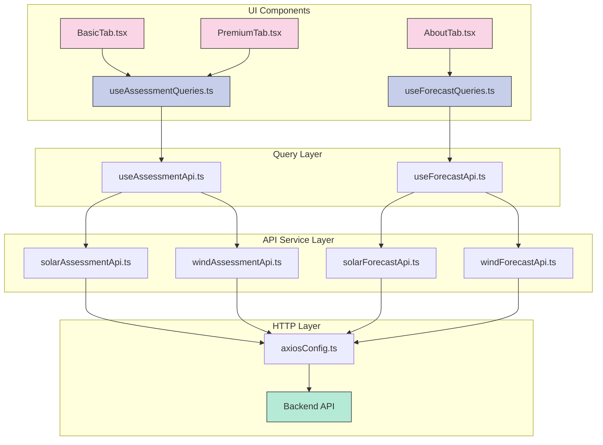

### File Structure and Responsibilities

| File | Responsibility | Key Functions |
|------|----------------|---------------|
| **UI Components** | | |
| `BasicTab.tsx` | Handles basic assessment form UI and state | Form rendering, validation, submission |
| `PremiumTab.tsx` | Handles premium assessment form UI and state | Advanced form options, validation, submission |
| `AboutTab.tsx` | Displays information about assessments | Data visualization, chart rendering |
| **Query Layer** | | |
| `useAssessmentQueries.ts` | TanStack Query hooks for assessments | `useBasicSolarAssessmentMutation`, `useWindBasicQuery` |
| `useForecastQueries.ts` | TanStack Query hooks for forecasts | `useSolarForecastTimeSeriesQuery`, `useWindForecastAboutQuery` |
| **API Layer** | | |
| `useAssessmentApi.ts` | Authentication wrapper for assessment APIs | `submitSolarBasic`, `fetchWindAbout` |
| `useForecastApi.ts` | Authentication wrapper for forecast APIs | `fetchSolarForecastTimeSeries`, `fetchWindForecastAbout` |
| **Service Layer** | | |
| `solarAssessmentApi.ts` | Solar assessment API services | `submitBasicSolarAssessment`, `getSolarAbout` |
| `windAssessmentApi.ts` | Wind assessment API services | `submitBasicWindAssessment`, `getWindAbout` |
| `solarForecastApi.ts` | Solar forecast API services | `getSolarForecastTimeSeries`, `getSolarForecastAbout` |
| `windForecastApi.ts` | Wind forecast API services | `getWindForecastTimeSeries`, `getWindForecastAbout` |
| **HTTP Layer** | | |
| `axiosConfig.ts` | Axios configuration and interceptors | `setAuthToken`, `axiosInstance` |

### Data Flow Between Files

1. **User Input to API Request**:

   ```text
   BasicTab.tsx → useAssessmentQueries.ts → useAssessmentApi.ts → solarAssessmentApi.ts → axiosConfig.ts → Backend
   ```

2. **API Response to UI**:

   ```text
   Backend → axiosConfig.ts → solarAssessmentApi.ts → useAssessmentApi.ts → useAssessmentQueries.ts → BasicTab.tsx
   ```

3. **Forecast Data Flow**:

   ```text
   AboutTab.tsx → useForecastQueries.ts → useForecastApi.ts → solarForecastApi.ts → axiosConfig.ts → Backend
   ```

### Type Definitions Flow

The application uses TypeScript interfaces that are shared across files:

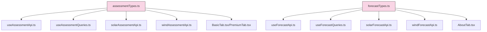

## Overview

This document provides a visual representation of the data flow in the HYREF assessment components, from user input to API response and visualization. The document focuses on the assessment workflow, which is a core functionality of the application.

## Architecture Diagram

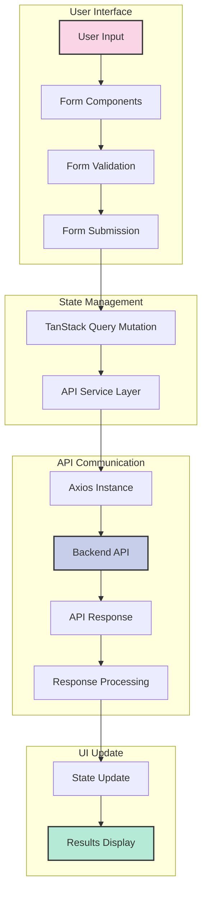

## Detailed Data Flow

### 1. User Input Collection

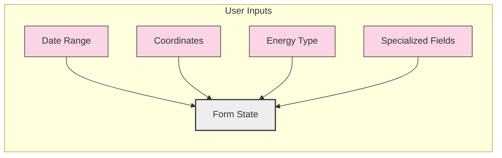

The user interacts with various form components:

- **DateRangeInputs**: Collects start and end dates
- **CoordinateInputs**: Captures latitude and longitude
- **Energy Type Toggle**: Switches between solar and wind assessments
- **Specialized Fields**:
  - For Solar: tilt, azimuth, tracking, capacity
  - For Wind: hub height, power curve model

### 2. Form Validation Process

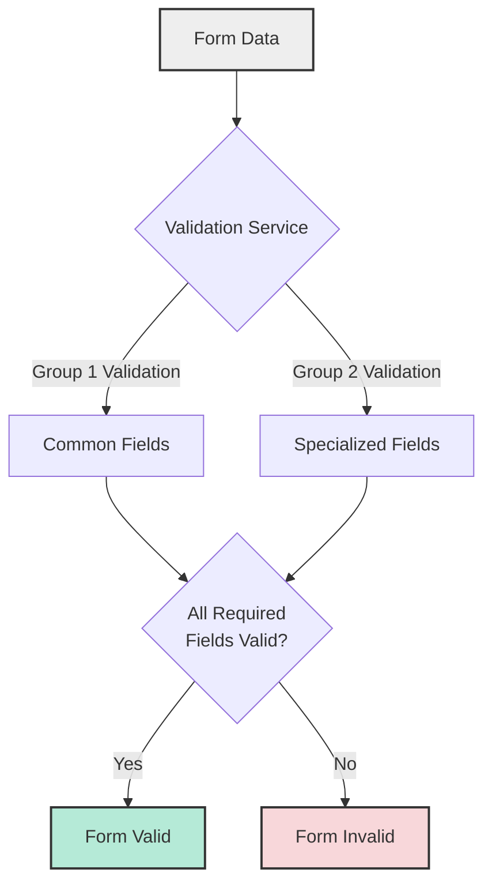

- **useAssessmentFormValidation**: Custom hook that validates form data
- **Validation Groups**:
  - Group 1: Common fields (dates, coordinates)
  - Group 2: Specialized fields based on energy type
- **Validation Rules**: Date ranges, coordinate formats, required fields

### 3. API Request Flow

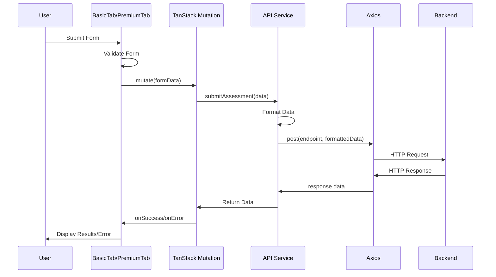

1. **Form Submission**: User submits the form
2. **Data Transformation**:
   - String values converted to appropriate types
   - Dates formatted to ISO strings
3. **API Call**:
   - TanStack Query mutation executes
   - API service formats and sends the request
4. **Response Handling**:
   - Success: Results displayed to user
   - Error: Error messages logged and displayed

### 4. Data Structure Transformation

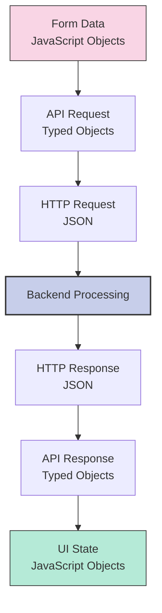

**Form Data to API Request:**

```typescript
// Form Data (Component State)
{
  startDate: "2025-03-01",
  endDate: "2025-03-31",
  latitude: "37.7749",
  longitude: "-122.4194"
}

// API Request (After Transformation)
{
  startDate: "2025-03-01T00:00:00.000Z",
  endDate: "2025-03-31T00:00:00.000Z",
  latitude: 37.7749,
  longitude: -122.4194
}
```

**API Response to UI State:**

```typescript
// API Response
{
  assessmentId: "a123456",
  results: {
    averageDailyProduction: 42.5,
    totalProduction: 1275,
    efficiencyRating: "High"
  },
  metadata: {
    // Additional information
  }
}

// UI State (For Results Display)
{
  data: {
    // API response data
  },
  energyType: "solar",
  startDate: "2025-03-01",
  endDate: "2025-03-31"
}
```

## Component Interaction

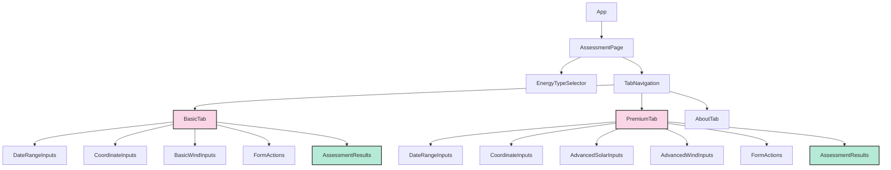

## TanStack Query Implementation

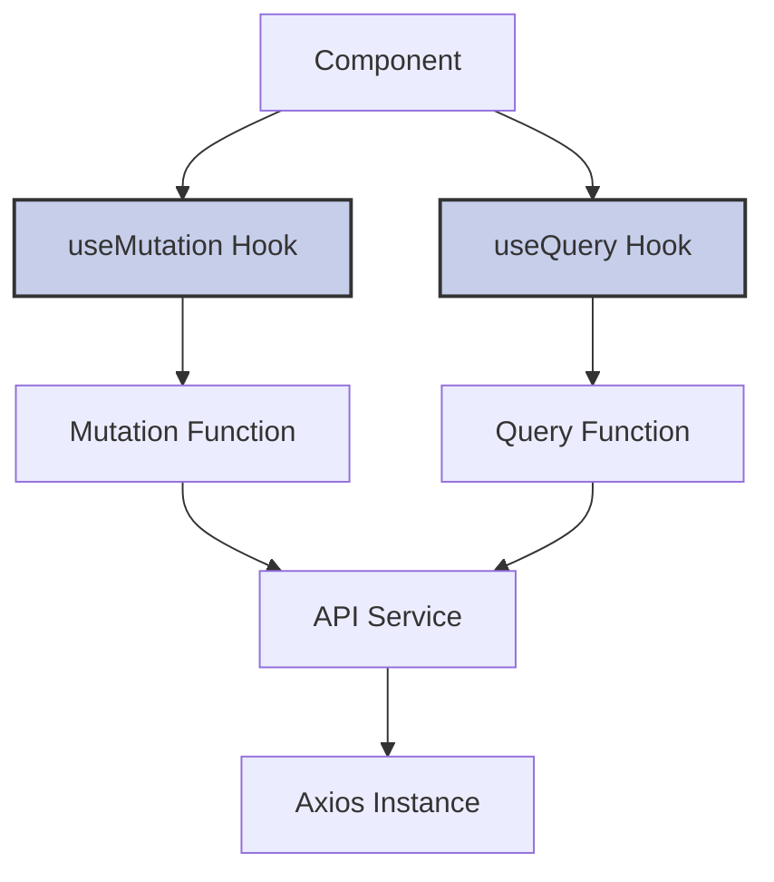

**Key Components:**

1. **useMutation**: Handles form submissions

   ```typescript
   const solarMutation = useMutation<SolarAssessmentApiResponse, AxiosError, BasicSolarAssessmentRequest>({
     mutationFn: submitBasicSolarAssessment,
   });
   ```

2. **useQuery**: Fetches data

   ```typescript
   const { data, isLoading } = useQuery<AssessmentApiResponse, Error>({
     queryKey: ["assessment", "solar", "about"],
     queryFn: getSolarAbout,
   });
   ```

3. **Query Keys**: Structured hierarchically

   ```typescript
   ["assessment", "solar", "about"]
   ["assessment", "wind", "basic", startDate, endDate, latitude, longitude, height]
   ```

## Error Handling Flow

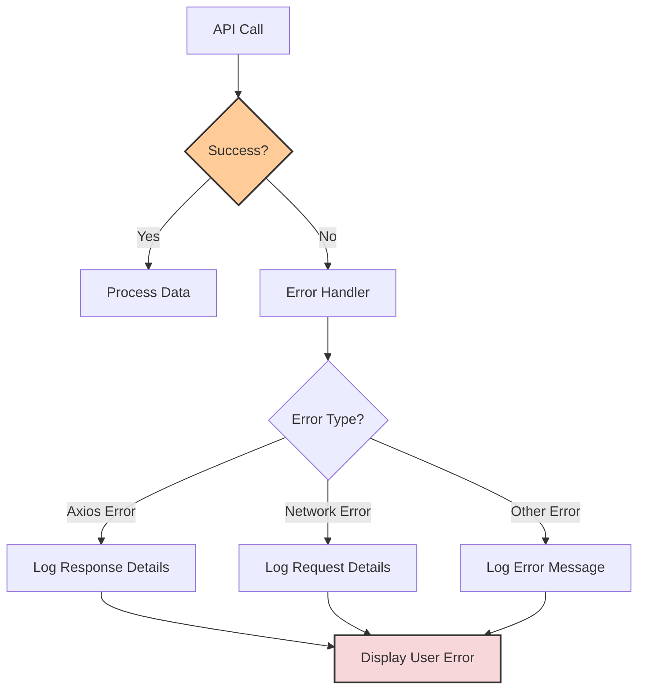

Error handling is implemented with detailed logging:

```typescript
onError: (error: Error) => {
  console.error("Assessment error:", error);
  if (error instanceof AxiosError && error.response) {
    console.error("Error response data:", error.response.data);
    console.error("Error response status:", error.response.status);
  } else if (error instanceof AxiosError && error.request) {
    console.error("Error request:", error.request);
  } else {
    console.error("Error message:", error.message);
  }
}
```

## Energy Type Switching Behavior

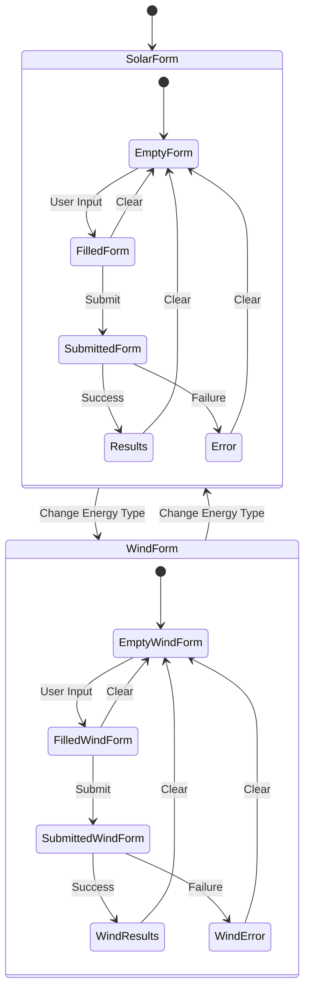

When switching energy types:

1. All form fields are reset to default values
2. All validation states are cleared
3. API mutations are reset
4. Previous results are cleared
5. Components are re-rendered with a new key

## Conclusion

This document provides a comprehensive overview of the data flow in the HYREF assessment components. The architecture follows a clean separation of concerns, with distinct layers for UI components, state management, API communication, and data visualization. The use of TanStack Query provides a robust solution for managing API state, caching, and error handling.

## Forecast & Assessment Data Flow Documentation

### Core Components

1. **TrainForecastForm**
   - Handles form submission
   - Data Flow:
     - Receives initialValues from parent
     - Validates using validateForm
     - Submits via useMutation
     - Emits status changes via onMutationStateChange

2. **OrdersView**
   - Displays order status
   - Data Flow:
     - Receives mutationState from parent
     - Shows loading/error states
     - Links to details view

3. **Tab Components (Annual/OneOff)**
   - Manages tab-specific logic
   - Data Flow:
     - Maintains formState
     - Handles submission locks
     - Coordinates between form and view

### API Interaction Flow

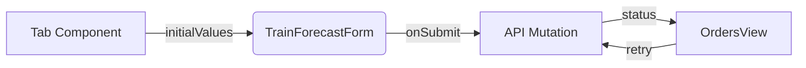

### State Management

- **Local State**: Form inputs, submission locks
- **Mutation State**: isLoading, isError, isSuccess
- **Cross-Component**: Shared via props callbacks

### Key Data Types

- OrderPayload: ISO dates, forecast parameters
- MutationState: { isLoading, isError, error }
