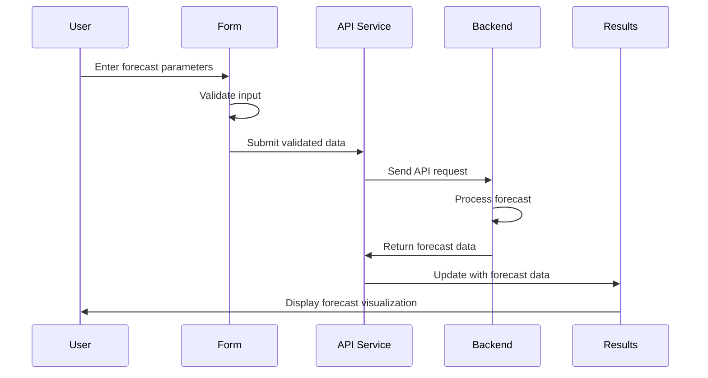

# Forecast Component Documentation

## Table of Contents

1. [Overview](#overview)
2. [Component Structure](#component-structure)
3. [Data Flow](#data-flow)
4. [API Endpoints](#api-endpoints)
5. [Validation](#validation)
6. [State Management](#state-management)
7. [Mutation Handling](#mutation-handling)
8. [Internationalization](#internationalization)
9. [Utility Functions](#utility-functions)
10. [Planned Refactoring](#planned-refactoring)

## Overview

The forecast component provides users with the ability to generate energy production forecasts for solar and wind power plants. It supports two main forecasting services:

1. **One-off Forecasting**: Generates a forecast for a specific time period.
2. **Annual Forecasting**: Generates a forecast for an entire year.

Each service can generate forecasts using one of two methods:

1. **Trained Model**: Uses historical data uploaded by the user to train a model for more accurate forecasts.
2. **Standard Model**: Uses standard models with user-provided specifications.

## Component Structure

The forecast component is organized into the following structure:

```typescript
src/
  components/
    forecast/
      ForecastLayout.tsx       # Main layout component
      OneOffTab.tsx            # Tab for one-off forecasts
      AnnualTab.tsx            # Tab for annual forecasts
      TrainForecastForm.tsx    # Form for trained forecasts
      StandardForecastForm.tsx # Form for standard forecasts
      ForecastResults.tsx      # Display forecast results
      ForecastCharts.tsx       # Visualization components
  hooks/
    useForecastQueries.ts      # Data fetching hooks
    useForecastApi.ts          # API access hooks
  services/
    api/
      solarForecastApi.ts      # Solar forecast API functions
      windForecastApi.ts       # Wind forecast API functions
      forecastTypes.ts         # Type definitions
```

### Key Components

#### ForecastLayout

The main container component that manages:

- Energy type selection (Solar/Wind)
- Tab navigation between One-off and Annual forecasts
- Overall layout and state management

```typescript
const ForecastLayout = () => {
  const [activeTab, setActiveTab] = useState('oneOff');
  const [energyType, setEnergyType] = useState<'solar' | 'wind'>('solar');
  
  return (
    <div className="forecast-container">
      <EnergyTypeSelector 
        value={energyType} 
        onChange={setEnergyType} 
      />
      
      <TabNavigation 
        activeTab={activeTab} 
        onTabChange={setActiveTab} 
      />
      
      {activeTab === 'oneOff' ? (
        <OneOffTab energyType={energyType} />
      ) : (
        <AnnualTab energyType={energyType} />
      )}
    </div>
  );
};
```

#### OneOffTab / AnnualTab

These components manage:

- Toggle between Trained and Standard forecast forms
- Form state management
- Submission handling
- Results display

```typescript
const OneOffTab = ({ energyType }) => {
  const [forecastType, setForecastType] = useState<'trained' | 'standard'>('standard');
  const [formData, setFormData] = useState({});
  const [showResults, setShowResults] = useState(false);
  
  const handleSubmitSuccess = () => {
    setShowResults(true);
  };
  
  return (
    <div>
      <ForecastTypeSelector 
        value={forecastType} 
        onChange={setForecastType} 
      />
      
      {forecastType === 'trained' ? (
        <TrainForecastForm 
          energyType={energyType}
          onSubmitSuccess={handleSubmitSuccess}
          setFormData={setFormData}
        />
      ) : (
        <StandardForecastForm 
          energyType={energyType}
          onSubmitSuccess={handleSubmitSuccess}
          setFormData={setFormData}
        />
      )}
      
      {showResults && (
        <ForecastResults 
          energyType={energyType}
          formData={formData}
        />
      )}
    </div>
  );
};
```

#### TrainForecastForm / StandardForecastForm

These components handle:

- Form input fields
- Validation
- File uploads (for trained forecasts)
- Submission to API

```typescript
const TrainForecastForm = ({ energyType, onSubmitSuccess, setFormData }) => {
  const [formState, setFormState] = useState({
    startDate: '',
    endDate: '',
    latitude: '',
    longitude: '',
    elevation: '',
    // Additional fields based on energy type
  });
  
  const [file, setFile] = useState<File | null>(null);
  const [errors, setErrors] = useState({});
  
  const validateForm = () => {
    // Validation logic
  };
  
  const handleSubmit = async (e) => {
    e.preventDefault();
    if (!validateForm()) return;
    
    // API submission logic
    // On success:
    setFormData(formState);
    onSubmitSuccess();
  };
  
  return (
    <form onSubmit={handleSubmit}>
      {/* Form fields */}
    </form>
  );
};
```

## Data Flow

The forecast component follows this data flow:

1. **User Input**: Collected through form components
2. **Validation**: Performed client-side before submission
3. **API Submission**: Data sent to backend via API services
4. **Data Fetching**: Results retrieved using React Query hooks
5. **State Updates**: Component state updated with results
6. **Rendering**: Results displayed in UI components

### Sequence Diagram



## API Endpoints

The forecast component interacts with the following API endpoints:

### Solar Forecast Endpoints

| Endpoint | Method | Description | Request Payload | Response |
|----------|--------|-------------|-----------------|----------|
| `/api/Forecast/solar_time_series` | GET | Get solar forecast time series data | None | `SolarForecastApiResponse` |
| `/api/Forecast/solar_prediction_comparison` | GET | Get solar prediction comparison data | None | `SolarPredictionComparisonResponse` |
| `/api/Forecast/solar_about` | GET | Get solar forecast about page data | None | `SolarAboutResponse` |
| `/api/Forecast/solar_basic` | POST | Submit standard solar forecast | `SolarBasicForecastRequest` | `SolarForecastResponse` |
| `/api/Forecast/solar_trained` | POST | Submit trained solar forecast | Form data with file | `SolarForecastResponse` |

### Wind Forecast Endpoints

| Endpoint | Method | Description | Request Payload | Response |
|----------|--------|-------------|-----------------|----------|
| `/api/Forecast/wind_time_series` | GET | Get wind forecast time series data | None | `WindForecastApiResponse` |
| `/api/Forecast/wind_prediction_comparison` | GET | Get wind prediction comparison data | None | `WindPredictionComparisonResponse` |
| `/api/Forecast/wind_about` | GET | Get wind forecast about page data | None | `WindAboutResponse` |
| `/api/Forecast/wind_basic` | POST | Submit standard wind forecast | `WindBasicForecastRequest` | `WindForecastResponse` |
| `/api/Forecast/wind_trained` | POST | Submit trained wind forecast | Form data with file | `WindForecastResponse` |

### API Response Types

```typescript
export interface SolarForecastApiResponse {
  forcastvstime: ForecastTimeDataPoint[];
  realvsforecast: RealVsForecastDataPoint[];
  csv_link: string[];
}

export interface ForecastTimeDataPoint {
  time: string;
  forecast: number;
  actual: number;
}

export interface RealVsForecastDataPoint {
  actual: number;
  forecast: number;
  time: string;
}
```

## Validation

The forecast component implements the following validation strategies:

### Client-Side Validation

- **Required Fields**: Checks that all required fields are filled
- **Numeric Validation**: Ensures numeric fields contain valid numbers
- **Range Validation**: Verifies values are within acceptable ranges
- **Date Validation**: Ensures dates are valid and in correct order
- **File Validation**: Checks file types and sizes for uploads

### Validation Implementation

```typescript
const validateLatitude = (value: string): string | null => {
  if (!value) return 'Latitude is required';
  
  const num = parseFloat(value);
  if (isNaN(num)) return 'Latitude must be a number';
  if (num < -90 || num > 90) return 'Latitude must be between -90 and 90';
  
  return null;
};

const validateLongitude = (value: string): string | null => {
  if (!value) return 'Longitude is required';
  
  const num = parseFloat(value);
  if (isNaN(num)) return 'Longitude must be a number';
  if (num < -180 || num > 180) return 'Longitude must be between -180 and 180';
  
  return null;
};

const validateDateRange = (startDate: string, endDate: string): string | null => {
  if (!startDate) return 'Start date is required';
  if (!endDate) return 'End date is required';
  
  const start = new Date(startDate);
  const end = new Date(endDate);
  
  if (isNaN(start.getTime())) return 'Invalid start date';
  if (isNaN(end.getTime())) return 'Invalid end date';
  if (start > end) return 'Start date must be before end date';
  
  return null;
};
```

## State Management

The forecast component uses React's built-in state management with a combination of:

1. **Local Component State**: For form inputs, validation errors, and UI state
2. **React Query**: For server state management, caching, and refetching
3. **Context API**: For shared state across components (when needed)

### React Query Implementation

```typescript
export const useSolarForecastTimeSeriesQuery = () => {
  const { fetchSolarForecastTimeSeries } = useForecastApi();
  return useQuery<SolarForecastApiResponse, Error>({
    queryKey: ['solarForecastTimeSeries'],
    queryFn: fetchSolarForecastTimeSeries,
    staleTime: 5 * 60 * 1000,
    refetchOnWindowFocus: false,
  });
};

export const useWindForecastTimeSeriesQuery = () => {
  const { fetchWindForecastTimeSeries } = useForecastApi();
  return useQuery<WindForecastApiResponse, Error>({
    queryKey: ['windForecastTimeSeries'],
    queryFn: fetchWindForecastTimeSeries,
    staleTime: 5 * 60 * 1000,
    refetchOnWindowFocus: false,
  });
};
```

## Mutation Handling

The forecast component uses React Query mutations to handle form submissions:

```typescript
export const useSolarBasicForecastMutation = () => {
  const { submitSolarBasicForecast } = useForecastApi();
  return useMutation<SolarForecastResponse, Error, SolarBasicForecastRequest>({
    mutationFn: submitSolarBasicForecast,
    onSuccess: (data) => {
      // Handle success
      queryClient.invalidateQueries({ queryKey: ['solarForecastTimeSeries'] });
    },
    onError: (error) => {
      // Handle error
      console.error('Error submitting solar basic forecast:', error);
    },
  });
};

export const useSolarTrainedForecastMutation = () => {
  const { submitSolarTrainedForecast } = useForecastApi();
  return useMutation<SolarForecastResponse, Error, FormData>({
    mutationFn: submitSolarTrainedForecast,
    onSuccess: (data) => {
      // Handle success
      queryClient.invalidateQueries({ queryKey: ['solarForecastTimeSeries'] });
    },
    onError: (error) => {
      // Handle error
      console.error('Error submitting solar trained forecast:', error);
    },
  });
};
```

## Internationalization

The forecast component supports internationalization using the i18next library:

```typescript
import { useTranslation } from 'react-i18next';

const ForecastForm = () => {
  const { t } = useTranslation();
  
  return (
    <form>
      <label>{t('forecast.latitude')}</label>
      <input type="text" placeholder={t('forecast.enterLatitude')} />
      
      <label>{t('forecast.longitude')}</label>
      <input type="text" placeholder={t('forecast.enterLongitude')} />
      
      <button type="submit">{t('common.submit')}</button>
    </form>
  );
};
```

### Translation Keys

Key translation files are organized by feature and language:

```plaintext
src/
  locales/
    en/
      forecast.json
    fr/
      forecast.json
    // Other languages
```

Example translation file (en/forecast.json):

```json
{
  "forecast": {
    "title": "Energy Forecast",
    "oneOff": "One-off Forecast",
    "annual": "Annual Forecast",
    "trained": "Trained Model",
    "standard": "Standard Model",
    "latitude": "Latitude",
    "longitude": "Longitude",
    "elevation": "Elevation (m)",
    "startDate": "Start Date",
    "endDate": "End Date",
    "enterLatitude": "Enter latitude",
    "enterLongitude": "Enter longitude",
    "errorMessages": {
      "requiredField": "This field is required",
      "invalidNumber": "Please enter a valid number",
      "latitudeRange": "Latitude must be between -90 and 90",
      "longitudeRange": "Longitude must be between -180 and 180"
    }
  }
}
```

## Utility Functions

The forecast component uses several utility functions from the `src/utils` directory:

### Date and Time Utilities

```typescript
// src/utils/dateUtils.ts

export const formatDate = (dateString: string): string => {
  const date = new Date(dateString);
  return date.toLocaleDateString();
};

export const formatDateTime = (dateString: string): string => {
  const date = new Date(dateString);
  return date.toLocaleString();
};

export const getDateRange = (startDate: string, endDate: string): string[] => {
  const dates = [];
  let currentDate = new Date(startDate);
  const end = new Date(endDate);
  
  while (currentDate <= end) {
    dates.push(new Date(currentDate).toISOString().split('T')[0]);
    currentDate.setDate(currentDate.getDate() + 1);
  }
  
  return dates;
};
```

### UI Utilities

```typescript
// src/utils/uiUtils.ts

export const formatNumber = (value: number, decimals = 2): string => {
  return value.toFixed(decimals);
};

export const formatPercentage = (value: number): string => {
  return `${(value * 100).toFixed(1)}%`;
};

export const getColorForValue = (value: number, min: number, max: number): string => {
  // Generate color based on value range
  const ratio = (value - min) / (max - min);
  const hue = (ratio * 120).toString(10);
  return `hsl(${hue}, 100%, 50%)`;
};
```

### Environment Utilities

```typescript
// src/utils/envUtils.ts

export const getApiBaseUrl = (): string => {
  return import.meta.env.VITE_API_BASE_URL || '';
};

export const isDevEnvironment = (): boolean => {
  return import.meta.env.DEV === true;
};

export const getEnvironmentName = (): string => {
  return import.meta.env.VITE_ENVIRONMENT_NAME || 'development';
};
```

### Authentication Utilities

```typescript
// src/utils/authUtils.ts

export const getAuthToken = (): string | null => {
  return localStorage.getItem('authToken');
};

export const setAuthToken = (token: string): void => {
  localStorage.setItem('authToken', token);
};

export const clearAuthToken = (): void => {
  localStorage.removeItem('authToken');
};

export const isAuthenticated = (): boolean => {
  const token = getAuthToken();
  if (!token) return false;
  
  // Add token validation logic if needed
  return true;
};
```

## Planned Refactoring

The forecast component has several areas identified for future refactoring:

1. **Form Abstraction**: Create a more generic form handling system to reduce duplication between TrainForecastForm and StandardForecastForm

2. **API Service Consolidation**: Refactor the solar and wind API services to share common functionality

3. **Enhanced Error Handling**: Implement more robust error handling and user feedback

4. **Performance Optimization**: Add memoization and lazy loading to improve performance

5. **Accessibility Improvements**: Ensure all components meet WCAG 2.1 AA standards

6. **Test Coverage**: Increase unit and integration test coverage

7. **Mock API Implementation**: Create a mock API system for development and testing without backend dependencies
