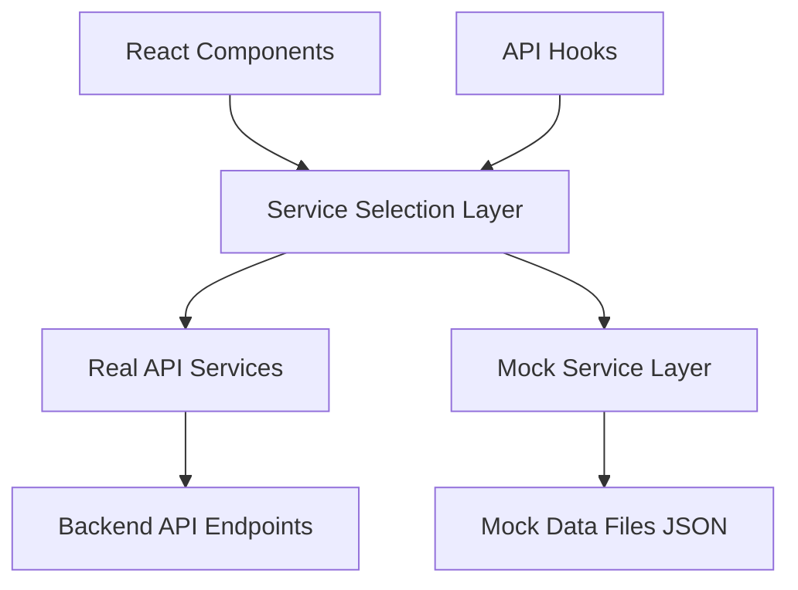

# Toggling Between Real and Mock API Calls

## Overview

This document outlines the implementation strategy for creating a flexible system that allows toggling between real API calls and mock data for the forecast component. This approach enables development, testing, and demonstrations without requiring a connection to the backend services.

## Table of Contents

1. [Architecture](#architecture)
2. [Implementation Steps](#implementation-steps)
3. [Configuration](#configuration)
4. [Mock Data Structure](#mock-data-structure)
5. [Usage Examples](#usage-examples)
6. [Best Practices](#best-practices)
7. [Troubleshooting](#troubleshooting)

## Architecture

The toggle system uses a layered approach:

1. **Configuration Layer**: Environment variables and toggle flags
2. **Service Selection Layer**: Logic to choose between real and mock services
3. **Mock Service Layer**: Implementation of mock API functions
4. **Mock Data Layer**: JSON files containing mock responses

This architecture preserves all existing API call code while adding a parallel mock implementation path.



## Implementation Steps

### 1. Create Mock Configuration Module

```typescript
// src/services/mockData/config.ts
export const ENABLE_MOCK_API = import.meta.env.VITE_USE_MOCK_API === 'true' || false;

// Optional: Add more granular control
export const mockConfig = {
  enableMockAPI: ENABLE_MOCK_API,
  simulateNetworkDelay: true,
  networkDelayMs: 800, // Simulate realistic network delay
  simulateErrors: false, // Occasionally return errors to test error handling
  errorRate: 0.1, // 10% of requests will fail if simulateErrors is true
};

// Helper function to simulate network delay
export const simulateNetworkDelay = async (): Promise<void> => {
  if (mockConfig.simulateNetworkDelay) {
    await new Promise(resolve => setTimeout(resolve, mockConfig.networkDelayMs));
  }
};
```

### 2. Create Mock Data Directory Structure

```plaintext
src/
  services/
    mockData/
      config.ts
      solar/
        timeSeriesData.json
        predictionComparisonData.json
        aboutData.json
      wind/
        timeSeriesData.json
        predictionComparisonData.json
        aboutData.json
      solarForecastMockApi.ts
      windForecastMockApi.ts
```

### 3. Implement Mock API Services

```typescript
// src/services/mockData/solarForecastMockApi.ts
import { simulateNetworkDelay, mockConfig } from './config';
import timeSeriesData from './solar/timeSeriesData.json';
import predictionComparisonData from './solar/predictionComparisonData.json';
import aboutData from './solar/aboutData.json';
import { SolarForecastApiResponse } from '../api/forecastTypes';

export const getMockSolarForecastTimeSeries = async (): Promise<SolarForecastApiResponse> => {
  await simulateNetworkDelay();
  
  // Optionally simulate errors
  if (mockConfig.simulateErrors && Math.random() < mockConfig.errorRate) {
    throw new Error('Simulated network error in getMockSolarForecastTimeSeries');
  }
  
  return timeSeriesData as SolarForecastApiResponse;
};

// Implement other mock API functions similarly
```

### 4. Modify API Service Files

```typescript
// src/services/api/solarForecastApi.ts
import { ENABLE_MOCK_API } from '../mockData/config';
import { getMockSolarForecastTimeSeries } from '../mockData/solarForecastMockApi';

export const getSolarForecastTimeSeries = async (): Promise<SolarForecastApiResponse> => {
  // Use mock implementation if enabled
  if (ENABLE_MOCK_API) {
    return getMockSolarForecastTimeSeries();
  }
  
  // Otherwise use the real API
  try {
    const response = await axiosInstance.get<SolarForecastApiResponse>("/api/Forecast/solar_time_series");
    return response.data;
  } catch (error) {
    console.error('❌ API Error in getSolarForecastTimeSeries:', error);
    throw error;
  }
};

// Modify other API functions similarly
```

### 5. Add Visual Indicator for Mock Mode

```typescript
// src/components/common/MockApiIndicator.tsx
import React from 'react';
import { ENABLE_MOCK_API } from '../../services/mockData/config';

export const MockApiIndicator: React.FC = () => {
  if (!ENABLE_MOCK_API) return null;
  
  return (
    <div className="fixed bottom-4 right-4 bg-yellow-100 text-yellow-800 px-4 py-2 rounded-md shadow-md text-sm font-medium z-50">
      Using Mock API Data
    </div>
  );
};

// Add to your layout component
// <MockApiIndicator />
```

## Configuration

### Environment Variables

Add to your `.env.development` file:

```makefile
# Enable mock API for development
VITE_USE_MOCK_API=true
```

For production or when testing against real APIs:

```makefile
# Disable mock API for production
VITE_USE_MOCK_API=false
```

### Runtime Toggle

For more flexibility, you can create a UI toggle that changes the setting at runtime:

```typescript
// src/context/MockApiContext.tsx
import React, { createContext, useState, useContext, useEffect } from 'react';

interface MockApiContextType {
  useMockApi: boolean;
  toggleMockApi: () => void;
}

const MockApiContext = createContext<MockApiContextType | undefined>(undefined);

export const MockApiProvider: React.FC<{ children: React.ReactNode }> = ({ children }) => {
  const [useMockApi, setUseMockApi] = useState(() => {
    // Initialize from localStorage or environment variable
    const savedValue = localStorage.getItem('useMockApi');
    return savedValue !== null 
      ? savedValue === 'true' 
      : import.meta.env.VITE_USE_MOCK_API === 'true';
  });

  // Save to localStorage when changed
  useEffect(() => {
    localStorage.setItem('useMockApi', String(useMockApi));
    // Optionally force reload to ensure all components use the new setting
    // window.location.reload();
  }, [useMockApi]);

  const toggleMockApi = () => setUseMockApi(prev => !prev);

  return (
    <MockApiContext.Provider value={{ useMockApi, toggleMockApi }}>
      {children}
    </MockApiContext.Provider>
  );
};

export const useMockApi = (): MockApiContextType => {
  const context = useContext(MockApiContext);
  if (context === undefined) {
    throw new Error('useMockApi must be used within a MockApiProvider');
  }
  return context;
};
```

## Mock Data Structure

### Example Mock Data File

```json
// src/services/mockData/solar/timeSeriesData.json
{
  "forcastvstime": [
    {
      "time": "2025-03-19T00:00:00",
      "forecast": 0,
      "actual": 0
    },
    {
      "time": "2025-03-19T01:00:00",
      "forecast": 0,
      "actual": 0
    }
    // More data points...
  ],
  "realvsforecast": [
    {
      "actual": 0,
      "forecast": 0,
      "time": "2025-03-19T00:00:00"
    }
    // More data points...
  ],
  "csv_link": ["https://example.com/mock-data.csv"]
}
```

### Data Generation Utilities

For generating realistic mock data:

```typescript
// src/services/mockData/utils/generateMockData.ts
export const generateTimeSeriesData = (
  startDate: Date,
  days: number,
  peakValue: number
) => {
  const data = [];
  const currentDate = new Date(startDate);
  
  for (let day = 0; day < days; day++) {
    for (let hour = 0; hour < 24; hour++) {
      currentDate.setHours(hour);
      
      // Generate a bell curve for solar production (daylight hours)
      let forecast = 0;
      if (hour >= 6 && hour <= 18) {
        // Simple bell curve centered at noon
        const hourFromNoon = Math.abs(hour - 12);
        forecast = peakValue * Math.exp(-(hourFromNoon * hourFromNoon) / 8);
      }
      
      // Add some randomness
      const actual = forecast * (0.8 + Math.random() * 0.4);
      
      data.push({
        time: currentDate.toISOString(),
        forecast: Math.round(forecast * 100) / 100,
        actual: Math.round(actual * 100) / 100
      });
    }
    
    // Move to next day
    currentDate.setDate(currentDate.getDate() + 1);
  }
  
  return data;
};
```

## Usage Examples

### Toggling Mock API in Development

```typescript
// In your API service file
import { useMockApi } from '../context/MockApiContext';

export const YourComponent = () => {
  const { useMockApi, toggleMockApi } = useMockApi();
  
  return (
    <div>
      <button onClick={toggleMockApi}>
        {useMockApi ? 'Switch to Real API' : 'Switch to Mock API'}
      </button>
      
      {/* Your component content */}
    </div>
  );
};
```

### Testing Form Submissions with Mock API

```typescript
// src/services/mockData/solarForecastMockApi.ts
export const mockSubmitSolarBasicForecast = async (data: any) => {
  await simulateNetworkDelay();
  
  console.log('Mock API: Submitted solar basic forecast data', data);
  
  // Return a successful response
  return {
    success: true,
    message: 'Forecast generated successfully',
    // Include any other fields your real API would return
  };
};

// In your API service file
export const submitSolarBasicForecast = async (data: SolarBasicForecastRequest): Promise<SolarForecastResponse> => {
  if (ENABLE_MOCK_API) {
    return mockSubmitSolarBasicForecast(data);
  }
  
  // Real API implementation
  try {
    const response = await axiosInstance.post<SolarForecastResponse>("/api/Forecast/solar_basic", data);
    return response.data;
  } catch (error) {
    console.error('❌ API Error in submitSolarBasicForecast:', error);
    throw error;
  }
};
```

## Best Practices

1. **Keep Mock Data Realistic**:
   - Use actual API responses as templates for mock data
   - Ensure all required fields are present
   - Maintain the same data structure as real API responses

2. **Simulate Network Conditions**:
   - Add realistic delays to mock responses
   - Occasionally simulate errors to test error handling
   - Vary response times to simulate network fluctuations

3. **Type Safety**:
   - Ensure mock implementations return data with the same types as real APIs
   - Use TypeScript interfaces to enforce consistency

4. **Documentation**:
   - Document all mock API functions
   - Include examples of mock data structure
   - Provide clear instructions for toggling between real and mock APIs

5. **Maintainability**:
   - Keep mock data separate from mock implementation
   - Update mock data when API contracts change
   - Use constants for configuration values

## Troubleshooting

### Common Issues

1. **Mock API Not Working**:
   - Check if `VITE_USE_MOCK_API` is set to 'true' in your `.env` file
   - Verify that the mock implementation is being called
   - Check browser console for errors

2. **Type Errors**:
   - Ensure mock data matches the expected types
   - Check for missing or null properties in mock data

3. **Inconsistent Behavior**:
   - Clear localStorage if using runtime toggle
   - Restart the development server
   - Check for conditional logic that might affect API calls

### Debugging

Add debug logging to track which implementation is being used:

```typescript
export const getSolarForecastTimeSeries = async (): Promise<SolarForecastApiResponse> => {
  if (ENABLE_MOCK_API) {
    console.debug('Using MOCK implementation of getSolarForecastTimeSeries');
    return getMockSolarForecastTimeSeries();
  }
  
  console.debug('Using REAL implementation of getSolarForecastTimeSeries');
  // Real implementation...
};
