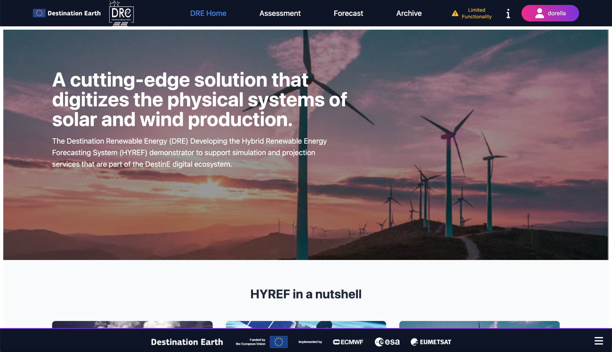
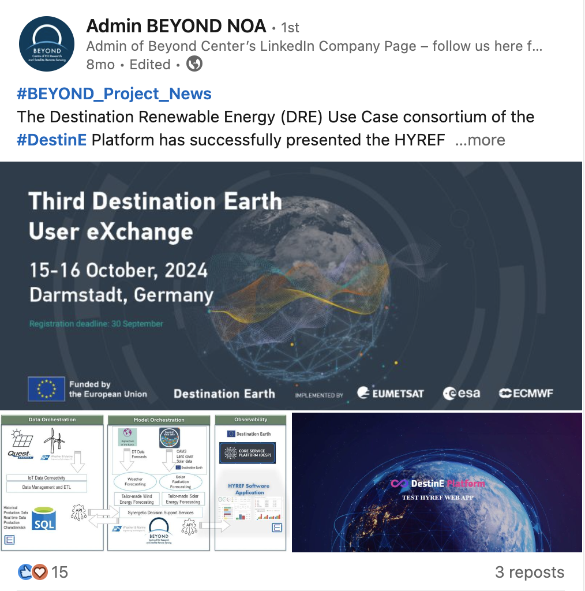
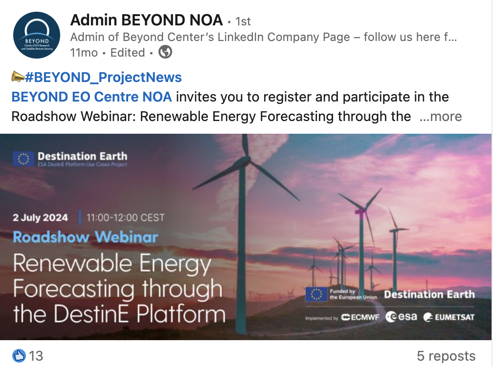
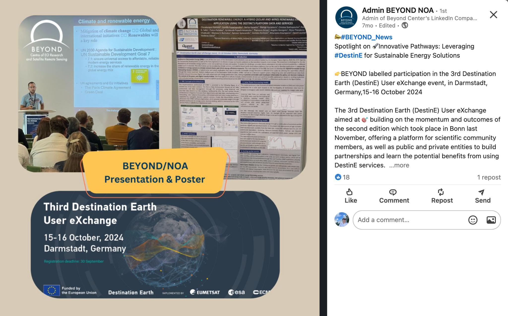

***

**Destination Renewable Energy (DRE)**

**Final Report**

***

Ref.: DestinE_ESA_DRE\_ Final_Report \_v1.1

**Author's Table**

| Written by:  | George Koutalieris Symeon Symeonidis Theodora Papadopoulou Rizos-Theodoros Chadoulis Aggelos Georgakis Christos Stathopoulos Platon Patlakas | ENORA INNOVATION ENORA INNOVATION NOA NOA NOA WeMET PC WeMET PC |
|--------------|----------------------------------------------------------------------------------------------------------------------------------------------|-----------------------------------------------------------------|
| Verified by: | Theodora Papadopoulou                                                                                                                        | NOA                                                             |
| Approved by: | Haris Kontoes                                                                                                                                | NOA                                                             |

**Change Log**

| **Issue** | **Date**     | **Reason for change**                                                                                          | **Section(s) changed** |
|-----------|--------------|----------------------------------------------------------------------------------------------------------------|------------------------|
| 1.0       | 17 June 2025 | Creation of the document                                                                                       |                        |
| 1.1       | 16 July 2025 | Reply to Starion TO comments to include the workaround regarding Dt data, remove mention to DOSI tickets, etc. | Section 4 & 7.3        |

***

**Table of Contents**

[**1. Introduction 4**](#introduction)

[1.1. Purpose of the Document 4](#purpose-of-the-document)

[**2. DRE Overview 5**](#dre-overview)

[2.1. Objectives 5](#objectives)

[2.2. Target End Users & Benefits 5](#target-end-users--benefits)

[**3. Use Case Development 7**](#use-case-development)

[**4. Integration on DestinE Platform 11**](#_heading=h.ez1h0nd1aeyo)

[**5. Verification & Validation 13**](#verification--validation)

[5.1. Technical Verification 13](#technical-verification)

[5.2. User Validation & Testimonials 13](#user-validation--testimonials)

[**6. Outreach & Communications 15**](#outreach--communications)

[**7. Roadmap & Future Evolution 19**](#roadmap--future-evolution)

[7.1. Strategic Direction 19](#strategic-direction)

[7.2. Exploitation Activities 20](#exploitation-activities)

[7.3. Commercialisation 21](#commercialisation)

[7.4. Funding and Investment Opportunities 23](#funding-and-investment-opportunities)

[7.5. Future Directions 24](#future-directions--next-steps)

# Introduction

## Purpose of the Document

This document is the Final Report of the Destination Renewable Energy (DRE) Use Case project. It summarizes all the activities performed during the DRE Use Case Project, from its conception to development, integration on the DestinE platform, validation, and operationalisation.

***

It consolidates the efforts undertaken during the Use Case's 18-month duration, focusing on leveraging the outcomes to benefit renewable energy stakeholders. It assesses the sustainability of the forecasting system and its application across various energy-related domains while addressing the pressing demand for clean and efficient energy solutions from economic, environmental, and social perspectives. In addition, it lists the outreach and communication activities undertaken to spread the word and raise awareness on what DRE does. Finally, it also looks forward in its exploitation strategy and future evolution, with the ultimate goal to keep DRE alive and continuously evolving.

***

## Background

***

The last eight years have been the hottest on record and there is a scientific consensus that immediate action is needed to reduce greenhouse gas (GHG) emissions. Energy is at the heart of the challenge of achieving both the 2030 Agenda for Sustainable Development and the Paris Agreement on climate change.

***

Renewable energy systems (solar and wind) are weather and climate dependent, so the transition to clean energy requires improved climate information and services for the energy sector. Climate services and satellite data are tools that can be used to develop applications that can ensure the resilience of energy systems to climate-related shocks and inform energy efficiency measures. For example, the daily energy market requires accurate and detailed information on solar and wind availability at different spatial scales, from rooftop to regional and national levels, which can only be provided by models or satellite-based Earth observation platforms.

***

The idea of DRE is based on the concept of bringing together NOA’s solar energy model and WeMET’s wind energy model to build a hybrid system where outputs for both Renewable Energy Sources (RES) would be made available to the end users. This, combined with the use of DestinE Data Lake data and [Weather-Induced Extremes Digital Twin](https://destine.ecmwf.int/news/a-digital-twin-to-sharpen-our-vision-of-extreme-weather/) data, all available and interconnected in a single platform, creates a unique capability for users.

***

# DRE Overview

The DRE Use Case is a flagship demonstrator within the DestinE initiative. It focuses on designing, developing and operationalising a cutting-edge hybrid system for renewable energy assessment and short-term forecasting, integrating wind and solar resources. Its primary objective is to deliver accurate, site-specific, short-term (0–2 days ahead) renewable energy power output forecasts with high temporal and spatial resolution.

This system addresses critical operational needs accross the renewable energy value chain, enabling stakeholders to anticipate fluctuations in solar and wind output and make informed decisions regarding energy production, storage, dispatch, and market participation.

The system leverages the capabilities of the full technological stack of the Destination Earth (DestinE) platform, including the DestinE Core Service Platform (DESP), the Digital Twin Engine (DTE), and the Data Lake (DEDL). These components enable the DRE Use Case to provide robust, data-driven services for both **resource assessment** and **short-term forecasting**, advancing Europe’s transition to a digital, resilient, and carbon-neutral energy future.

## Objectives

***

The three key objectives of the DRE application are:

1\. Hybrid Forecasting: Integrate solar and wind energy data to improve forecasting accuracy using DestinE’s system capabilities.

2\. Decision Support: Provide stakeholders with actionable insights to support informed decisions on energy consumption, storage, and trading strategies.

3\. Scalability: Using advanced DestinE and DestinE Core Service Platform (DESP) data streams, develop a solution that can be adapted to various spatial scales, from local installations to regional grids.

## Target End Users & Benefits

***

Identifying target users is crucial for ensuring the effective utilisation of the results and findings of the DRE Use Case. Engaging these users and maintaining their interest in the Use Case's progress is key to its success, especially after the end of the project, when the service becomes operational. The Use Case coordination, in collaboration with the consortium, has developed a list of primary stakeholders and interested parties to keep the system's tools and outputs relevant and impactful.

The main target users identified for the DRE Use Case and its associated outcomes are as follows:

1.  **Renewable Energy Producers**: Companies and organisations operating solar and wind farms, as well as individual energy producers, seek accurate forecasts to optimise production and distribution.
2.  **Policy Makers and Regulators**: National and regional authorities responsible for energy policy, climate action plans, and renewable energy incentives, requiring reliable data for informed decision-making.
3.  **Energy Traders and Market Operators**: Professionals and companies involved in energy trading rely on forecasts to enhance market strategies and trading efficiency.
4.  **Energy Storage Developers**: Organisations focusing on battery storage or other energy storage technologies, utilising forecasts to maximise storage efficiency and integration with renewable sources.
5.  **Academic and Research Institutions**: Researchers, scientists, and students interested in renewable energy forecasting, hybrid energy models, and climate-resilient energy systems.
6.  **Consultancy Firms**: Professionals providing advisory services in renewable energy optimisation, grid management, and sustainable energy transitions.
7.  **Regional Energy Networks**: Organisations, associations, and governmental bodies supporting renewable energy transitions at regional and national levels, focusing on sustainability and innovation.
8.  **Environmental Advocacy Groups**: NGOs and organisations promoting clean energy adoption and climate resilience, utilising system insights for advocacy and outreach.
9.  **EO experts** with a general interest in various EO applications, willing to learn how to use DRE.

This list ensures that the **DRE** is tailored to the needs of its diverse stakeholders, fostering adoption and maximising the Use Case's impact across the renewable energy sector.

The key benefits for end users include:

-   Improved Efficiency: Enhance energy portfolios by optimising consumption, storage, and trading strategies.
-   Informed Planning: Support infrastructure development and investment decisions using high-precision forecasts.
-   Broader Impact: Contribute to the green and digital transformation of the energy sector by advancing the integration of Renewable Energy Sources (RES).
-   Smart Living Solutions: Leverage AI-powered smart home technologies to offer end users greater control over their energy use, aligning with modern sustainability goals and cost optimisation.

The DRE Use Case exemplifies how advanced forecasting and decision-support tools can empower stakeholders to address challenges related to renewable energy integration and climate resilience, driving the transition toward a sustainable energy future.

# Use Case Development

​The DRE (Destination Earth Renewable Energy) Use Case supports the transition to renewable energy sources (RES) by offering a robust suite of tools for site potential assessment and energy output forecasting. Tailored for energy experts, asset managers, and producers, these services are designed to improve decision-making throughout the RES lifecycle—from feasibility analysis to operational management.

The transition to renewable energy requires robust tools for assessing site potential and predicting energy output. This Use Case supports this transition by delivering services that help evaluate wind and solar resources based on reliable, high-quality climate data. The services provide essential capabilities for informed decision-making at all stages of project development, from feasibility studies to operational management. In addition to long-term resource assessments, a 2-day forecast feature is included to support short-term operational planning. This functionality enables users to anticipate near-future energy production, optimize scheduling for maintenance or grid integration, and manage energy dispatch more efficiently, which is particularly valuable for operators, asset managers, and energy traders aiming to maximize performance and revenue.

**​Key Capabilities:**

**​Site Potential Assessment**

-   ​Wind and Solar Resource Evaluation: Enables users to assess the production capacity of selected RES sites.
-   ​High-Quality Climate Data: Utilizes reliable datasets available through the DestinE platform for accurate modeling.

**​Energy Production Forecasting**

-   ​Long-Term Assessments:
    -   ​Provides detailed estimations for annual and seasonal production outputs.
-   ​Short-Term Forecasting:
    -   ​Offers 48-hour ahead predictions to support real-time operations.
    -   ​Helps optimize grid integration, scheduling maintenance, and energy dispatching.

**​Strategic value**

​DRE is deploying a set of carefully configured services that establish essential capabilities on the DestinE platform, empowering energy experts and producers to make informed decisions across all stages of renewable energy (RES) production. These services support activities ranging from feasibility studies to operational management, with the aid of daily 48-hour energy forecasts.

​In addition to long-term resource assessments, the platform includes a 2-day forecasting feature that supports short-term operational planning. This functionality enables users to anticipate near-future energy production, optimize maintenance schedules and grid integration, and manage energy dispatch more effectively. These capabilities are particularly valuable for operators, asset managers, and energy traders aiming to maximize performance and revenue.

These capabilities are made possible through the strategic exploitation of the DestinE platform and its suite of advanced tools, services, and databases. By leveraging DestinE’s high-resolution Digital Twins of the Earth, open-access climate data repositories, and computational infrastructure, the Use Case ensures access to consistent, state-of-the-art information. This integration enhances the accuracy, spatial coverage, and usability of the services, empowering users across the renewable energy community to make data-driven decisions that accelerate the energy transition.

Towards the development of the Use Case, to ensure reliability, adequacy, global applicability, and precision, the following data criteria were defined:

-   Long time series

***

-   Global geographic coverage

***

-   High spatial resolution
-   High temporal frequency
-   Community recognized

To meet the above criteria and ensure robustness across both solar and wind energy services, the following data sources and tools were selected and integrated:

**ERA5 hourly data on single levels**: Provided by the Copernicus Climate Data Store (CDS), <https://cds.climate.copernicus.eu/datasets/reanalysis-era5-single-levels?tab=overview>, ERA5 delivers hourly meteorological data on certain levels. It includes key atmospheric variables, such as wind speed at altitudes relevant to wind resource assessment, providing a foundational dataset for wind energy analysis.

**CAMS Solar Radiation Service**: Offered by the Copernicus Atmosphere Monitoring Service (CAMS), <https://ads.atmosphere.copernicus.eu/datasets/cams-gridded-solar-radiation?tab=overview>), high-quality solar variables such as Global Horizontal Irradiance (GHI) and Direct Normal Irradiance (DNI) are available for solar energy analysis.

**Weather-Induced Extremes Digital Twin**: This service from the DestinE platform, <https://destine.ecmwf.int/weather-induced-extremes-digital-twin-1/>, was incorporated to enhance short-term forecasting capabilities. It enables high-resolution, data-driven simulations of extreme weather events, supporting more accurate energy forecasts.

Furthermore, the integration of DestinE’s Digital Twin in combination with machine learning techniques enables statistical downscaling of coarse-resolution weather data, effectively adjusting predictions to site-level conditions. This approach captures the distinct characteristics of each location and unresolved features, such as terrain complexity and local microclimates, significantly improving the accuracy and relevance of the outputs. As a result, users benefit from more precise information for energy planning, infrastructure design, and operational decision-making.

The development of the DRE Use Case service followed a modular and scalable approach, ensuring reliability, maintainability, and smooth deployment in a cloud-native environment. Development began with the creation of standalone scripts to automate the complete workflow for each service:

-   **Data acquisition**: Automatically fetching from the DestinE platform, climate datasets of ERA5, CAMS, and Digital Twin.
-   **Pre-processing**: Handling spatial interpolation, time alignment, regridding, and variable transformation.
-   **Analysis**: Performing domain-specific computations such as radiation and wind speed statistics, as well as energy yield calculations.

These scripts formed the foundation of the services, eventually evolving into more integrated and ready for production components.

Development was carried out primarily in Python, with several key open-source libraries. Indicative examples are the xarray, pandas, and numpy libraries for handling large datasets, interpolation and regridding processes, the fastapi, uvicorn, and requests for API interaction and asynchronous data fetching, and scikit-learn and xgboost for implementing machine learning techniques.

To ensure consistency and portability across environments, each service was encapsulated in Docker containers. This guaranteed the same behavior in local development, staging, and production environments, regardless of system dependencies.

A robust CI/CD pipeline was implemented using GitLab CI/CD, allowing automated code testing, Docker image building, and deployment to the registry and cluster. This setup facilitated quick iterations and ensured the reproducibility of builds across development cycles.

The Docker images were published to Harbor, a private container registry, which provided secure and organized storage for the service images. Images were versioned to allow controlled updates and the ability to revert to previous versions if needed.

Deployment was orchestrated using Rancher, which enabled cluster management, load balancing, and scalability of services. Rancher also facilitated secure access control and resource monitoring.

All services were unified under a central web application that served as the User Interface (UI). The UI facilitated user interaction and provided access to:

-   Site-specific wind and solar assessment services.

***

-   2-day forecasting capabilities for operational planning.

***

-   Input forms for location and park configurations.

***

-   Interactive visualizations and downloadable outputs.

***

This design ensured a seamless experience for users, abstracting the complexity of backend computations behind a simple, intuitive interface.

The final result of the Use Case development was a fully web-based application, accessible via a secure URL and supporting secure login and logout. The service offers a user-friendly interface where users can configure and submit requests for resource assessment or energy forecasting. The results are delivered in several formats: downloadable CSV files containing raw and processed data, summary statistics, and performance indicators that support decision-making. Additionally, users receive clear visual graphs that make it easier to understand and interpret the results.

# Integration on DestinE Platform

​The integration of the DRE Use Case into the DestinE Platform (DESP) represented a critical milestone in ensuring interoperability, compliance, and operational readiness within the European digital ecosystem. This process was carried out in close coordination between the DRE consortium partners and Serco, the platform’s technical operator. All integration phases were executed following an onboarding framework guided by the platform provider (SERCO) via the DOSI ticketing system and supported by modern DevOps methodologies.

​The DRE partners successfully completed the Identity and Access Management (IAM) integration, using the DESP testing environment provided through Keycloak (https://iam.ivv.desp.space/realms/desp). ENORA led this effort by verifying user authentication and access mechanisms. The tests confirmed that DRE service users could authenticate using DESP credentials and gain access to protected client services through a standardized login process.

​The integration was supported by a centralized Jira issue-tracking system managed by Serco. Each DOSI ticket defined a specific technical, security, or documentation requirement essential for service readiness. The DRE partners followed these tickets diligently, using them as procedural and technical guidance throughout the onboarding cycle. ​

​Parallel to the IAM integration, the DRE team finalized the API specifications for the solar and wind forecasting services. This effort involved defining input and output data schemas to ensure consistency with DESP’s expectations for interoperability. The specifications were documented using Swagger (OpenAPI) for machine-readable API definitions and Sphinx for generating human-readable user guides. This dual-format documentation enabled seamless integration with the web portal and user onboarding.

As the team has experienced a regular unavailability of DT data, which ESA and the platform provider also confirmed, a workaround was put in place. In the absence of current Weather-Induced Extremes Digital Twin data, the solar forecast outputs displayed are based on a recent available forecast. This means that the results viewed by users may correspond to a previous forecast issued at an earlier date. Forecast accuracy may be affected as a result.

A dedicated disclaimer appears in DRE services using DT data as input, so that users can be informed in advance and take this into account when interpreting the results.

​The development lifecycle was managed through a modern continuous integration/continuous delivery (CI/CD) pipeline. The code committed to the GitLab repository triggered automatic build jobs in a secure, cloud-based environment. Once built, the application code was containerized into Docker images. These containers were then pushed to the Harbor registry, ensuring centralized management of deployable artifacts. Deployment was completed via Rancher, enabling scalable and consistent service deployment onto the designated infrastructure.

​This automated deployment pipeline contributed to high availability, traceability, and operational reliability while minimizing manual errors and deployment delays.

​Technical Implementation and CI/CD Pipeline

​The technical integration was underpinned by a CI/CD pipeline, which automated build, test, containerization, and deployment operations. Developers routinely committed source code changes to the GitLab repository, triggering automated workflows to build the application within a secure cloud environment.

​​Following successful builds, the application was packaged into Docker container images, capturing the application logic and its dependencies. These images were stored in the Harbor registry, ensuring centralized image management, traceability, and version control. Once verified, the containers were deployed via Rancher, transitioning the services to an operational state on the target infrastructure.

​This pipeline ensured high deployment reliability and reduced downtime while maintaining compliance with DESP’s operational guidelines.

​As part of the integration, the DRE Use Case implemented the DESP-standardized header and footer components, adopted the new Access Group Policy , and completed service registration tasks . Additionally, the IAM service integration was finalized, and the service infrastructure was selected and notified in line with the requirements.

​A security assessment was conducted , leveraging documentation to ensure the service met the minimum security and data protection requirements. Operational integration activities focused on establishing service availability, reliability metrics, and logging mechanisms for DESP operations monitoring, which will be implemented when the application is transferred to the E2E environment. ​

​During the final onboarding stages, a Service Verification Test Plan was developed, detailing the scope, test cases, and procedures used to validate functional compliance. The DRE team executed these tests, and the results were compiled in a formal Service Verification Test Report, later reviewed and approved by the Serco Validation Team.

Image: The DRE homepage

# Verification & Validation

## Technical Verification

***

​The technical verification phase was conducted to systematically assess the DRE against the functional and non-functional requirements defined in the Software Verification and Validation Plan (SVVP), with the primary aim of confirming compliance with the standards and specifications outlined.

​Verification activities began early in the development cycle and continued iteratively through successive software builds, guided by a risk assessment matrix in the SVVP. A comprehensive verification strategy was employed. All results were meticulously logged and tracked in Jira and reviewed weekly by the software engineering team.

​Regression testing ensured the stability of previously validated functionality. The final verification summary reported successful execution of all high- and medium-priority test cases, with critical bugs resolved and only minor, non-critical issues deferred to post-deployment enhancements. Verification confirmed that HYREF reliably executed its core functions—data ingestion and processing from DESP, execution of forecasting models, and generation of user-facing insights—while meeting both functional and non-functional specifications such as responsiveness, load stability, and error recovery. Integration tests validated module interoperability, and input/output consistency checks maintained data integrity.

In total, ​173 verification test cases are conducted. Risk-based prioritization ensured that high-impact components, including the forecasting engine and dashboards, received focused testing. Root cause analyses were conducted for any failures, with traceable documentation of resolutions. Overall, the verification phase substantiated the correctness, robustness, and deployment readiness of the application as implemented for the DRE Use Case.

## User Validation & Testimonials

***

The final step of the DRE project was the validation from the two key end users, i.e., Quest Energy for the solar services and WemET for the wind services.

Based on the feedback from Quest Energy and WeMET, it is clear that DRE’s solar and wind energy services have demonstrated strong alignment with real-world operational needs across the renewable energy value chain. Quest Energy highlighted DRE as a pivotal tool in optimizing solar asset management by integrating SCADA and meteorological data into a seamless forecasting and monitoring workflow. Its day-ahead forecasts, automatic bias correction, and instant data exports have streamlined tasks that previously required time-consuming manual effort, thereby enhancing both operational efficiency and decision-making accuracy.

WeMET offered a similarly positive evaluation from the wind energy perspective, emphasizing the value of DRE’s dual resource assessment and forecasting services. The basic and premium wind resource tools cater to a spectrum of user needs—from early-stage site evaluations to advanced project feasibility studies. Importantly, DRE’s clean interface, customizable outputs, and visualizations make it highly usable for expert users who require detailed metrics like wind power density and turbine-specific yield estimates. These features enable more precise planning and long-term investment decisions in wind energy infrastructure.

Both users recognised the added value of DRE being hosted on the DestinE platform, which enables access to high-resolution, scientifically robust digital twin data and advanced computational resources. This enhances the speed and scale of energy assessments and forecasts, particularly for portfolio-wide or long-term analyses. Quest Energy also appreciated the computational advantage offered by DestinE, turning complex, data-heavy solar forecasting tasks into near real-time solutions. For WeMET, DRE’s unique offering lies in its fully integrated pipeline—from resource mapping to tailored operational forecasts—which distinguishes it from other tools in the market that often lack user interactivity, transparency, or workflow integration.

In addition to its robust foundation, both stakeholders identified areas for further enhancement. Quest Energy recommended the development of a well-documented REST API and improved handling of data continuity to ensure reliability in operational environments. WeMET suggested enriching the turbine library, modelling wake effects, and supporting multi-turbine configurations to improve forecast accuracy. Integration with GIS tools, scenario-based planning features, and automation-friendly interfaces were also highlighted as opportunities to strengthen adoption. These targeted improvements would reinforce DRE’s position as a next-generation application for renewable energy planning and operations.

# Outreach & Communications

As part of the DRE’s outreach and communication strategy, a wide range of activities were implemented to maximize visibility and engagement across diverse audiences (Table I). A key aspect of this effort was the project’s active participation in several high-profile international events and conferences, where DRE’s objectives, progress, and outcomes were shared with European stakeholders, primarily from the EO sector. These engagements not only helped to position the project within the broader EO and DestinE ecosystem but also facilitated valuable exchanges with partners, researchers, and policy-makers.

Table I: Outreach activities.

| Outreach event                                               | Date               | Type of material                 | Details                                                                                                                                                                                                 |
|--------------------------------------------------------------|--------------------|----------------------------------|---------------------------------------------------------------------------------------------------------------------------------------------------------------------------------------------------------|
| **2nd Destination Earth User eXchange event**                | 13 November 2023   | poster                           |                                                                                                                                                                                                         |
| **Roadshow Webinar**                                         | 13 December 2023   | presentation                     |                                                                                                                                                                                                         |
| **EGU 2024**                                                 | 14-19 April 2024   | Poster presented                 | *The Development of a Hybrid Renewable Energy Forecasting System under the Destination Earth initiative (ESSI2.5, EDI, Digital Twins of the Earth System).*                                             |
| **Launch event**                                             | 10 June 2024       | Video (20”)                      | *Video of the current version of the software.*                                                                                                                                                         |
| **Video interview**                                          | June 2024          | interview                        | *Interview with MEW partners on DestinE impact*                                                                                                                                                         |
| **Interview on recommendations**                             | Next week          | interview                        | *Interview on technical aspects, on-boarding, etc.*                                                                                                                                                     |
| **Webinar**                                                  | 2 July 2024        | webinar                          | *Webinar organised by Trust-IT. The Agenda and outline are already drafted.*                                                                                                                            |
| **IGARSS 2024**                                              | 7-12 July 2024     | Oral presentation                | *Paper \#1219: Destination Renewable Energy: A Renewable Energy application based on Destination Earth Initiative data and platforms (CCS.28: Copernicus and Destine Platform Ecosystem Opportunities)* |
| **3rd DestinE User eXchange event**                          | 15-16 October 2024 | Poster & Presentation            |                                                                                                                                                                                                         |
| **HARMONIA Workshop on Aerosol data users and applications** | 16-17 June 2025    | Presentation                     | *Destination Earth - Renewable Energy Use Case*                                                                                                                                                         |
| **ESA Living Planet Symposium**                              | 23-27 June 2025    | 1-to-5 sessions on the ESA booth |                                                                                                                                                                                                         |
| **4th DestinE User eXchange event**                          | 23-27 June 2025    | Poster                           |                                                                                                                                                                                                         |

Complementing these in-person activities, the project maintained a consistent presence on social media, using platforms such as X and LinkedIn to share updates, highlight milestones, and amplify relevant developments from the DestinE initiative. Regular posts helped to reach both specialist audiences and the general public. Examples of posts are shown below.

Furthermore, one of the most significant communication outputs was the development of a Massive Open Online Course (MOOC), designed to educate expert and non-expert users about the DRE system and its applications. This MOOC will be hosted on the DestinE platform, ensuring long-term accessibility and reinforcing the project’s commitment to open knowledge and capacity building.

# Roadmap & Future Evolution

## Strategic Direction

Looking into the long-term sustainability of the DRE application on DestinE, it is predominantly aimed at moving towards commercialising its capabilities. By delivering highly accurate short-term forecasts from zero to two days ahead, the application positions itself as an essential tool primarily for energy producers, national distribution and transmission operators looking to optimise their energy management strategies, and private companies dealing with RES investments and policymakers. This focus on accurate forecasting drives operational efficiency. It creates a competitive advantage in the market for renewable energy, making it an attractive option for potential users who aim to harness the full potential of wind and solar resources.

DRE enables users to explore alternative energy uses, assess storage options, and identify trading opportunities based on the real-time availability of renewable energy. By facilitating a business model that encourages user uptake, the application aims to attract a diverse range of customers, from energy producers to policymakers, who are looking to participate or contribute to the renewable energy market actively. As the user base expands, the application realises its commercial potential. It contributes to a sustainable energy landscape, promoting the broader adoption of clean energy solutions and fostering economic growth within the sector.

The strategic direction for exploiting the DRE Use Case focuses on actively engaging primary and secondary users while attracting organisations interested in adopting the tools and methodologies developed through the Use Case. The overarching goal is to empower stakeholders to use the DRE and its hybrid forecasting capabilities. Using these innovative tools, users can optimise renewable energy production, evaluate energy potential, enhance decision-making processes, and contribute to effective policy development.

***

***

The consortium's diverse expertise and practical applications demonstrated during the Use Case will redefine how hybrid renewable energy forecasting is perceived and applied. The tools' adaptability ensures they can accommodate a variety of geographic scales, energy infrastructures, and user needs, making them highly relevant across different contexts and maximising their impact.

***

Use Case partners to leverage their strengths and extensive networks to drive these efforts. Exploitation activities will prioritise sharing the Use Case's scientific and technical advancements through targeted publications, conferences, and workshops for academic and professional energy communities. These initiatives will promote the utility of the DRE system, fostering widespread adoption and establishing it as a pivotal tool in driving green energy innovation and enabling the energy sector's digital transformation.

***

***

## Exploitation Activities

Table II production-ready outlines the proposed activities for exploiting DRE after the end of the project. It highlights their purpose, target audiences, and expected impacts to ensure the DRE system's widespread adoption and effective utilisation.

**Table II. Proposed exploitation activities to maximise the adoption of the DRE system.**

***

| **Activity**                                  | **Description**                                                                                                                                      | **Target Audience**                                          | **Expected Outcome**                                                                     |
|-----------------------------------------------|------------------------------------------------------------------------------------------------------------------------------------------------------|--------------------------------------------------------------|------------------------------------------------------------------------------------------|
| **Engagement of the end users**               | Collaborate with renewable energy producers, policymakers, and market operators to promote the DRE system.                                           | Energy producers, policymakers, and market operators.        | Adoption of the DRE system in energy operations and policy decision-making.              |
| **Tool Adaptation and Localisation**          | Customise forecasting tools to fit specific geographic scales and energy infrastructure requirements.                                                | Regional and local energy stakeholders.                      | Broader applicability of the DRE system across various contexts.                         |
| **Outreach & Communications**                 | Remain active on social media, participate in related international events, e.g., LPS, DestinE User eXchange events.                                 | EO community, research communities, and energy stakeholders. | Increased awareness and validation of the DRE system in the EO and research communities. |
| **Workshops and Webinars**                    | Organise events to showcase DRE's capabilities and train users on its application.                                                                   | Energy sector professionals and consultants.                 | Enhanced understanding and utilisation of the DRE system.                                |
| **Networking and Collaboration**              | Build partnerships with international organisations and renewable energy networks.                                                                   | Global and regional energy organisations.                    | Strengthened dissemination channels and collaborative opportunities for DRE.             |
| **Additional funding via Follow-on Projects** | Implement follow-on projects to showcase the practical applications of the DRE system and further evolve the current system on the DestinE platform. | ESA, Industry stakeholders, and investors.                   | Real-world validation and increased confidence in the system's utility.                  |
| **Feedback Collection and Iteration**         | Continuously gather input from users to refine and improve the system.                                                                               | All stakeholders.                                            | An iterative approach ensures the DRE system meets user needs and expectations.          |

## Commercialisation

The commercialisation strategy for the DRE Use Case focuses on transforming the Use Case's innovations into viable market solutions that address the growing demand for accurate renewable energy forecasting and decision-support tools. This strategy ensures that the DRE Use Case's outcomes generate tangible value for stakeholders while contributing to the broader adoption of hybrid renewable energy systems.

**Key Elements of the Commercialisation Strategy**

In case the EC will not allow commercialisation via the platform, we could establish bilateral agreements, e.g., with the Service provider (SERCO) or with the end-users (QUEST Energy and Unisystems Software Integrator member of QUEST Group), the cloud facilities provider (OVH), etc., so that when a user would like to use the paid tier, the user would purchase the service directly from NOA. Then NOA will purchase the respective resources, etc., from the platform and service providers.

**Market Segmentation**  
Renewable energy producers, traders, policymakers, infrastructure developers, and energy storage providers are the primary market segments for DRE. These stakeholders require advanced forecasting capabilities to optimise production, trading, and storage while supporting strategic planning and regulatory compliance.

Beyond these primary segments, the assessment capabilities of the DRE application, particularly in analysing solar and wind fields, can benefit a much broader range of end users. These include households, energy communities, farmers, sailors, and any individual users who can leverage the data to inform their decisions. When combined with the relevant Greek legislative framework, the system can assist users in evaluating the suitability of their land or production units, assessing investment potential, and optimising their energy generation strategies.

Furthermore, the application’s geographical scope can be extrapolated to cover wider areas, enhancing its applicability across different regions and user profiles.

For energy communities specifically, the DRE offers significant value by enabling them to share their energy portfolios with larger companies with the necessary technical expertise. Such users would benefit from knowing whether their production units operate under optimal conditions and whether their land is suitable for photovoltaic investments.

For smaller installations that participate in larger cooperative schemes and receive dividends annually, understanding the expected energy yield of their individual assets becomes essential. Access to accurate forecasts would help them assess whether to continue partnerships with their current energy providers or explore alternative options.

**Value Proposition**  
DRE offers precise, renewable energy forecasts (solar and wind) up to two days ahead with high spatial and temporal resolution. By integrating advanced hybrid modelling and decision-support capabilities, the system helps stakeholders reduce operational risks, maximise energy efficiency, and make informed investment decisions.

**Day-Ahead Market in Maximising DRE’s Impact -** The Day-Ahead Market (DAM) plays a crucial role in the energy sector, enabling producers, aggregators, and suppliers to plan their operations and trading strategies accurately and efficiently. By submitting bids for the following day, market participants secure their positions and manage price volatility and production variability risks. For renewable energy stakeholders, especially those relying on variable sources such as solar and wind, accurate day-ahead forecasting is essential to optimise energy output, reduce imbalances, and minimise associated costs. Integrating advanced forecasting solutions, such as those developed in the DRE Use Case, directly supports market participation by improving forecast precision, enabling better decision-making, and enhancing competitiveness in an increasingly dynamic energy market.

**Business Models**

DRE provides solar/wind power output forecasting tailored to DestinE users' infrastructure. An additional source of revenue could be for the consortium to develop endpoints and provide tailored forecasting as a service, integrating with existing applications or developing bespoke solutions to address the needs of large customers. SaaS services would link with customers to analyse their production data and provide forecasting as a service. In this context, it makes sense to pay for the assets and resources of the DestinE platform because SaaS revenues are dependent on DestinE resources.

Free tier: The free tier provides (i) a demonstration of solar/wind resource assessments for specific locations and (ii) limited previews of subscription-based visualisations and outputs.

Paid tier:

One-off: The one-off services include i) a single solar/wind resource assessment, offering in addition energy production estimates based on user-selected infrastructure inputs, and ii) providing a one-time solar/wind power output forecast for a specific production site with tailored outputs.

Annual subscription: The annual subscription delivers daily 2-day forecasts of solar/wind power outputs at a user-defined location, allowing users to submit specifications of their power plants, such as time series data and system design, for customised outputs.

**Custom Solutions**: Develop tailored services for large-scale energy operators or policymakers with specific requirements.

**Partnerships and Alliances**  
Collaborations with renewable energy companies, regulatory bodies, and technology providers will be key to scaling DRE's commercialisation. Partnerships with industry leaders like QUEST ENERGY can provide credibility and access to broader markets.

Also, HEDNO (Hellenic Electricity Distribution Network Operator S.A. - ΔΕΔΔΗΕ) represents a valuable opportunity for potential future collaboration within the framework of the exploitation strategy.

There is also market potential for smart home solutions that integrate AI agents capable of automatically managing household energy systems.

**Revenue Streams**

Subscription fees for regular access to forecasting services.

Licensing of the DRE software to third-party energy management platforms.

Consultancy services for system customisation, training, and integration.

**Marketing and Outreach**  
A focused marketing campaign will raise awareness about DRE's capabilities, targeting key stakeholders through industry events, conferences, webinars, and direct engagement. Demonstration projects and pilot deployments will showcase the system's practical benefits and encourage adoption.

**Scalability and Global Reach**  
The system's design allows for scalability, enabling its application across different regions and energy markets. Utilising DESP data ensures adaptability to various geographies, expanding DRE's commercial potential globally.

**Post-Project Support**  
A dedicated support team will provide ongoing maintenance, updates, and user support to ensure long-term sustainability. Feedback from early adopters will drive continuous improvement and innovation.

The commercialisation of DRE aims to position it as a leading solution in the renewable energy market, fostering the transition to sustainable energy systems and driving economic and environmental benefits for stakeholders worldwide.

## Funding and Investment Opportunities

Strategic funding and investment opportunities will be crucial for commercialisation and scalability.

The Use Case will explore funding from ESA & EU innovation programs, renewable energy grants, and private investors focused on clean energy technologies. These investments will enable the expansion of DRE's capabilities, the development of tailored solutions for diverse markets, and the establishment of a robust support system for its users.

## Future Directions & Next Steps

Future directions for the DRE application involve expanding its capabilities to include real-time data integration from various RES and improving its machine learning algorithms for more accurate and reliable forecasts. Emphasis will be placed on enhancing user interface design to facilitate ease of use for stakeholders with varying levels of technical expertise.

NOA remains committed keep DRE up and running on DESP for a minimum of 6 months after the contract closure. During this period, NOA will ensure the continuous availability and reliability of DRE, including regular system maintenance to preserve optimal performance. In addition to ongoing support, NOA will explore opportunities to implement upgrades where feasible, enhancing the system's capabilities and user experience. The DRE system will also explore integrating new technologies, such as blockchain for secure data sharing and artificial intelligence for predictive maintenance, to solidify its role further as a pivotal tool in the renewable energy sector.

NOA has already started presenting DRE in RES-related events, and it is in our greatest interest to continue promoting the application and boosting user uptake. Additionally, efforts will be made to develop partnerships with national and international energy organisations to promote global adoption. Through continuous innovation and collaboration, the DRE system aims to become a leading solution in the transition towards a sustainable energy future.
