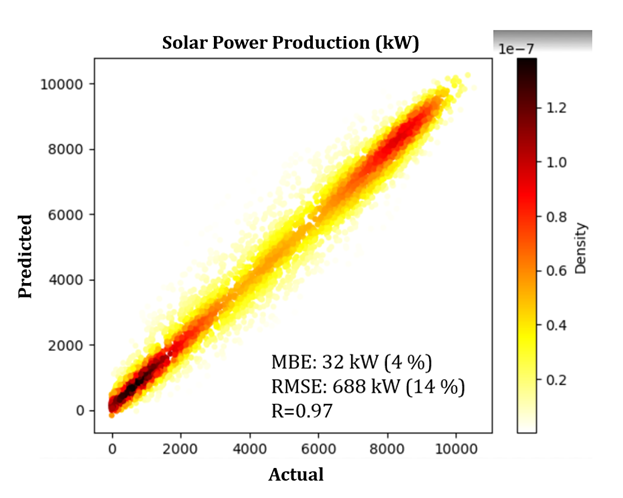
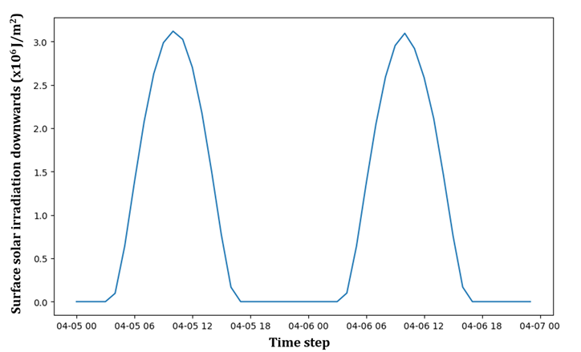
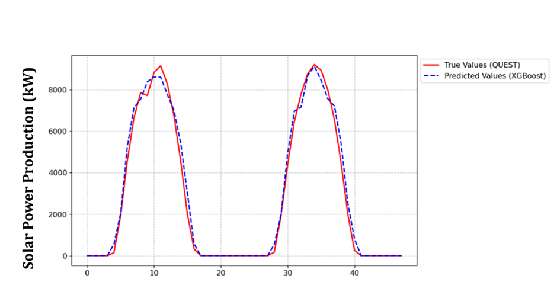

**Destination Renewable Energy (DRE)**

Use Case Descriptor

Ref.: DestinE_ESA_DRE\_ D5.2_UCD_v6

**Author's Table**

| Written by:  | George Koutalieris Symeon Symeonidis Vasillis Perifanis Iphigenia Kapsomenaki Stelios Kazadzis Kyriaki Papachristopoulou Athanasios Drivas Rizos-Theodoros Chadoulis Aggelos Georgakis Christos Stathopoulos Platon Patlakas | ENORA INNOVATION ENORA INNOVATION ENORA INNOVATION ENORA INNOVATION NOA NOA NOA NOA NOA WeMET WeMET |
|--------------|------------------------------------------------------------------------------------------------------------------------------------------------------------------------------------------------------------------------------|-----------------------------------------------------------------------------------------------------|
| Verified by: | Theodora Papadopoulou                                                                                                                                                                                                        | NOA                                                                                                 |
| Approved by: | Haris Kontoes                                                                                                                                                                                                                | NOA                                                                                                 |

**Change Log**

| Issue | Date             | Reason for change        | Section(s) changed                            |
|-------|------------------|--------------------------|-----------------------------------------------|
| 1.0   | 15 December 2023 | Creation of the document |                                               |
| 2.0   | 14 February 2024 | New version              | Edits in the entire document                  |
| 2.1   | 1 March 2024     | New version              | Inclusion of what-if scenarios (section 9)    |
| 2.2   | 6 March 2024     | New version              | Modification of what-if scenarios (section 9) |
| 3     | 14 May 2024      | New version              | Edits in the entire document                  |
| 4.0   | 27 July 2024     | New Version              | Edits in the entire document                  |
| 5.0   | 24 October 2024  | New Version              | Edits in the entire document                  |
| 6.0   | 12 May 2025      | Sixth Version            | Edits in the entire document                  |

**Table of Contents**

[**1 Purpose of the Document 7**](#purpose-of-the-document)

[1.1 DRE Use Case Overview 7](#dre-use-case-overview)

[**2 Data Integration 9**](#data-integration)

[2.1 Solar Data Integration 10](#solar-data-integration)

[2.2 Description of solar data sources 10](#description-of-solar-data-sources)

[2.2.1 Forecasting Models – Solar 11](#forecasting-models--solar)

[**2.2.2 Solar Forecasting Implementation 12**](#_heading=)

[2.2.2.1 Solar Forecasting API description 14](#solar-forecasting-api-description)

[2.3 Wind Data Integration 15](#wind-data-integration)

[**2.3.1 Wind Forecasting Implementation 17**](#_heading=)

[2.3.1.1 Wind Forecasting API description 18](#wind-forecasting-api-description)

[**2.4 Advanced services 19**](#_heading=)

[**2.5 What-if scenarios 20**](#_heading=)

[**3 High-Level software design 21**](#high-level-software-design)

[3.1 High-Level Architecture 21](#high-level-architecture)

[3.2 System Architecture and Implementation Technologies 22](#system-architecture-and-implementation-technologies)

[3.2.1 User Interface Layer 23](#user-interface-layer)

[3.2.2 Application Layer 23](#application-layer)

[3.2.3 Data Layer 24](#data-layer)

[3.2.4 Infrastructure and Deployment technologies 24](#infrastructure-and-deployment-technologies)

[3.2.5 Additional Tools 24](#additional-tools)

[3.3 Integration with DESP 24](#integration-with-desp)

[3.4 Data Exchange Mechanisms 25](#data-exchange-mechanisms)

[**3.5 DRE's Data Services Diagram 26**](#_heading=)

[3.6 DRE's status for DESP Onboarding 28](#dres-status-for-desp-onboarding)

[3.7 DOSI Tickets 29](#dosi-tickets)

[**4 DRE Use Case 30**](#dre-use-case)

[4.1 Forecasting and Simulation 30](#forecasting-and-simulation)

[**5 User Stories for Use Case Demo 31**](#user-stories-for-use-case-demo)

[5.1 Benefits 31](#benefits)

[5.2 Integration with Agile Practices 31](#integration-with-agile-practices)

[5.2.1 AENEA's Role in DRE 32](#aeneas-role-in-dre)

[5.2.2 Narrative to User Stories Transition 32](#narrative-to-user-stories-transition)

[5.3 Collection of Requirements 32](#collection-of-requirements)

[5.4 User Stories for Use Case Demo 33](#user-stories-for-use-case-demo-1)

[5.5 Feature Collection Form for User Stories 34](#feature-collection-form-for-user-stories)

[**6 Wireframe Design 39**](#wireframe-design)

[**7 DRE Release 5: DRE Operationalization and User Support 42**](#dre-release-5-dre-operationalization-and-user-support)

[7.1 Assessment Operationalization 42](#assessment-operationalization)

[7.2 Forecasting Operationalization 43](#forecasting-operationalization)

[**7.3 Creation of User Stories for DRE Release 5 45**](#_heading=)

[**7.3.1 Solar User Stories 45**](#_heading=)

[**7.3.2 Wind User stories 50**](#_heading=)

[**7.4 Design of Prototype 56**](#_heading=)

[**8 HYREF Prototype Release 5 (Solar / Wind Operationalization) 59**](#hyref-prototype-release-5-solar--wind-operationalization)

[**9 Testing Infrastructure 78**](#_heading=)

[**10 DRE sustainability prospects 79**](#dre-sustainability-prospects)

[**11 Conclusion 82**](#conclusion)

# Purpose of the Document

This sixth version of this deliverable aims to outline the objectives, functionalities, and structural components of the Hybrid Renewable Energy Forecasting System (HYREF) demonstrator of the Destination Renewable Energy (DRE) Use case. Its scope extends to outlining the system architecture, describing the various use cases, and presenting operational scenarios. Additionally, it delves into the integration strategies with existing data systems, such as the DESP Data Lake. It explores the user stories from partners to ensure the system aligns with real-world requirements. The ultimate objective of this document is to provide a comprehensive guide that not only aids in understanding HYREF's capabilities but also assists in strategic decision-making processes related to wind and solar energy utilisation, trade, and storage. Therefore, this document uses the terms DRE Use Case and HYREF interchangeably.

## DRE Use Case Overview

The Hybrid Renewable Energy Forecasting System (HYREF) represents a pioneering initiative in renewable energy management. It emerges as a response to the growing need for advanced, accurate forecasting in the field of solar and wind energy production. At its core, HYREF is an innovative demonstrator that seeks to digitise physical systems of renewable energy sources (RES), particularly solar and wind. This digital transformation is achieved by integrating the physical energy production systems with their digital model counterparts. These services are a fundamental component of the DRE digital ecosystem, facilitating enhanced simulation and projection services.

As part of Work Package 5 (WP5), HYREF incorporates both solar and wind resource assessment and forecasting capabilities. The system leverages CAMS historical solar radiation and wind data, along with key meteorological parameters such as Global Horizontal Irradiance (GHI), wind speed, direction, temperature, pressure, humidity, and air density, to assess energy yield and system performance. A user-oriented software component supports location-based assessment, tailored to the specific needs of each end-user.

In addition, the forecasting models developed under DRE release 5 enable user-customised simulations by allowing the integration of user-provided time series data. This empowers solar and wind park operators to generate tailored forecasts based on real operational input.

The Hybrid Renewable Energy Forecasting System (HYREF) represents a step in enhancing the efficiency and predictability of renewable energy sources, particularly solar and wind energy. At the heart of HYREF is the approach of digitising physical systems in solar and wind energy production. This digitisation process involves creating detailed, dynamic models of physical RES, which are the foundation for advanced forecasting and simulation techniques.

The importance of this digitisation lies in its ability to enhance the predictability and reliability of renewable energy sources. By accurately modelling and forecasting energy outputs, HYREF aids in optimising energy use, trade, and storage strategies, significantly contributing to renewable energy utilisation's overall efficiency and sustainability. Therefore, this demonstrator is advancing in integrating renewable energy into broader energy grids, aligning with EU and global efforts towards sustainable energy solutions.

***

***

***

# Data Integration

The HYREF intends to utilise DESP functionalities with the use of datasets necessary for the wind and solar forecasting models. A list of the required data and other relevant information is provided in Table 1.

**Table 1. DESP platform data is required alongside their characteristics.**

***

| **DESP platform data type**             | **Data**                                                                                                                                   | **Update frequency**    | **Spatial Resolution**              | **Temporal Resolution**               | **Purpose**                                              |
|-----------------------------------------|--------------------------------------------------------------------------------------------------------------------------------------------|-------------------------|-------------------------------------|---------------------------------------|----------------------------------------------------------|
| DestinE Digital Twins generated dataset | U & V wind speed components, 2-metre temperature, Surface solar radiation downwards, Total cloud cover                                     | Daily/maximum available | From 4km x 4km to maximum available | From 3 hours to the maximum available | Solar and wind inputs: Model runs, end-user co-designing |
| DestinE Data Lake                       | CAMS European air quality forecast                                                                                                         | Daily                   | Fixed                               | Fixed                                 | Aerosol, trace gases forecasts for solar model           |
| DestinE Data Lake                       | Global Ocean 1/12° Physics Analysis and Forecast, Vegetation Indices, CORINE Land Cover, Vegetation cover, ERA5 single and pressure levels | Daily                   | Fixed                               | Fixed                                 | Wind Model initialisation & boundary conditions          |
| DestinE Data Lake                       | CAMS solar radiation time-series, Copernicus DEM digital elevation model                                                                   | one time use            | Fixed                               | Fixed                                 | Solar climatology for solar model                        |

Data integration within the software is sourced from the DESP data platform (data lake and digital twins). In addition, historical data on solar energy output (10 years of solar output from specific locations) from the Quest energy partner are also incorporated. The data flow, forms and details are described in the following sections.

***

## Solar Data Integration

The solar data integration in the software of the Use Case is twofold. The first part has to do with the Quest energy partner, which provides historical energy production data from an operational solar plant as a user of the Use case. The second part concerns the solar forecasting model, which uses Weather-Induced Extremes Digital Twin forecasts as input.

Regarding solar power production forecasting, this is a model trained to use DESP data and real data for the end-user infrastructure. In order to build this model, data lake data from the Copernicus Atmospheric Monitoring (CAMS) Service (solar radiation data) for the past decade and the specific locations of Quest solar parks have been used. This model has been integrated into the platform and uses the digital twin's forecasts to infer solar power production for two days ahead.

The data integration hierarchy of the Use Case is as follows:  
a. An autonomous ML model has been trained, combining CAMS data from the data lake, with the user’s (QUEST) historical power production data to provide solar power production outputs tailored to the user infrastructure and needs (described in Section 2.2.1). b. Digital twin data flow to HYREF will be used as input parameters for this model and will produce solar power production forecasts for specific infrastructures (Quest). c. Data outputs as a time series of forecasted data (both solar radiation and solar power production output) will be visualised by the HYREF-related tools.

We have been granted access to Weather-Induced Extremes Digital Twin forecasts at the end of October via the insula tool. Then, all the necessary modifications and tests were implemented in the solar model and transferred to the platform following the onboarding process. Concerning the Digital Twin data, a pool of data has been created to demonstrate the applicability of the solar model (details of the available period are given in Section 2.3). We communicated and got feedback from ECMWF via Starion Group for information regarding DT data and access through the insula. Regarding the necessary DEDL data for the solar model, we communicated with EUMETSAT/ECMWF via Starion Group to explore several APIs offered for this case, and the notebooks provided have been successfully implemented to assess DEDL.

## Description of solar data sources

The data sources of the solar model are a blend of real-time and historical data. Past historical data are used as the basis for the model under development during the training phase, and forecast data as the basis for the forecasts of solar power production output during the inference phase. The proposed system requires real-time information from Digital Twins (solar radiation), in addition to atmospheric composition forecasts and other data already available from DESP (CAMS radiation data). For DT data, real-time acquisition of forecast fields is the most important aspect of this application, with a frequent (e.g., 1 hour) forecast horizon for the next 2 days (up to 48 hours ahead). Ideal spatial resolution in order to help with user-related co-designing and data assimilation is up to 10 Km for solar and cloud data. However, since the upscaling aspect will be investigated, spatial resolutions as high as 0.25 x 0.25 could be used to investigate the impact of spatial resolution input data on application performance. The user's Power production data will be the basis of the co-design and site adaptation techniques.

### Forecasting Models – Solar

The Solar forecasting model outputs serve different user needs as an outcome of the co-design with the project's end user. The developed AI model from historical solar parameters and user-provided power production data directly calculates solar power production output based on the user infrastructure, including system characteristics, periodic or systematic losses, etc.

The solar power forecasting model for our use case is tailored to our user's needs and infrastructure, which is QUEST energy, specifically the solar park at the Kinigos site. It is a machine learning (ML) model that was trained once using as input historical data of solar power production from the Kinigos site for 2014-2021 and historical solar radiation data from Copernicus data available in DEDL. The result is an autonomous model that will provide solar power production outputs tailored to Kinigos solar park. Through the operational service available on the DestinE platform, new users (i.e., new sites) will be onboard. New sites can potentially be added by users of the operational service by following the same approach used in the Use Case (specify location, provide user-related data). More details are provided in Section 8, which describes the HYREF Operationalisation.

The year 2022 was outside the training period and was used as an independent year to evaluate the model. Figure 1 shows the evaluation of the model for the independent year of 2022 by comparing the actual values of the Solar power production for the Kinigos site (x-axis) with the predicted values from the model (y-axis). We can see that the model's performance is outstanding, as most of the points lie on the identity line. A high correlation coefficient value was found (0.97), and the relative mean bias error was 4%.

**Figure 1. Evaluation of a solar model for Kinigos solar park of QUEST Energy for one year (2022).**

As a second step, this tailored model will be used every time to infer solar power production, which will be the forecast. On a daily basis, the model will be used as input forecasts of solar radiation and other parameters from the Digital Twin in order to produce forecasts of solar power production for 2 days ahead, with a 1-hour time step for the specific infrastructure of our end-user (Quest Energy).

### Solar Forecasting Implementation

After being granted access to Digital Twin data, the solar model was integrated into the platform following the integration process. The first implementation of the model was performed using test Digital Twin data that were available for download using the polytope tool, and the results are provided in this section.

The forecasts of Digital Twin for 5 and 6 April were utilised. The parameters needed as input to the solar model (solar radiation, temperature, relative humidity and wind speed) were extracted as time series corresponding to the Kinigos site of our use cases from the global DT file in GRIdded Binary (GRIB) format. An example of the aforementioned time series for the surface solar irradiation forecast is provided in Figure 2 for Kinigos solar park.

**Figure 2. Example of downwelling surface solar irradiation derived from Weather-Induced Extremes Digital Twin, for April 05 and 06, 2024.**

The solar model was run using as input the Digital Twin output for 5 and 6 of April, and the resulting predicted values of solar power production for the Kinigos site are presented in Figure 3 (blue dashed line). For comparison, the actual values of solar power production from Kinigos Solar Park are also provided (red line).

**Figure 3. Demonstration of the implementation of the solar model for Kinigos solar park of QUEST energy, using as input forecast from Weather-Induced Extremes Digital Twin, for April 05 and 06, 2024.**

A pool of DT data has been created to demonstrate the solar forecasting model on the platform as if it were operational. The DT data pool covers a broader period, including more recent data. This temporary solution will be used to demonstrate our Use case until DT data is consistently available and delivery timeliness is stabilised. After that, we plan to switch to the real data stream.

***

### Solar Forecasting API description

The Solar Forecasting API has been designed to facilitate seamless access to solar forecast data or historical data based on valid user-defined parameters. To support this service, four distinct API servers have been developed. These APIs are deployed as Docker containers and orchestrated via Rancher, where they are managed by a Kubernetes service for scalability and reliability.

These APIs provide access to solar forecasts within specified geographic boundaries and time frames by utilising FastAPI[^1] for high performance and ease of use, Uvicorn[^2] for fast ASGI server deployment and Pandas[^3] for data manipulation.

[^1]: https://fastapi.tiangolo.com/

[^2]: https://www.uvicorn.org/

[^3]: https://pandas.pydata.org/

1.  CSV validation API. The first API service is used for the validation of the user-provided csv file containing the historical power production data. This API accepts the path of the uploaded file as input, and returns a boolean value indicating the success or failure of the validation process, accompanied by a relevant message for user guidance, in the case of a failed validation.
2.  Model training API. The second API service developed for the solar forecast is the one used for the training of the model. This service is triggered every time a user uploads a new csv file of historical data, in order to create a new solar forecasting model based on it. This API receives as input the path of the now validated, user uploaded csv file, as well as the latitude, longitude and elevation parameters, provided by the user via the UI. It then proceeds to analyse the user uploaded dataset, download the relevant CAMS solar radiation time series data, corresponding to the exact latitude, longitude, elevation and time range of the user provided data, and combine them in order to train the relevant XGBoost ML model, responsible for the solar power production forecasts. This API returns the path of the trained XGBoost model, along with any relevant error messages.
3.  Model Inference API. This API is responsible for the daily inference of the model. This service is not directly accessed by users, instead, it is automatically invoked by the model training API upon successful model creation, and also runs daily via a cronjob, for every trained model a user has ordered. Its input parameters are the path of the trained model along with the relevant user-defined park location attributes (latitude, longitude, elevation). Based on these inputs, the API proceeds to search for the current day's extremes-DT downloaded forecast. In case these forecasts have not yet been made available, the service will use the internally available Data Pool we have created, , and proceed on inferring the xgboost model with this data as input.
4.  
5.  In the desired case that the DT forecast data are available, the API will proceed to postprocess these data, apply AOD correction on it, by using the Harmonized Data Access (HDA) service to download the relevant aod forecasts from the CAMS (CAMS global atmospheric composition forecast collection), and use it as inputs for the model inference. The response of the API is the forecasted power production in kilowatts, the global horizontal irradiance in kilowatt-hours per square meter and relevant forecasting timesteps. These results, along with any relevant error messages, are returned to the UI in JSON format, where they get visualised, providing comprehensive insights into solar power production and environmental conditions, enabling precise analysis and decision-making for energy management systems.
6.  Power Production Forecast using park specifications: This API service is designed to generate a solar power forecasting model based solely on user-provided park specifications, rather than historical production data. Upon submission of the relevant photovoltaic system parameters—namely capacity (in kW), tilt angle, azimuth orientation, and tracking configuration (0 for fixed, 1 for single-axis, 2 for dual-axis)—along with geographic location attributes (latitude, longitude, and elevation), the service initiates the model generation process.

By combining the aforementioned APIs, the solar forecasting module allows other services to harvest and utilise the solar forecast data efficiently. It also adheres to a rolling data retention policy, meaning that historical data are being erased over a certain time threshold.

## Wind Data Integration

The wind power prediction forecasts emerge through a combination of numerical weather prediction (NWP) and statistical models. For short-term forecasts, NWP simulations are required to obtain predicted meteorological data at the specific locations and heights where wind turbines operate. Long-term simulated datasets originating from several model grid points and various vertical levels are weighted against available in-situ observational data. Following the selection of the optimum model output, the forecasting performance can be further enhanced with the aid of wind farm observations through statistical and/or machine learning algorithms. A power curve sub-model is implemented to convert the meteorological output into wind power, analysing historical park data to account for the effects of different wind directions, local terrain, and asymmetric turbine layout in a wind plant. The resulting power prediction outputs are generated for the desired locations of interest and are significantly more accurate compared to the default power curves of the wind turbine manufacturer.

WeMET has deployed and developed a number of modelling platforms in the past. Those models provide high localised unique properties through very high-resolution forecasts and hindcasts. In this project, deploying high-resolution NWP model outputs available from the Data Lake, along with software tools for pre- and post-model operations, will estimate expected wind power energy yield over selected testbed areas.

The key steps to generate accurate predictions in terms of Wind forecasting are as follows:

\- Data Collection: Retrieve NWP model outputs (DESP platform), all available observations (weather stations, satellite data, etc) and measurements from the wind parks (wind speed, wind direction, temperature, wind power).

\- Data Assimilation: Assimilation of all the initial conditions alongside the available measurements

\- Power Curve Model: Tailored power curves will emerge from the analysis of the historical data. An equivalent wind plant power curve for wind plants consisting of numerous wind turbines.

\- Wind power forecasting: A modified algorithm produces wind power forecasts for each wind turbine on hub height. The algorithm dynamically assimilates near real-time input from the end-user to fine-tune/adjust the forecasts.

The first step is to set up and run NWP simulations in WeMET's in-house HPC infrastructure and adjust the necessary assimilation fields. Sensitivity tests using long-term DESP data, such as ERA5, are performed to ensure the correct model setup. The next step is the operational use and extraction of the required NWP fields (modelled wind speed, wind direction, air density) at wind farm sites, exploiting products, such as the Digital Twin generated datasets. The fusion of the NWP data with previously recorded data in a statistical post-process will allow for corrected/adjusted NWP outputs and the provision of the energy yield over the next hours and days.

***

***

We have been granted access to Weather-Induced Extremes Digital Twin forecasts at the end of October via the insula tool. The necessary modifications and tests were implemented for the wind model and transferred to the platform after onboarding. This dataset shows simulated wind speed in heights (100m) close to the wind turbine's hub heights, appropriate for wind power forecasting applications. Data is provided in grib2 format and on an octahedral reduced Gaussian grid. For proper exploitation on regional scales, a conversion is required from the reduced Gaussian grid to a regular Gaussian grid, together with necessary processes for the extraction of the data from the current format to others (e.g. from grib2 to NetCDF or CSV), allowing further implementations. An example of the aforementioned dataset is illustrated in Figure 4, which focuses on a domain covering Greece.

***

**Figure 4. Example of Wind speed spatial distribution and direction at 100m derived from Weather-Induced Extremes Digital Twin, for April 07, 2024 at 01:00 UTC.**

### Wind Forecasting Implementation

Using an available sample of the Weather-Induced Extremes Digital Twin, covering the days between 05/04/2024 and 06/04/2024, the wind power forecasting model was implemented to estimate the energy yield. More precisely, the expected wind power production was estimated using the aforementioned methodologies for a specific location in Greece, as presented in Figure 5. After being granted access to Digital Twin data, this was integrated into the platform following the integration process. With the access to DT data updated daily, wind power generation can be estimated for any potential wind farm on an operational basis, given the provision of geospatial characteristics and relevant information (such as rated power and historical wind/power data).

***

***

**Figure 5. Wind power forecasts (blue dashed line) with the use of Weather-Induced Extremes Digital Twin and actual wind power (red line) targeting a specific wind turbine located in Greece.**

### Wind Forecasting API description

The Wind Forecasting API is developed to deliver forecasts of wind speed and wind power generation, tailored to specific wind plant configurations. It achieves this by incorporating actual installation specifications along with user-provided historical data and parameters. The service is supported by two dedicated API servers, each with distinct responsibilities. These APIs are containerised using Docker and deployed within a Kubernetes cluster managed via Rancher, ensuring robust scalability, reliability, and streamlined orchestration.

These APIs provide the wind forecasts within specified geographic boundaries, turbine height and time frames by utilising FastAPI for high performance and ease of use, Uvicorn for fast ASGI server deployment, Pandas for data manipulation and Pydantic for robust data validation and parsing based on Python type hints.

1.  User input validation API. This API is responsible for validating user-submitted input data in CSV format. The file must include historical time series for mandatory variables such as wind power, wind speed, and wind direction, and may optionally include variables like temperature and humidity. The API also supports validation of a user-provided power curve. In both cases, it verifies the structure and content of the files, ensuring they conform to the required format and that all variables meet predefined criteria. The API accesses the uploaded file based on a job-specific path derived from the submitted *job_id* and returns validation feedback to the main service. In the event of validation failure, a detailed message is provided to guide the user in correcting the issues.
2.  Model training and forecasting API. The second API server consists of the main core of the wind forecasting service, providing wind power and wind speed prediction for the location of interest. The API processes all the key input parameters such as the geographical coordinates, the turbine hub height and date. Moreover, the user's input information regarding the power curve model and/or the historical data from the target location is processed. Given the aforementioned input, the API initiates various sub-processes to retrieve and adapt raw forecast data and convert it into power output after performing certain actions such as conversions and interpolations spatially and vertically. When historical datasets are available, a machine learning adjustment is employed to refine the forecasts based on local weather and production conditions. More precisely, a regression version of the Support Vector Machine (SVM) algorithm is used, namely the Support Vector Regression (SVR) with RBF Kernel. The current scheme is designed to learn non-linear relationship**s** by mapping the input features into a higher-dimensional space where a linear relationship can be found. The main advantage is the ability to model complex and non-linear patterns, using limited input data. To extract the optimum outcome, a training phase is required where specific hyperparameters have to be tuned. The final output includes forecasted power production (in kilowatts), wind speed, and wind direction. Results are saved in CSV format to a job-specific storage path and are also returned in JSON format for integration into the service's user interface.

## Advanced services

HYREF renewable energy application aiming to provide renewable energy forecasts across different time scales. This section describes the development of an advanced service based on the hybrid (solar and wind) model, aiming to work like a decision-making support system and optimise oriented strategies for the user's portfolio with both renewable systems, solar and wind.

The primary users of the DRE Use Case application that benefit from this service are the Hybrid RES Production Manager (see the corresponding user story). These users require accurate, timely information to make informed energy production and policy decisions. DRE Use Case application addresses these needs by providing hybrid services, which build upon the already implemented services (Detailed energy forecasts, Scenario analysis tools, and User-friendly interfaces for interaction with the digital twins).

A solar model that directly calculates power production output based on the user infrastructure, including system characteristics, periodic or systematic losses, etc., has already been developed as described in Sections 2.1-2.2. A wind power forecast application, which also requires past production data, available meteorological data from the wind farm, and information regarding site characteristics and technical specifications, has also been developed and described in Section 2.3. Those models digitise the physical systems of solar and wind production to support simulation and projection services that are part of the DRE digital ecosystem.

Those models are merged for users with a portfolio that includes both renewable systems, solar and wind, and provides the hybrid service. This service displays the power output of Solar, Wind and their combined total as a hybrid. In this way (by also displaying solar and wind, apart from the sum as a hybrid), the user will be able to monitor which renewable component contributes the most/or is equal to the total amount (more energy yield from wind or more from sun or both). A demonstration will be provided first for the simplest case of one solar and wind park.

## What-if scenarios

The "what-if" scenarios simulate potential future weather events and their impacts on the energy grid by utilising historical data, predictive models, and real-time inputs. Thus, the "what-if" scenarios allow stakeholders to anticipate and mitigate risks associated with variability in renewable energy production, such as a reduction in the produced power output from solar PV panels due to unexpected factors like Saharan dust intrusions. A possible increase in the frequency of such events and related solar reduction due to dust intrusions will have major impacts on local and national electricity grids, national electricity distributors and energy traders.

Integrating CAMS aerosol forecasts and user-specific data, these scenarios help understand such day-to-day solar energy variability and provide actionable insights for optimising energy production, improving grid resilience, and preventing electricity disruptions and possible temporal blackouts. This strategy enhances forecasting accuracy and supports sustainable energy policies by offering tools for informed decision-making under uncertain environmental conditions.

The HYREF application will provide advanced visualisations of the relevant "what-if" scenarios. The user will be able to switch to different initial conditions using pre-run simulations based on historical data. More specifically, several historical dust intrusion cases have been explored, and the impact of dust attenuation and soiling has been quantified based on the event's severity. The resulting visualisations will give the user the option to select between different aerosol concentration intensity levels, described as "low", "medium", and "high", providing improved insights into the effects of the extreme dust intrusions. These scenarios will be illustrated through interactive graphs that plot the time-series data, displaying the original solar radiation forecast (GHI) and the corrected one accounting for the different labels of aerosol effect. By switching between these scenarios, users can dynamically explore how varying dust concentrations impact solar radiation and energy production forecasts, enabling informed decision-making and enhanced grid management.

# High-Level software design

Figure 6 presents the high-level architecture of the hybrid renewable energy forecasting system (HYREF), designed in SoW to provide a comprehensive and accurate forecasting mechanism for wind and solar energy production. This advanced system is structured to integrate and process a multitude of data sources, creating a seamless and efficient forecast model.

## High-Level Architecture

HYREF's architecture, as presented in Figure 6, is centred around the integration of data collection, advanced data assimilation, operational forecasting, and specialised algorithms for wind and solar power forecasting.

This system harnesses a blend of global models, observational data, and precise measurements from renewable energy parks, tunnelling these insights into a Decision Support Services unit. At the bottom of the Field Layer, data on renewable energy production and management are generated. These data are then channelled into the Virtual System (VS) Layer, which employs AI-driven modelling techniques to construct a virtual system. Following this, the Layer of HYREF Data Platform/DestinE Integration takes over, focusing on visualisation and data management, ultimately propelling the results to the Presentation Layer for DRE Use Case demonstration.

***

***

**Figure 6. High-Level Architecture of HYREF.**

***

The architecture of HYREF is geared towards harnessing the potential of renewable energy sources by leveraging advanced data analytics, real-time data assimilation, and forecasting models. This architecture can enhance the accuracy of renewable energy forecasts and can support the decision-making processes in energy production, trade, and storage.

**Figure 7. HYREF Implementation Architecture.**

Figure 7 presents the implementation architecture of HYREF, as used during Release 3. It is divided into three main sections: Data Orchestration focuses on IoT data connectivity and data management through ETL processes, using historical and real-time data stored in an SQL database facilitated by APIs. The following section, Model Orchestration, integrates forecasts from digital twins and data lakes, emphasising weather forecasting, solar radiation forecasting, and tailored wind and solar energy predictions, supported by synergetic decision support services. Finally, the Observability section showcases the HYREF Software Application, which provides actionable insights through detailed dashboards for energy sector decision-making, connected to the Core Service Platform (DESP) from Destination Earth.

## System Architecture and Implementation Technologies

Figure 8 illustrates how the different components interact and how the data flows through the HYREF proposed architecture. The System Architecture and Integration section for the DRE Use Case, Hybrid Renewable Energy Forecasting System (HYREF), outlines how HYREF interfaces with existing systems, the mechanisms for data exchange, and the security and access control protocols, all crucial for its operational effectiveness.

The User Interface layer serves as the primary point of user interaction, employing HTTP requests and RESTful APIs for communication. The underlying Web Server acts as an intermediary, channelling these requests to the Application Layer, which encapsulates the core business logic. In the persistence tier, a Data Layer (PostgreSQL) is entrusted with data management, showcasing the system's commitment to data handling capabilities. Complementing this, a dedicated Search/Analytics component enhances data retrieval and analytics capabilities. Visualisation capabilities are integrated, providing support for data representation.

A Caching/Session mechanism is implemented to improve performance, ensuring data access and state management across user sessions. The system's responsiveness is further enhanced by Asynchronous Jobs, allowing for non-blocking operations and streamlined processing. Event Messaging supports the application's reactive nature, enabling services to interact through a publish-subscribe model.

Containerisation is implemented through Docker, facilitating a standardised approach to application deployment, with Kubernetes providing orchestration to maintain application health and scalability within a Cloud Platform environment. The incorporation of a CI/CD Pipeline emphasises our commitment to agile development practices and automation, with Git for version control reflecting an approach to source code management. Lastly, the inclusion of Jupyter Notebook indicates the system's support for data science use.

**Figure 8. DRE System Architecture.**

***

### User Interface Layer

**Implementation framework**

-   We use HTML/CSS to create the markup and style the user interfaces.

***

-   The user interface is implemented using JavaScript and React to develop interactive and dynamic web-based user interfaces.

***

-   We utilise Redux for state management across the React application.

***

### Application Layer

**Back-end Development**

-   It uses a web framework to structure the back-end services and handle HTTP requests.

***

-   Implements REST Framework to create RESTful APIs for the front-end to consume.

***

-   Manages real-time data feeds and decision support service, for example, with Kafka or RabbitMQ for messaging and stream processing, depending on the throughput and fault-tolerance requirements.

***

-   Handles asynchronous task queue caching and session management.

***

### Data Layer

**Database and Storage**

-   Stores relational data in PostgreSQL.

***

-   For example, Redis can be utilised for transient data and fast access requirements.

***

-   Employs search and analytics operations software and provides visualisation and data monitoring interfaces.

***

### Infrastructure and Deployment technologies

**Containerisation and Orchestration**

-   Package applications using Docker for consistent deployment environments.

***

-   Manages and scales the application with Kubernetes, handling container orchestration.

***

-   We use a web server and reverse proxy to manage incoming traffic and SSL termination.

***

**Cloud Platform**

-   Deploy on a cloud platform to utilise various services for hosting, storage, and other cloud-based resources.

***

**CI/CD Pipeline**

-   Implements continuous integration and deployment using tools like Jenkins, GitLab CI/CD, or Travis CI.

***

### Additional Tools

**Version Control**

-   We track all changes and collaborate using BitBucket.

***

**Data Analysis**

-   Jupyter Notebooks serve as an environment for data analysis.

***

## Integration with DESP

The DRE Use Case application will integrate with DESP subsystems like the DE Data Lake and other relevant data sources once they become available. This integration will involve retrieving data from global models, weather stations, satellites, and wind and solar production sites, ensuring a comprehensive and accurate dataset for forecasting. The system's flexibility allows it to assimilate various data types, including wind speed, direction, temperature, and power measurements from renewable energy parks.

**Figure 9. Integration Architecture.**

The integration architecture of the HYREF with DestinE will be aligned with the various phases of DESP Core Services deployment. As detailed in Figure 9, DRE will be integrated with the core components of the DESP platform. The integration planning is based on the latest version of DESP specifications (DESP Documentation 1.0)

DESP will provide open endpoint interfaces for the IAM Service to request authorisation through REST web services. Token retrieval, resources and policies for the authorisation process are attached to this interface type. Furthermore, for the Service Registry, DESP offers APIs for service onboarding and configuration control management within the DESP ecosystem, including REST APIs for registration, validation, listing, updating, and publishing information, and a user-friendly GUI for registration, including mandatory and optional fields. Regarding DESP Data Workflow Service, a client-server model provides data access and management functionalities to end users via the internet, ensuring a secure and seamless connection and supports RESTful API access via STAC, OpenSearch, S3, and GDAL. Regarding the DESP Data Visualisation service, a client-server model allows users to visualise Earth Observation (EO) data on spheres and 2D or 3D maps. Users can create custom visualisations by selecting dataset projections and adjusting colours and zoom levels. The service also exports generated figures for community sharing.

## Data Exchange Mechanisms

Data exchange within the DRE Use Case application is facilitated through real-time and historical data processing. Operational forecasting in HYREF utilises Numerical Weather Prediction (NWP) system simulations, crucial for wind and solar energy forecasts. The system will employ advanced wind power forecasting algorithms, dynamically integrating users' real-time inputs to refine predictions. HYREF incorporates real-time atmospheric forecasts for solar energy, including aerosols and cloud data, pre-run radiative transfer solar modelling (RTM), and site-specific user data for enhanced accuracy.

In practice, the DRE Use Case application's integration approach synthesises wind and solar energy forecasting and will provide accurate and reliable digital twins of renewable energy sources. This integration is instrumental in enhancing forecast precision, with an anticipated accuracy rate of up to and beyond 95%. HYREF's decision-support component, offering data on energy variability and optimisation strategies for use, storage, and trading, is a critical feature for energy policymakers and producers. The system's multi-faceted data approach and sophisticated operational algorithms position HYREF as a cutting-edge tool in renewable energy forecasting and policy decision-making.

## DRE's Data Services Diagram

This section aims to provide an overview of the data services architecture employed in the HYREF project, focusing on the integration and coordination of partners and systems to enable efficient solar and wind energy forecasting and assessment. The "HYREF Data Services Diagram" is a reference that presents how production, forecasting, live demonstration, and evaluation processes are systematically organised in the software. The project ensures system interoperability by leveraging APIs for data retrieval and exchange in formats like JSON and CSV.

**Figure 10. HYREF Data Services Diagram.**

***

The HYREF Data Services Architecture in Figure 10 showcases the integration and interaction between partners and service layers to support data-driven decision-making for renewable energy forecasting and production. The architecture is divided into five main service domains, which are grouped as follows: a) Production Services and, Forecasting Services for the QUEST/WeMet end users of the DRE Use Case, b) Live Demonstration, and Evaluation and Production Forecasting Services that will be part of the DRE Advanced Service. Each domain facilitates distinct functionalities, such as data collection from solar and wind sources, advanced forecasting algorithms, and assessments using geospatial parameters. The system leverages API integrations to retrieve, process, and distribute data in standardised formats (JSON and CSV). This approach enhances the accuracy of renewable energy forecasts and optimises the deployment of these insights in both live and simulated environments, thereby supporting the continuous evaluation and improvement of forecasting models. The architecture ensures seamless data flow across different service areas, aligning with the project's objectives to advance the predictability and efficiency of renewable energy systems. The following subsection describes in detail each service of the DRE Advanced Service.

## DRE's status for DESP Onboarding

Currently, DRE partners are actively coordinating with Serco to streamline the onboarding process in DESP.

IAM testing (KeyCloak) has been completed with the accounts given to ENORA using the testing environment: <https://iam.ivv.desp.space/realms/desp>. It follows the standardised process where users enter their credentials on the DESP user login page to gain access to the client services.

A common Jira issue-tracking system records and manages any issues or dependencies during this phase. DRE's partners are committed to providing timely access and support, facilitating a smooth transition and prompt onset of project activities. Regarding the Service Registry and API Specification of the API specification and system integration for solar and wind forecasts, DRE partners are internally finalising the API input/output specifications. This will complete the onboarding phase and validate and integrate the service effectively.

The development and deployment processes for DRE are progressing efficiently, leveraging an automated CI/CD pipeline to ensure seamless integration and deployment. Developers have actively pushed the latest updates to the GitLab repository, incorporating the most recent changes and improvements to the source code. This action triggers the CI/CD pipeline, which initiates the build process within a secure cloud environment, ensuring the code is compiled and prepared for deployment.

Following the build process, a container image is generated from the compiled code, encapsulating the application and its dependencies. This container image is then securely stored in the Harbor repository, providing a centralised and reliable location for managing application images. By maintaining these images in Harbor, the system ensures traceability and version control for each deployment.

The final stage involves deploying the container image to the server using Rancher. This step transitions the application to a live environment, making it accessible on the designated server. The streamlined deployment process minimises downtime and ensures that the application remains consistent, scalable, and ready to support the needs of its users. This automated pipeline demonstrates a commitment to robust development practices and operational efficiency. Figure 11 showcases a detailed screenshot illustrating the onboarding procedure in action.

**Figure 11. Onboarding status.**

***

## DOSI Tickets

Serco has created a list of Jira tickets to support the onboarding process, outlining the key tasks and steps that need to be followed. Alongside these tickets, they have provided relevant documents, reports, and guidelines to help users understand and complete the process more easily. These materials are actively followed by the DRE partners to ensure a clear, consistent, and well-organised onboarding aligned with the overall project requirements.

# DRE Use Case

## Forecasting and Simulation

**Description:**

This use case focuses on the forecasting and simulation of wind and solar energy production within the Hybrid Renewable Energy Forecasting System (HYREF). Utilising advanced data collection, assimilation, and forecasting techniques, HYREF provides accurate energy predictions. The process involves gathering data from various sources, including weather models and on-site sensors, followed by the integration of this data into sophisticated forecasting algorithms. These algorithms, tailored for wind and solar energy, dynamically incorporate real-time user inputs to enhance forecast precision. The outcome is a detailed, hourly forecast for up to two days, facilitating energy use, storage, and trading decision-making.

**Actors:**

\- Energy Producers (Wind/Solar)

\- Policymakers

\- Data Analysts

\- System Operators

**Preconditions:**

\- Access to global models, weather stations, satellite data, and measurements from wind parks and solar facilities.

\- Availability of operational Numerical Weather Prediction (NWP) system simulations.

\- Existing infrastructure for real-time data reception and algorithmic processing.

**Basic Flow:**

1\. Data Collection: Gather data from global models, weather observations, and energy production sites.

2\. Data Assimilation: Integrate collected data with initial and boundary conditions.

3\. Operational Forecasting: Execute NWP system simulations for wind and solar forecasting.

4\. Algorithmic Processing: Modify algorithms based on real-time input for accurate energy forecasts.

5\. Forecast Generation: Produce a detailed 48-hour forecast with hourly intervals.

6\. Dissemination: Provide forecasts to users via the HYREF application.

**Alternative Flows:**

\- In case of data inconsistency or unavailability, use historical data for simulation.

\- If real-time user input is delayed, utilise the most recent data for forecast adjustments.

**Postconditions:**

\- Users receive accurate, site-specific forecasts for wind and solar energy production.

\- Decision-makers have access to data supporting energy utilisation, trade, and storage strategies.

\- Continuous adaptation and refinement of the forecasting models based on user feedback and evolving data patterns.

# User Stories for Use Case Demo

The Destination Earth (DRE) Use case incorporates the AENEA methodology, a hybrid approach blending Agile methodologies with co-creation and design thinking techniques. AENEA is designed to tackle the unique challenges of advanced software projects lacking fixed specifications, focusing on evolving stakeholder needs and requirements. This method is particularly effective for projects characterised by brief development cycles and requires iterative stakeholder and end-user feedback on each software iteration.

## Benefits

Forecasting solar output based on digital twin and CAMS (DESP data lake) data, tailored to the user's needs, is a tool that could benefit various stakeholders of the energy community. Such tools, with the proper adjustment to the user-related infrastructures, can be directly used by small or larger PV park owners, private or government-based. In addition, it can help decision-making bodies from a neighbourhood municipality to the national level with business planning towards building solar infrastructure for various user needs. Finally, it directly impacts the energy trading market as accurate forecasts are directly related to decisions on using/selling/storing the potential energy that will be produced during the next few days.

Given the increasing solar and wind generation penetration, operators require accurate hourly and day-ahead wind and solar power forecasts to manage power system loads effectively and optimise energy trading. Accurate short-term power forecasting is particularly vital for operation and maintenance, as it significantly impacts the costs associated with wind and solar power installations. Concurrently, having prior knowledge of the variability and uncertainty levels is crucial for various decision-support functionalities.

## Integration with Agile Practices

AENEA enhances traditional Agile frameworks by embedding an additional co-creation phase in the development of Epics/User Stories. While retaining standard Scrum roles, AENEA modifies the "Product Owner" role to a "Project Manager." This role is central to fostering collaborative development and evaluation of User Stories, incorporating stakeholder insights through simultaneous co-creation sessions.

### AENEA's Role in DRE

Implementing AENEA within the DRE development framework has been instrumental in embedding domain-specific knowledge, especially in the field of renewable energy sources (RES). It facilitates active involvement from RES producers and relevant energy stakeholders. The methodology operates through several critical stages.

### Narrative to User Stories Transition

This step involves translating stakeholder needs and stories into actionable Epics/User Stories, which then steer the software development trajectory.

## Collection of Requirements

The following subsections outline the process of collecting requirements, emphasising the transformation of stakeholder narratives into actionable software development user stories. Figure 12 presents the collection of requirements for the DRE Use case, collected by Miro software.

**Figure 12. Collection of requirements by Miro.**

***

## User Stories for Use Case Demo

Following the collection of requirements, we now present the User Stories that have been created. These stories have been developed through collaborative sessions, ensuring they accurately reflect the needs and objectives identified during the stakeholder engagement phase of the AENEA methodology in the DRE Use Case. Each story is designed to guide the software development process effectively, aligning with the Use Case's goals and the dynamic nature of the renewable energy sector.

**Epic 1: Forecasting System Development and Optimisation**

User Story 1: As an energy community member, I want to participate in a survey to help define precise forecasting objectives and user needs.

User Story 2: As a grid operator, I need detailed area-specific energy forecasts to optimise grid efficiency and stability.

User Story 3: As a grid operator, I need detailed area-specific energy forecasts to balance supply and demand.

User Story 4: As a plant manager, I want end-user tailored forecasting data to make informed decisions about energy management.

User Story 5: As a financial analyst, I want to assimilate solar and wind forecasts with our data for optimised revenue streams.

User Story 6: As a government policymaker, I want to assess renewable energy potential in various areas for infrastructure development decisions.

**Epic 2: User Engagement and Feedback Integration**

User Story 7: As a potential user, I want to know how I can contribute to and be part of the DRE community.

User Story 8: As a plant manager, I want to effectively manage multi-plant portfolios based on accurate energy forecasts.

**Epic 3: Maintenance and Operational Efficiency**

User Story 9: As an O&M team member, I want to plan maintenance schedules based on energy forecasts to minimise production disruption.

User Story 10: As a plant manager, I want to optimise energy storage using accurate forecasts to reduce reliance on less-clean energy sources.

**Epic 4: User Accessibility and Understanding**

User Story 11: As a farmer, I need forecasts presented in an easily understandable format to plan farming procedures.

***

## Feature Collection Form for User Stories

Collecting and documenting features in User Stories as part of the AENEA methodology is designed to align with the unique requirements of the DRE Use Case, facilitates the systematic capture of stakeholder inputs and ensures that every software feature resonates with their needs and expectations. The form is structured to provide clarity and direction in the development process, bridging the gap between stakeholder narratives and tangible software functionalities. The forms filled out by end-users are presented below.

**Weather Modelling Scientist**

| **Title:**                                                                                                                                                                                                                                                                                                                                                                                                                                                                                                                                                                                                                                                                                                                  | **Priority** | **Estimate:** |
|-----------------------------------------------------------------------------------------------------------------------------------------------------------------------------------------------------------------------------------------------------------------------------------------------------------------------------------------------------------------------------------------------------------------------------------------------------------------------------------------------------------------------------------------------------------------------------------------------------------------------------------------------------------------------------------------------------------------------------|--------------|---------------|
| **User Story:**  As a **Weather (Solar) Modelling Scientist**   I want high resolution historical data from measurements or DESP data lake (CAMS radiation data)  Also solar radiation forecast data with high spatial resolution and frequent (e.g., 3 hour) forecast steps for the next 6 hours to 3 days, so that I have an accurate representation of the past and future radiation field at a certain location defined by an end user. Past historical data can be used as a basis for the model under development, and forecast data, the basis for the forecasts of electrical output.  *An example for Greek area* [*https://solar.beyond-eocenter.eu/\#solar_long*](https://solar.beyond-eocenter.eu/#solar_long)  |              |               |
| **Acceptance Criteria:** Given that solar and/or cloud forecast data exist for a global model such as the Destination Earth digital twin, with a certain spatiotemporal resolution  When I isolate the data products and use tools for colocation with end user data ,  Then accurate fields of solar horizontal and direct normal solar radiation in the shortwave range can be used and provided for a specific area under different time (past and future) windows.                                                                                                                                                                                                                                                      |              |               |

**Electricity Production Model Analyst**

| **Title:**                                                                                                                                                                                                                                                                                                                                                                                                                                                                                                                                                                                                                                                                                                                                                                                                                                                                                                                                                                                                                                   | **Priority** | **Estimate:** |
|----------------------------------------------------------------------------------------------------------------------------------------------------------------------------------------------------------------------------------------------------------------------------------------------------------------------------------------------------------------------------------------------------------------------------------------------------------------------------------------------------------------------------------------------------------------------------------------------------------------------------------------------------------------------------------------------------------------------------------------------------------------------------------------------------------------------------------------------------------------------------------------------------------------------------------------------------------------------------------------------------------------------------------------------|--------------|---------------|
| **User Story:**  As a **Electricity Production Model Analyst**  Focused on wind power plants, I want historical data for both wind speed and energy yield over each wind park and wind turbine, as well as additional parameters such as wind direction and temperature. So that the performance patterns and the prevailing meteorological conditions would be under consideration. A power curve will be defined based on the actual measurements rather than the constructor technical specifications, and a model will be trained to correlate wind speed with energy production efficiently. In addition, an analysis of the wind direction will denote if there are divergences due to topography, wind shading from obstacles or neighbouring wind turbines. I want a visualisation tool so that the energy production could be overlaid with the forecast for all time scales (past-present-future). The tool must be capable of producing dynamic time plots as well as statistical analyses for custom user selected time windows. |              |               |
| **Acceptance Criteria:** Given the characteristics of the Weibull distribution for wind intensity and the wind direction variability together with the energy yield  When a divergence is evident in the power production that roots in wind direction and/or wind speed variability Then the correlation of wind speed with the theoretical power curve will provide a quantification of the uncertainty.                                                                                                                                                                                                                                                                                                                                                                                                                                                                                                                                                                                                                                   |              |               |

**Production Site Manager**

| **Title:**                                                                                                                                                                                                                                                                                                                                                                                                                                                                                                                                                                                                                                                                                                                                                                                                                                                                                                                                         | **Priority** | **Estimate:** |
|----------------------------------------------------------------------------------------------------------------------------------------------------------------------------------------------------------------------------------------------------------------------------------------------------------------------------------------------------------------------------------------------------------------------------------------------------------------------------------------------------------------------------------------------------------------------------------------------------------------------------------------------------------------------------------------------------------------------------------------------------------------------------------------------------------------------------------------------------------------------------------------------------------------------------------------------------|--------------|---------------|
| **User Story:**  As a **Production Site Manager**  I want access to historical and real-time data on solar energy production, including current output levels, system performance metrics, and environmental conditions (like solar irradiance, and temperature), as well as predictive analytics for the next 24-48 hours.  Predictive analysis will allow me to optimise the operational efficiency and energy output of the production site according to grid operator demands. This includes making informed decisions on energy storage, maintenance scheduling, and adjusting operational parameters. This way I will maximise energy production and reduce operational costs.  Access to historical (and real-time data in some cases) allows me to benchmark performance against past telemetry data and validate manufacturer specifications, ensuring that the equipment is performing as promised (e.g. pyranometers, inverters, etc.)  |              |               |
| **Acceptance Criteria:** Given access to historical data on energy production and system performance, When comparing this data against manufacturer specifications and claims, Then the system should allow for a clear and accurate assessment of whether the equipment is performing as per the manufacturer's claims over different time periods.                                                                                                                                                                                                                                                                                                                                                                                                                                                                                                                                                                                               |              |               |

**Hybrid RES Production Manager**

| **Title:**                                                                                                                                                                                                                                                                                                                                                                                                                                                                                                                                                                                                                                                                                                                                                                                                                                                                                                                                                                                                                                                                                                       | **Priority** | **Estimate:** |
|------------------------------------------------------------------------------------------------------------------------------------------------------------------------------------------------------------------------------------------------------------------------------------------------------------------------------------------------------------------------------------------------------------------------------------------------------------------------------------------------------------------------------------------------------------------------------------------------------------------------------------------------------------------------------------------------------------------------------------------------------------------------------------------------------------------------------------------------------------------------------------------------------------------------------------------------------------------------------------------------------------------------------------------------------------------------------------------------------------------|--------------|---------------|
| **User Story:**  As a **Hybrid RES Production Manager**   I want historical electrical output data from the user based PV infrastructure with high temporal resolution and also technical and geographical characteristics of the user installation So that I can combine solar model historical data with electrical power data in order to build a mathematical or AI model that will directly calculate electrical output based on the user infrastructure, including system characteristics, periodic or systematic losses etc. For wind power forecast application, I will also need past electricity production data together with available meteorological data from the wind farm. Information regarding site characteristics and technical specifications are also required. Given the aforementioned information, modelled meteorological data will be weighted against corresponding observations. This will indicate the necessary steps required for the use or/and development of static or dynamic numerical methods for the conversion of modelled data into power output for a future horizon.  |              |               |
| **Acceptance Criteria:** Given that end-user electrical power data are provided and a model of solar radiation-electrical power is developed  When real or near real time information of such data could be provided from the end user Then an accurate solar PV electrical output forecast could be available for the user with Given that end user electricity production data and site meteorological data are available and a model for wind power prediction can be developed Then wind power forecast would be available for the end user                                                                                                                                                                                                                                                                                                                                                                                                                                                                                                                                                                  |              |               |

**What-if User stories**

| **Title:**                                                                                                                                                                                                                                                                       | **Priority:**  | **Estimate:** |
|----------------------------------------------------------------------------------------------------------------------------------------------------------------------------------------------------------------------------------------------------------------------------------|----------------|---------------|
| User Story 1: **Adjusting Solar Forecasts with Aerosol Data**  **As a** system user,**I want** to visualise the impact of aerosols on solar energy production forecasts,**So that** I can make informed decisions for energy grid balancing during varying dust load conditions. |                |               |
| **Acceptance Criteria:** The system displays solar production forecasts both with and without aerosol impact. Forecasts can be viewed with dotted curves for "before" aerosol and solid curves for "after" aerosol scenarios.                                                    |                |               |

| **Title:**                                                                                                                                                                                                                                                                                  | **Priority:**  | **Estimate:** |
|---------------------------------------------------------------------------------------------------------------------------------------------------------------------------------------------------------------------------------------------------------------------------------------------|----------------|---------------|
| User Story 2: **Visualisation of Dust Event Impact Over Time** **As a** system user,**I want** to visualise the time series of solar production changes due to dust events over consecutive days,**so that** I can identify trends and prepare grid adjustments based on aerosol forecasts. |                |               |
| **Acceptance Criteria:** The visualisation includes two sets of curves: one for production without aerosol impact (dotted) and one with aerosol impact (solid). The impact of aerosols is displayed more prominently for days with higher aerosol concentrations.                           |                |               |

| **Title:**                                                                                                                                                                                                                                                                                                                 | **Priority:**  | **Estimate:** |
|----------------------------------------------------------------------------------------------------------------------------------------------------------------------------------------------------------------------------------------------------------------------------------------------------------------------------|----------------|---------------|
| User Story 3: **User Toggles Between Different Dust Load Scenarios** **As a** system user,**I want** to toggle between different dust load scenarios interactively,**so that** I can explore how different dust levels affect solar radiation and production forecasts.                                                    |                |               |
| **Acceptance Criteria:** The system provides an interactive toggle feature for users to select between "low," "medium," and "high" dust load scenarios. The forecasts dynamically update to reflect the selected dust scenarios. A percentage change graphic compares the selected scenario against a "no dust" baseline.  |                |               |

# Wireframe Design

In the development of the DRE Use case, particular emphasis has been placed on the UI/UX design to ensure that the system is functional but also user-friendly and intuitive.

During a productive Software Workshop session, the Use Case partners made progress in the software design and implementation phases, with notable advancements in the user interface. These enhancements included developing a login system and creating a cohesive template design, both of which are essential for a seamless user experience. Furthermore, the partners have dedicated considerable effort to construct wireframes specifically tailored to meet the business needs of the project.

**Figure 13. Solar HYREF Wireframe.**

***

The main page, designed to present energy production and wind forecasts, is presented in Figures 13 and 14, respectively. The solar production facility (Kynhgos) is used as an example. Integration through the DESP Data Visualisation service will enable users to visualise customised visualisations by adjusting colours and zoom levels, and even share their creations with the community.

**Figure 14 Wind HYREF Wireframe.**

# DRE Release 5: DRE Operationalization and User Support

Release 5 delivers the operational deployment of HYREF, ensuring system reliability, usability, and alignment with user requirements. This phase integrates stakeholder feedback to enhance functionality, supporting effective renewable energy forecasting and user management.

## Assessment Operationalization

1.  Solar assessment

In the Assessment Operationalization phase for solar energy, the HYREF system transitioned into operational status by enabling site-specific solar resource assessment.

The system operationally supports solar resource assessment for any global location, covering the period from 01/02/2004 up to 2 days before the current date. This basic component is intended for early-stage site screening and supports tasks such as site selection, feasibility studies, energy yield estimation, and planning.

Extending this functionality, the Premium Assessment adds solar panel energy yield estimation tailored to user-defined configurations. Users can input parameters such as tilt, azimuth, tracking capabilities, and capacity to estimate the power production potential. This enables quantification of expected yield under real-world operating conditions, supporting investment planning, bankability evaluations, and project optimisation.

All analytics are provided through an interactive interface that validates inputs and offers downloadable results in user-friendly formats. The assessment module is fully containerised and integrated with DESP data sources, ensuring operational robustness, scalability, and adaptability across diverse user scenarios.

1.  Wind assessment

In the Assessment Operationalization phase for wind energy, the HYREF system transitioned into operational status by enabling site-specific wind resource assessment.

The system operationally supports wind resource assessment for any global location at 10 m and/or 100 m height, covering the period from 01/01/1940 up to 7 days before the current date. This basic component is intended for early-stage site screening and supports tasks such as site selection, feasibility studies, energy yield estimation, and turbine layout planning. Integrated reanalysis datasets of wind speed and direction enable statistical analysis and visualisation of key resource characteristics. Outputs include directional statistics matrices, histograms, Weibull distribution fittings, and wind rose plots, offering comprehensive insights into local wind regimes.

Extending this functionality, the Premium Assessment adds turbine-specific energy yield estimation tailored to user-defined configurations. Users can input parameters such as hub height and power curve models (custom or predefined) to estimate long-term energy production potential. This enables quantification of expected yield under real-world operating conditions, supporting investment planning, bankability evaluations, and project optimisation.

All analytics are provided through an interactive interface that validates inputs and offers downloadable results in user-friendly formats. The assessment module is fully containerised and integrated with DESP data sources, ensuring operational robustness, scalability, and adaptability across diverse user scenarios.

## Forecasting Operationalization

1.  Solar forecasting

The HYREF system operationalises solar power forecasting by combining high-resolution meteorological Digital Twin forecasts with site-specific solar park historical data. Forecasts are generated daily; in case of no Digital Twin forecasts’ availability, they will be based on simulated data (Data Pool), with an hourly time resolution and a forecast horizon of up to 48 hours.

The one-off forecasting service provides users with a one-time, tailored 48-hour solar power production forecast for a specific site. Users can either provide historical solar power production data from their park, or, if historical data is not available, by selecting the ‘park specifications’ tab provide the following parameters: longitude, latitude, elevation, tilt, azimuth, tracking and capacity(kw), and still get a detailed site-specific solar power production forecast.

Extending the one-off service, the annual forecasting service offers continuous operational support by delivering updated 48-hour solar power forecasts on a daily basis. Once the site parameters and input data (historical data or park specifications) are registered, the system automatically retrieves daily Digital Twin forecasts, processes them through the configured site-specific model, and publishes updated production forecasts.

All the relevant solar forecasting services are fully containerised and integrated with the DESP ecosystem, ensuring high reliability, scalability, and the ability to assimilate user feedback and real-time operational data for future improvements.

1.  Wind forecasting

The HYREF system operationalises wind power forecasting by combining high-resolution meteorological Digital Twin forecasts with site-specific turbine configurations and power curve models. Forecasts are generated at turbine hub heights, with an hourly resolution and a forecast horizon of up to 48 hours.

The one-off forecasting service provides users with a tailored 48-hour wind energy production forecast for a specific site and time window. Users can either provide historical wind (and meteorological) and power production observations from their park, provide both historical observations and a turbine-specific power curve, or, if historical data is unavailable, provide only a turbine-specific power curve.

Extending the one-off service, the annual forecasting service offers continuous operational support by delivering updated 48-hour wind power forecasts on a daily basis. Once the site parameters and input data (historical observations and/or power curve) are registered, the system automatically retrieves daily Digital Twin forecasts, processes them through the configured site-specific model, and publishes updated production forecasts.

Both services are fully containerised and integrated with the DESP ecosystem, ensuring high reliability, scalability, and the ability to assimilate user feedback and real-time operational data for future improvements.

In parallel with onboarding and system integration, the implementation of the Basic Wind Assessment service, which is a subcomponent of the whole application, has progressed considerably. The workflow is initiated when the user specifies a geographic location (latitude, longitude), a measurement height (10 m or 100 m), and a temporal range (start_date to end_date), aligned with the ERA5 Single Levels dataset.

Upon request submission, quality control routines are executed, and the validated parameters are passed to the data acquisition module, which queries the appropriate Copernicus Climate Data Store endpoints via Destination Earth to retrieve ERA5 wind fields for the specified configuration. The acquired data is then transferred to the statistical analysis component, which computes key wind resource metrics including Weibull parameters, directional statistics, wind roses, histograms, and aggregated time series. The resulting datasets are exposed through the user interface with dynamic visualisations and downloadable CSV outputs.

Building on this, the Premium Wind Assessment service introduces turbine-specific modelling for energy yield estimation. Users provide additional parameters such as turbine hub height, installed capacity, and a validated power curve in CSV format. Also, historical wind and power generation data can be uploaded to support supervised model calibration. After input validation, the data acquisition module retrieves the relevant reanalysis data, which is processed through the statistical engine to compute energy-focused metrics, including mean annual energy production, frequency-weighted directional distributions, and capacity-based summaries. Outputs are presented via the user dashboard, enabling refined site evaluation for pre-feasibility and bankability analysis.

Both the Basic and Premium Wind Assessment services have been successfully integrated and built upon the services of the Destination Earth Platform.

The Wind Forecasting service delivers fully automated, short-term power production forecasts. During initial onboarding, the user configures their wind farm through an input interface, specifying site parameters and uploading either historical measurements, a turbine power curve, or both. These inputs are used to initialise a forecasting model, which is persisted and scheduled for daily operation. Each day, meteorological forecasts from the Weather-Induced Extremes Digital Twin are retrieved via backend API calls, processed through the trained site-specific model, and used to generate 48-hour forecasts at hourly resolution. Forecast outputs—including wind speed, wind direction, and energy yield—are made available through the interface with visual dashboards and structured download endpoints, supporting real-time decision-making and operational integration. The development of the Wind Forecasting service has been established using the tools for deployment and integration provided by the DESP platform.

## Creation of User Stories for DRE Release 5

The following user stories are derived from prior phases, reflecting the requirements and objectives identified during stakeholder engagement and system evaluation. These stories provide a structured framework to guide development, ensuring alignment with user needs and the goals of the HYREF system. Each story captures specific functionalities that enhance the system's performance and usability in renewable energy forecasting.

### Solar User Stories

The solar user stories focus on functionalities that enhance solar energy data forecasting, assessment, and visualisation. These stories are designed to address the unique requirements of solar energy systems, ensuring accurate predictions and seamless integration into the HYREF platform. By reflecting user needs and operational objectives, they contribute to improved decision-making and resource management in solar energy production**.**

| **Title: Solar Assessment for Feasibility Study**                                                                                                                                                                                                                                                                                                                                                                                                                                                                                                                                                                                                                                                                                                                                                                                                                                                                                                 | **Priority:** | **Estimate:** |
|---------------------------------------------------------------------------------------------------------------------------------------------------------------------------------------------------------------------------------------------------------------------------------------------------------------------------------------------------------------------------------------------------------------------------------------------------------------------------------------------------------------------------------------------------------------------------------------------------------------------------------------------------------------------------------------------------------------------------------------------------------------------------------------------------------------------------------------------------------------------------------------------------------------------------------------------------|---------------|---------------|
| **User Story 1: Solar Assessment for Site Feasibility**  **As a** prospective solar developer, **I want** to access the solar energy assessment for a specific site, **so that** I can evaluate its solar potential. (A demo will be provided to the user to see how the output of this service will be)                                                                                                                                                                                                                                                                                                                                                                                                                                                                                                                                                                                                                                          |               |               |
| **Acceptance Criteria:** The system shall provide a solar energy potential assessment using historical solar radiation data corresponding to the user-specified location and date/time range.  The output shall include (i) two bar plots demonstrating the multi-year monthly means of Global Horizontal Irradiation (GHI) and Direct Normal Irradiation (DNI) and (ii) five (5) .csv files containing the corresponding data in all five (5) available time resolutions.  The system shall provide clear and informative messages at each stage of the process, including guidance for correcting problematic input (e.g., invalid coordinates, date ranges outside the available historical data) and notifications in cases of service unavailability (e.g., when the DestinE platform is temporarily offline). These messages shall enable users to successfully complete their tasks with appropriate feedback on errors and system status. |               |               |

| **Title: Demo of Solar 2-day forecasting Service for management of solar parks or rooftop PVs**                                                                                                                                                                                                                                                                                                                                                                                                                                          | **Priority:** | **Estimate:** |
|------------------------------------------------------------------------------------------------------------------------------------------------------------------------------------------------------------------------------------------------------------------------------------------------------------------------------------------------------------------------------------------------------------------------------------------------------------------------------------------------------------------------------------------|---------------|---------------|
| **User Story 1: Demo of Solar 2-day forecasting Service for management of solar parks or rooftop PVs**  **As a** system use**r,** **I want** to access a demo of solar power production 2-days ahead of the forecast for a specific location, **so that** I can assess the potential of such a service for my solar park.                                                                                                                                                                                                                |               |               |
| **Acceptance Criteria:** The system provides a demo report for the forecast of solar radiation and solar power production for 2-days ahead based on digital twin data input for the chosen site (Kinigos site - the use case). The forecasts of solar power production are based on the forecast of solar radiation from digital twin data and an autonomous model trained on the historical data of the user of our use case. The demo report visually represents expected solar radiation and potential solar power production output. |               |               |

| **Title: Solar Resource Assessment One-Time for Project Design**                                                                                                                                                                                                                                                                                                      | **Priority:** | **Estimate:** |
|-----------------------------------------------------------------------------------------------------------------------------------------------------------------------------------------------------------------------------------------------------------------------------------------------------------------------------------------------------------------------|---------------|---------------|
| **User Story 1: Solar Resource Assessment for a Specific Location**  **As a** system user**,** **I want** to receive a one-time solar resource assessment (solar radiation and power production) for a selected location, **so that** I can understand the site's solar potential and plan my project accordingly.                                                    |               |               |
| **Acceptance Criteria** ● The user can select a location on map, the altitude and provide basic solar park details to request a solar resource assessment. ● The system provides detailed historical solar radiation data and calculates energy yield potential. ● The report is delivered within a predefined time frame and available in visual and text formats.   |               |               |

| **Title: Solar Power Production Forecasts One-Time for Energy Planning (B.2)**                                                                                                                                                                                                                                                                                                                                                                                                                                                                     | **Priority:** | **Estimate:** |
|----------------------------------------------------------------------------------------------------------------------------------------------------------------------------------------------------------------------------------------------------------------------------------------------------------------------------------------------------------------------------------------------------------------------------------------------------------------------------------------------------------------------------------------------------|---------------|---------------|
| **User Story 2: Solar Power Production Forecast for Energy Planning**  **As a** system use**r,** **I want** to receive a one-time solar power production forecast for a specific location, **so that** I can assess the potential (or applicability) for solar energy production for 2-days ahead of my solar park.                                                                                                                                                                                                                                |               |               |
| **Acceptance Criteria:** ● The system allows users to select a location and altitude and **a.** either provides historical data of this solar/wind park (template will be provided in .csv format) **b.** or provides solar park details (boxes to be filed). ● Based on digital twin data input, the system provides forecasts of solar radiation and solar power production for 2-days ahead. ● The output includes graphs of expected solar radiation and potential solar power production output and data ready for download in .csv format.   |               |               |

| **Title: Daily Solar Forecast for Ongoing Power Management (C.1)**                                                                                                                                                                                                                                                                                                                                                                                                                                                                                             | **Priority:** | **Estimate:** |
|----------------------------------------------------------------------------------------------------------------------------------------------------------------------------------------------------------------------------------------------------------------------------------------------------------------------------------------------------------------------------------------------------------------------------------------------------------------------------------------------------------------------------------------------------------------|---------------|---------------|
| **User Story 1: Daily Solar Forecasts for Power Plant Management** **As a** system user**,** **I want** to receive daily solar power production forecasts for 2-days ahead for my facility, **so that** I can optimise energy generation and grid integration for the next two days.                                                                                                                                                                                                                                                                           |               |               |
| **Acceptance Criteria:** ● The system allows users to select a location and altitude and **a.** either provides historical data of this solar/wind park (template will be provided in .csv format. **b.** or provides solar/wind park details (boxes to be filed). ● Based on digital twin data input, the system provides forecasts for solar radiation and solar power production two days ahead daily. ● The output includes graphs of expected solar radiation and potential solar power production output and data ready for download in .csv format.     |               |               |

### Wind User stories

The wind user stories emphasise capabilities tailored to the forecasting, assessment, and visualisation of wind energy data. These stories are crafted to meet the specific challenges of wind energy systems, enabling precise predictions and robust system integration within the HYREF framework. They aim to support effective decision-making and optimise the utilisation of wind resources in renewable energy management.

| **Title: Wind Resource Assessment for Feasibility Study**                                                                                                                                                                                                                                                                                                                                                                                                                                                                                                                                                                                                                                                                                                                                                                                                                                                                                                                     | **Priority:** | **Estimate:** |
|-------------------------------------------------------------------------------------------------------------------------------------------------------------------------------------------------------------------------------------------------------------------------------------------------------------------------------------------------------------------------------------------------------------------------------------------------------------------------------------------------------------------------------------------------------------------------------------------------------------------------------------------------------------------------------------------------------------------------------------------------------------------------------------------------------------------------------------------------------------------------------------------------------------------------------------------------------------------------------|---------------|---------------|
| **User Story 1: Wind Resource Assessment for Site Feasibility**  **As a** prospective wind plant developer, **I want** to access the wind resource assessment for a specific site **so that** I can evaluate its wind potential and characteristics. (A demo will be provided to the user to see how the output of this service will be)                                                                                                                                                                                                                                                                                                                                                                                                                                                                                                                                                                                                                                      |               |               |
| **Acceptance Criteria:** ● The system shall provide a wind resource assessment using historical wind speed data corresponding to the user-specified location, height and date/time range. ● The output shall include (i) a histogram alongside a fitted Weibull distribution demonstrating the wind speed characteristics, (ii) a wind rose demonstrating the wind direction characteristics, and (ii) two .csv files containing the corresponding data and relevant statistics output, respectively. ● The system shall provide clear and informative messages at each stage of the process, including guidance for correcting problematic input (e.g., invalid coordinates, date ranges outside the available historical data) and notifications in cases of service unavailability (e.g., when the DestinE platform is temporarily offline). These messages shall enable users to successfully complete their tasks with appropriate feedback on errors and system status. |               |               |

| **Title:**  **Demo of Wind 2-day forecasting Service for management**                                                                                                                                                                                                                                                                                                                                                                                                                          | **Priority:** | **Estimate:** |
|------------------------------------------------------------------------------------------------------------------------------------------------------------------------------------------------------------------------------------------------------------------------------------------------------------------------------------------------------------------------------------------------------------------------------------------------------------------------------------------------|---------------|---------------|
| **User Story 2: Demo of Wind 2-day forecasting Service for management (Α.2)** **As a** system user**,** **I want** to access a demo of wind power production 2-days ahead forecast for a specific location, **so that** I can assess the potential of such a service for my wind park.                                                                                                                                                                                                         |               |               |
| **Acceptance Criteria:** ● The system provides a demo report for the forecast of wind speed and wind power production for 2-days ahead based on digital twin data input for a selected site. ● The forecasts of wind power production are based on the forecast of wind speed from digital twin data and an autonomous model trained on the historical data of the user of our use case. ● The demo report visually represents expected wind speed and potential wind power production output. |               |               |

| **Title:**  **Wind Potential Demo for Pre-Development**                                                                                                                                                                                                                                                        | **Priority:** | **Estimate:** |
|----------------------------------------------------------------------------------------------------------------------------------------------------------------------------------------------------------------------------------------------------------------------------------------------------------------|---------------|---------------|
| **User Story 3: Wind Potential Demo for Pre-Development (Α.3)** **As a** system user, **I want** to see a wind power potential demonstration for a specific location, **so that** I can make an informed decision about whether to proceed with the full assessment.                                           |               |               |
| **Acceptance Criteria:** ● The system provides a wind assessment demo with historical data for a selected location. ● The demo includes data visualisation (wind speed, direction, and energy output potential). ● Results are presented within a specified time frame and available in a downloadable format. |               |               |

| **Title:**  **Wind Speed and Energy Resource Assessment One-Time for Project Design**                                                                                                                                                                                                                                                                                                                           | **Priority:** | **Estimate:** |
|-----------------------------------------------------------------------------------------------------------------------------------------------------------------------------------------------------------------------------------------------------------------------------------------------------------------------------------------------------------------------------------------------------------------|---------------|---------------|
| **User Story 1: Wind Speed and Energy Resource Assessment One-Time for Project Design (B1)** **As a** system user, **I want** to receive a one-time wind speed and energy resource assessment (wind speed characteristics and power production) for a selected location, **so that** I can understand the site's wind potential and plan my project accordingly.                                                |               |               |
| **Acceptance Criteria:** ● The user can select a location, set the height and provide wind turbine(s) characteristics to request a wind speed and energy resource assessment. ● The system provides an assessment of wind speed data, including relevant characteristics and calculates energy potential. ● The report is delivered within a predefined time frame and is available in visual and text formats. |               |               |

| **Title:**  **Wind Power One-Time Forecast for Energy Planning**                                                                                                                                                                                                                                                        | **Priority:** | **Estimate:** |
|-------------------------------------------------------------------------------------------------------------------------------------------------------------------------------------------------------------------------------------------------------------------------------------------------------------------------|---------------|---------------|
| **User Story 1: Wind Power Forecast for Energy Planning (B2)** **As a** system user, **I want** to receive a one-time wind power forecast for a specific location, **so that** I can assess the short-term potential for wind energy production.                                                                        |               |               |
| **Acceptance Criteria:** ● The system allows users to input key parameters (location, wind turbine(s) specifications, historical data). ● The forecast is generated for a specific date range and location based on input information. ● The output includes graphs of expected wind speeds and potential power output. |               |               |

| **Title: Custom Wind Power Forecast for Ongoing Operations**                                                                                                                                                                                                                                                                                                                                                                   | **Priority:** | **Estimate:** |
|--------------------------------------------------------------------------------------------------------------------------------------------------------------------------------------------------------------------------------------------------------------------------------------------------------------------------------------------------------------------------------------------------------------------------------|---------------|---------------|
| **User Story 1: Custom Wind Power Forecast for Wind Farm Operations** **As a** system user**,** **I want** to receive daily wind power forecasts tailored to my turbines and site conditions, **so that** I can make informed decisions about energy production and maintenance schedules.                                                                                                                                     |               |               |
| **Acceptance Criteria:** ● The system provides daily forecasts based on user-specified parameters (turbine specs, recorded data, wind farm location). ● Based on digital twin data input, the system provides wind power forecasts for two days ahead, including wind speed and direction daily. ● The output includes graphs of expected wind speed and power production output and data ready for download in .csv format.   |               |               |

## 

## Design of Prototype

The design of the HYREF prototype is informed by the results and feedback gathered during earlier phases of development and testing. This iterative approach ensures that the prototype reflects the requirements of stakeholders and the dynamic needs of renewable energy forecasting. The design prioritises functionality, user experience, and scalability by integrating insights from User Stories and prior evaluations. The goal is to create a robust, user-centered system supporting effective decision-making for solar and wind energy management.

The prototype is structured to demonstrate key features such as real-time data visualisation, advanced forecasting capabilities, and intuitive interaction workflows. These design elements are tailored to address the specific challenges highlighted in the use cases, ensuring seamless operation and integration across diverse energy systems. The interface is designed to offer a cohesive experience, allowing users to easily navigate between solar and wind functionalities while focusing on actionable insights. By focusing on modularity and adaptability, the prototype showcases the HYREF system's capabilities and establishes a strong foundation for future iterations and enhancements. The design ensures that the prototype aligns with the overarching objectives of the project, providing a clear pathway toward operational deployment and user support. Figures 15 -19 highlight the design prototype proposed in Figma.

**Figure 15. DRE Use Case Release 5 prototype archive.**

**Figure 16. DRE Use Case Release 5 prototype assessment about services.**

**Figure 17. DRE Use Case Release 5 prototype forecasting about.**

**Figure 18. DRE Use Case Release 5 Prototype Solar Basic Assessment.**

**Figure 19. DRE Use Case Release 5 Prototype Solar One-Off Forecasting.**

# HYREF Prototype Release 5 (Solar / Wind Operationalization)

A preliminary version of the DRE Use Case application has been designed, as presented in Figure 20, with the team actively working towards its second release. This development phase has been marked by collaborative integration trials, focusing on the seamless integration of forecasting results and their effective presentation within the DRE Use Case application. Such collaborative efforts underscore the Use Case's commitment to developing a system that is not only technically robust but also highly accessible and beneficial to end users. Since the DRE Use Case application is based on the DESP platform that supports IAM user management (via KeyCloak), the same login process was used. A welcome page (for testing purposes, it will be replaced by the DESP services discovery page) is designed as an entry method.

**Figure 20: DRE Login, KeyCloak DESP platform.**

The user clicks the bottom link to log in to the DESP platform.

Figures 20 to 38 allow users to navigate through the DRE services for solar and wind, providing insights into the data and its interpretation. Through these concerted UI/UX design efforts, the DRE Use Case aims to deliver a platform that enhances energy use efficiency among its end users and facilitates informed decision-making in energy-related portfolio management and infrastructure development.

During the next period, modifications will be implemented based on the suggestions from DRE use case partners. These changes and improvements will enhance system functionality and user experience, addressing specific feedback.

**Figure 21: Welcome Page of the DRE service.**

**Figure 22: Overview of the WP5 Assessment and Forecasting Archive section, illustrating the storage of forecasted data and assessment results.**

**Figure 23. WP5 - Solar Assessment Module - Overview and Functionality.**

**Figure 24. Overview of Solar Resource Assessment – WP5 Basic Configuration.**

**Figure 25. WP5 - Solar Assessment Premium Interface.**

**Figure 26. Overview of WP5 - Wind Resource Assessment Module and information for end-users.**

**Figure 27. Basic Wind Resource Assessment Interface and key parameters.**

**Figure 28. Wind Assessment Premium service and parameters are to be filled out by users.**

**Figure 29. Overview of WP5 - Solar Forecasting Component and Related Functionality.**

**Figure 30. Workflow in WP5 – One-off solar forecasting training using user-provided data.**

**Figure 31. Overview of WP5 - Solar Forecasting: One-off Deployment and Park-Level Specifications.**

**Figure 32. WP5 - Solar Forecasting: Annual Training Using User-Provided Data.**

**Figure 33. Overview of WP5 Solar Forecasting: Annual Performance and Park-Level Specifications.**

**Figure 34. Overview of Wind Forecasting Functionalities.**

**Figure 35. WP5 - Wind Forecasting Module: One-off Training Using User-Provided Data.**

**Figure 36. Overview of WP5 Wind Forecasting: One-off Configuration and Wind Park Specifications.**

**Figure 37. WP5 - Wind Forecasting: Annual training results using project-specific data inputs.**

**Figure 38. Overview of WP5 Wind Forecasting: Annual Performance and Wind Park Specifications.**

# Testing Infrastructure

Testing infrastructure is a component of the software development lifecycle, ensuring that each application stack layer functions correctly and integrates seamlessly with the others. Leveraging a tool like Jira for managing testing activities provides a comprehensive platform for tracking issues, bugs, and test cases and ensures a transparent and communicative testing process.

Jira would serve as the central hub for all these testing activities, organising test cases, tracking their execution, and managing any issues. It facilitates communication between developers, testers, and other stakeholders, providing visibility into the testing process and ensuring that every infrastructure component meets the quality standards before deployment.

Using digital twin and CAMS (DESP data lake) data for solar output forecasting can significantly benefit the energy sector. This approach, customised for specific user needs, supports both small and large PV park owners, whether private or government-operated. It aids decision-making for building solar infrastructure at all levels, from local municipalities to national governments, and influences the energy trading market by enabling informed decisions about energy use, sales, and storage based on accurate short-term forecasts. The growing reliance on solar and wind energy necessitates precise hourly and day-ahead forecasts for efficient power system management and energy trading optimisation, crucial for reducing operation and maintenance costs and for decision-support functions regarding the variability and uncertainty of wind and solar power.

# DRE sustainability prospects

In addition to demonstrating the consortium's capabilities and the added value of the accumulated competencies within the DRE consortium, there is an opportunity to explore new avenues for leveraging and sustaining the DRE Use Case, particularly in its application to the Destiny platform. These capabilities can prove essential in mitigating adverse impacts related to climate change or other systemic shocks that may affect the operations of renewable energy production in Europe.

This opportunity arises from the fact that the algorithms used to forecast renewable energy production in the long term (e.g., over the next two or three days) can also serve as early warning systems, anticipating problems in the operation of energy production plants.

Environmental hazards, such as the disruptions caused by the eruption of the Icelandic volcano some years ago or the increased frequency of dust events linked with solar attenuation, underscore the importance of such early warning systems. Problems arising from such events, such as challenges in weather prediction and solar radiation forecast, could have been anticipated with minor adaptations of the DRE algorithms to operate as early warning systems for future shocks.

In this context, the consortium recognises the importance of addressing extreme events in the project documentation, particularly concerning sustainability, the exploitation of key concepts within the DRE Use case, and their potential applicability in new applications with significant societal impact. The DRE Use Case holds promise as a set of tools capable of enhancing the resilience of markets affected by weather conditions, such as Energy, Agri-food, and Transport. Establishing validated tools capable of anticipating and mitigating unexpected events represents a significant stride in this direction.

Periods characterised by low production or a significant imbalance between production and demand are defined as energy droughts. When cloudy and windless conditions coincide for hours or days, this is translated into lower energy generation from the wind and solar plants, resulting in a compound energy drought. As the shift towards renewable energy sources such as solar and wind is advocated to reduce reliance on fossil fuels, grid operators need to know about energy droughts occurring, especially when electricity demand might exceed supply. Furthermore, climate change, marked by intense weather variability, could lead to an increased demand for electricity in a world more dependent on renewables. It is an open and crucial issue regarding how climate change will impact the frequency and duration of energy droughts.

Significant and rapid fluctuations in power output from a wind farm or a portfolio of wind farms are identified as ramp events. Intense weather events can induce substantial ramps in wind power, creating challenges for power system operators. The reliable operation of a power system relies on maintaining a balance between demand and generation, which varies across different time frames. When experiencing a wind-down ramp, operators need to compensate for the decrease in generation by increasing output from other online sources or initiating currently offline units. Conversely, a wind up-ramp requires adjustments such as scaling down units or limiting the output of high-producing wind sources. The selected strategies depend on the ramp's rate, duration, magnitude, and timing. The magnitude and duration of the ramp play a crucial role in determining the capacity and energy requirements essential for compensating for the ramp. Additionally, predicting the ramp rate of a wind event is essential, as it directly influences the ramping rate requirements of the compensating generation during the event.

Further development of the DRE systems beyond the scope of this Use Case, alongside its supporting software application named HYREF, could deliver actionable and sustainable insights applicable to both energy producers and policymakers. In future iterations of HYREF, machine learning algorithms can be fine-tuned to detect rapid changes in input data, including diverse weather forecasts, unexpected values in input streams, or input from plant operators. This way, HYREF can accumulate distributed information sources, analyse and correlate slight changes in all input feeds, and implement Early Warning services corresponding to adverse and unexpected events.

Solar and wind energy forecasting are directly linked with atmospheric and climate variability and long-term changes. Climate change could directly affect both solar radiation reaching the ground and wind fields in the future, as regionally, atmospheric effects could be altered dramatically. Based on the above, the importance of reliable forecasts of incoming solar radiation is growing rapidly, especially for countries with an increasing share in photovoltaic power production. Failure to capture extreme events can lead to significant economic losses.

**What-if scenario:**

For example, a decrease in wind speed compared with historical data could affect installations based on decisions made based on such data. Increased cloudiness and/or increased aerosol concentrations could be crucial for solar radiation in decreasing energy production.

As a [realistic](https://atmosphere.copernicus.eu/repeated-saharan-dust-intrusions-raise-questions-about-increasing-frequency) "what if" example, increased Saharan dust intrusions could cause major day-to-day instability to the electricity grid due to the high variability of the solar energy compared with seasonal "normals". For example, on 4 April 2014, the day-ahead PV-power forecast overestimated the actual power production for Germany by up to 5.3 GW due to an unexpected dust event. Also, during the week of 10-17 February 2024, a plume of Saharan dust carried by Atlantic winds passed over Europe, dropping daily irradiance by up to 25% as dust in the atmosphere scattered, absorbed and reflected sunlight.

Renewable penetration of the energy mix is constantly increasing, and EU targets aim to maximise it. A possible increase in the frequency of such events and related solar reduction due to dust intrusions will have major impacts on local and national electricity grids, national electricity distributors and energy traders. Especially when renewables are the main pillar of electricity production, and alternatives are limited. Based on CAMS forecast data, the aerosol forecasting of the DRE suggested system could help understand such day-to-day solar energy variability and, through forecasting, help make real-time decisions towards avoiding electricity disruptions and possible temporal blackouts.

Concerning the relevant user-based simulations on HYREF based on such a "what if" scenario:

Aerosol dust intrusions are generally forecasted with reasonable accuracy by the Copernicus Atmospheric Monitoring Service Atmospheric aerosol forecasts (DESP data lake for DRE). So, in case of a large dust intrusion for a specific region, the CAMS forecast will help HYREF capture the dust event extent and the relative effects on solar radiation for the next day(s). However, in the case of a user installation, due to the high spatial information needed, CAMS forecasts, in addition to the user's near real-time data, can capture CAMS forecast spatial-related uncertainties.

In addition, dust intrusions lead to dust soiling. Dust soiling on photovoltaic (PV) panels hampers solar energy production, reducing efficiency and impacting accurate forecasting. Accumulated dust diminishes light absorption, leading to decreased power output. Regular cleaning is essential to maintain optimal performance, ensuring accurate solar forecasts and maximising the potential of renewable energy sources. Such dust-soiling effects cannot be captured by any DESP dataset or tool. However, the use of near real time data from the user (PV owner) in order to assimilate the solar forecasts, could include partly this effect.

For both cases and in the case of dust intrusions, the user will have the possibility to switch to different initial conditions using pre-run simulations based on historical data. As a result, a more "conservative" view of solar forecasting potential will be provided, improving the ability to capture the effects of extreme dust intrusions. More specifically, several historical dust intrusion cases have been explored, and the impact of dust attenuation and soiling has been quantified based on the severity of the event. Users will have the option to choose among three dust categories according to the severity of the event and to simulate the production forecast based on these options.

The aerosol forecasting, based on CAMS forecast data and user data, of the HYREF/DRE suggested system, together with user-based decisions described above, could help understand such day to day solar energy variability and through forecasting to help on real time decisions towards avoiding electricity disruptions and possible temporal blackouts.

To summarise, the integration of what-if scenarios into the project, underscores the commitment of the consortium to sustainability and the effective utilisation of the DRE Use Case. By leveraging its capabilities, such as providing actionable insights and enhancing resilience in markets sensitive to weather conditions, the DRE Use Case, along with the HYREF software application, demonstrates its potential to address challenges in energy production and policymaking. Through ongoing refinement of machine learning algorithms and the implementation of Early Warning services, the consortium could extend the current Use Case to deliver timely and accurate information to policymakers, contributing to informed decision-making and bolstering resilience against unforeseen events. Moving forward, these efforts will significantly contribute to play a pivotal role in shaping a more sustainable and resilient future for energy production and related sectors.

# Conclusion

This deliverable outlines the Use Case Descriptor for the DRE Use Case and offers a detailed overview of the HYREF demonstrator and DRE Use Case, integrating user stories and aligning with real-world requirements. The conceptual architecture is analysed, and the main components of the system architecture are presented along with their main implementation technologies. Integration with DESP is based on the provided specifications (DESP Documentation 1.0).

This phase has achieved significant milestones, including implementing Assessment and Forecasting Solar and Wind services, completing IAM testing using KeyCloak, and the onboarding process. These tests were conducted with designated ENORA accounts within the testing environment, ensuring robust security and a streamlined onboarding process. Creating comprehensive user stories and the prototype design for HYREF operationalisation and user support mark critical steps toward delivering a user-focused and functional platform.

The Jira issue-tracking system has been actively utilised to document and manage dependencies or challenges to enhance project tracking and issue resolution. This approach has facilitated timely support from DRE partners, ensuring a smooth and coordinated transition between project phases. Moreover, the design and initial implementation of data services, including API specifications for solar and wind forecasts, are underway. This effort aims to complete the onboarding phase with all services effectively validated and integrated.

This deliverable was updated throughout subsequent phases to provide a current and accurate reflection of the Use Case's progress and status.
