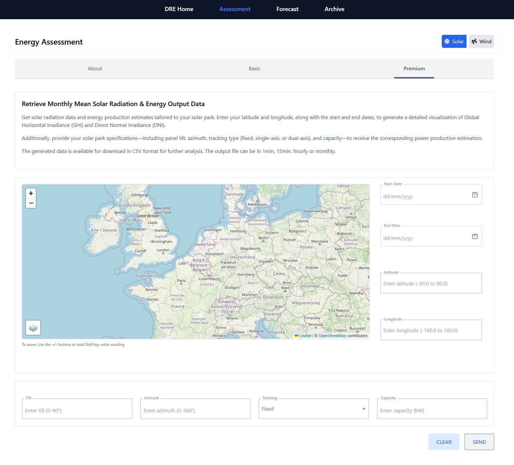

**Destination Renewable Energy (DRE)**

Use Case application (software)

Ref.: DestinE_ESA_DRE\_ D5.3_UCA_v5.0

**Author's Table**

| Written by:  | George Koutalieris Symeon Symeonidis Vasillis Perifanis Athanassios Drivas  Kyriaki Papachristopoulou Rizos-Theodoros Chadoulis Aggelos Georgakis Christos Stathopoulos Platon Patlakas | ENORA INNOVATION ENORA INNOVATION ENORA INNOVATION NOA NOA NOA NOA WeMET WeMET |
|--------------|-----------------------------------------------------------------------------------------------------------------------------------------------------------------------------------------|--------------------------------------------------------------------------------|
| Verified by: | Theodora Papadopoulou  George Koutalieris                                                                                                                                               | NOA ENORA INNOVATION                                                           |
| Approved by: | Haris Kontoes                                                                                                                                                                           | NOA                                                                            |

**Change Log**

| Issue | Date             | Reason for change        | Section(s) changed           |
|-------|------------------|--------------------------|------------------------------|
| 1.0   | 13 February 2024 | Creation of the document |                              |
| 2.0   | 14 May 2024      | New Version              | Edits in the entire document |
| 3.0   | 27 July 2024     | New Version              | Edits in the entire document |
| 4.0   | 27 October 2024  | New Version              | Edits in the entire document |
| 5.0   | 12 May 2025      | Fifth Version            | Edits in the entire document |

**Table of Contents**

***

[**1 Introduction 5**](#introduction)

[1.1 Scope of the deliverable 5](#scope-of-the-deliverable)

[**2 Deployment 6**](#deployment)

[**3 User Interfaces (UI) 7**](#user-interfaces-ui)

[3.1 User Interface: User Management Interface 25](#user-interface-user-management-interface)

[3.2 Component 2: DRE Release 5 Assessment and Forecasting services 26](#component-2-dre-release-5-assessment-and-forecasting-services)

[**4 Conclusion & Future Directions 33**](#conclusion--future-directions)

# Introduction

***

## Scope of the deliverable

This deliverable is the documentation for the Destination Renewable Energy (DRE) Use Case software application version 5.0, called the Hybrid Renewable Energy Forecasting System (HYREF). Therefore, this document uses the terms DRE Use Case and HYREF interchangeably.

***

# Deployment

The HYREF Software in the development environment is accessible at the following URL: [**https://hyrefapp.dev.desp.space/**](https://hyrefapp.dev.desp.space/)

***

# User Interfaces (UI)

The following subsection describes the interfaces' components within the DRE software application, designed for user documentation and to facilitate effective use of the system and its features, as presented in Figures 1 to 19.

***

***

***

**Figure 1: DRE Login, KeyCloak DESP platform.**

***

**Figure 2: Welcome Page of the DRE service.**

****

**Figure 3: Overview of the WP5 Assessment and Forecasting Archive section, illustrating the storage of forecasted data and assessment results.**

***

**Figure 4. WP5 - Solar Assessment Module - Overview and Functionality.**

***

***

***

**Figure 5. Overview of Solar Resource Assessment – WP5 Basic Configuration.**

**Figure 6. WP5 - Solar Assessment Premium Interface.**

**Figure 7. Overview of WP5 - Wind Resource Assessment Module and information for end-users.**

**Figure 8. Basic Wind Resource Assessment Interface and key parameters.**

**Figure 9. Wind Assessment Premium service and parameters are to be filled out by users.**

**Figure 10. Overview of WP5 - Solar Forecasting Component and Related Functionality.**

**Figure 11. Workflow in WP5 – One-off solar forecasting training using user-provided data.**

**Figure 12. Overview of WP5 - Solar Forecasting: One-off Deployment and Park-Level Specifications.**

**Figure 13. WP5 - Solar Forecasting: Annual Training Using User-Provided Data.**

**Figure 14. Overview of WP5 Solar Forecasting: Annual Performance and Park-Level Specifications.**

**Figure 15. Overview of Wind Forecasting Functionalities.**

**Figure 16. WP5 - Wind Forecasting Module: One-off Training Using User-Provided Data.**

**Figure 17. Overview of WP5 Wind Forecasting: One-off Configuration and Wind Park Specifications.**

**Figure 18. WP5 - Wind Forecasting: Annual training results using project-specific data inputs.**

**Figure 19. Overview of WP5 Wind Forecasting: Annual Performance and Wind Park Specifications.**

## User Interface: User Management Interface

**Title:** Login User Dialogue Box

***

**Functionality:** This interface is used to log in to a user within the system via the KeyCloak DESP platform.

***

***

**Fields and Options**

***

**Email:** Input field for the user's email address.

***

**Full Name:** Input field for the user's full name.

***

**Send email notification:** A checkbox, when selected, triggers the system to send an email notification to the new user upon account creation.

***

***

**Profile Picture:**

***

**Default Image Placeholder:** Indicates where the profile picture will be displayed.

***

**Choose Button:** Opens a dialogue to upload or select a profile picture.

***

**Actions:**

***

**Add User Button:** Submits the new user information to create a profile.

***

**Close Button:** Closes the dialogue without adding a new user.

***

***

## Component 2: DRE Release 5 Assessment and Forecasting services

**Main Features:** Archive Overview

***

***

-   Document Repository Interface:

***

Central location containing historical data, assessments, and forecasting outputs.

***

-   Data Organisation:

***

Structured folders categorised by assessment types and timeframes.

***

-   Accessibility:

***

It provides quick access to download or review past performance and project records.

***

***

**Main Features:** Solar Assessment Overview

***

***

-   Assessment Purpose Description:  
    Explains the objectives and scope of solar resource evaluation.

***

-   Service Coverage:  
    Includes irradiation analysis, PV potential estimation, and data collection methodology.

***

-   User Guidance Panel:  
    Offers information on how to request an assessment and interpret results.

***

***

**Main Features:** Solar Basic Assessment

-   **Solar Irradiation Time Series:  
    **Visualises Global Horizontal Irradiance (GHI) and Direct Normal Irradiance (DNI) trends across selected time ranges and locations.
-   **Basic Metrics Table:  
    **Presents monthly mean solar irradiation values, temperature, and photovoltaic power potential.
-   **Functionality:  
    **Users input latitude, longitude, and date range to generate site-specific solar radiation visualisations.
-   **Data Export:  
    ** Results can be downloaded in CSV format with selectable resolution- 1-minute, 15-minute, hourly, or monthly, for deeper analysis.

***

***

**Main Features:** Solar Premium Assessment

-   **High-Resolution Irradiation Mapping:  
    **Generates detailed visualisations of Global Horizontal Irradiance (GHI) and Direct Normal Irradiance (DNI), based on precise geographic inputs.
-   **Advanced PV Performance Metrics:  
    **Calculates energy output estimates by factoring in user-defined solar park specifications—panel tilt, azimuth, tracking type (fixed, single-axis, dual-axis), and system capacity.
-   **Functionality:  
    **Users input latitude, longitude, and date range, then specify system parameters to simulate accurate PV power production.
-   **Data Export:  
    **Results are downloadable in CSV format and available in 15-minute and hourly resolution formats for advanced analysis.

***

**Main Features:** Wind Assessment Overview

-   **Service Outline:**

    Explains the purpose of wind resource assessment, highlighting its role in site selection, feasibility analysis, and energy yield forecasting.

-   **Coverage and Capabilities:**

    Details the data inputs and modelling techniques used, including spatial resolution and turbine-specific output capabilities.

-   **User Orientation Section:**

    Guides users through required inputs—location, time range, and turbine configuration—and describes the format of the resulting assessment.

***

***

**Main Features:** Wind Basic Assessment

-   **Wind Speed Distribution Graph:  
    **Generates histograms, wind roses, and directional statistics to visualise wind speed frequency and directionality across speed bins.
-   **Essential Wind Statistics Table:  
    **Presents key metrics such as mean wind speed, Weibull parameters, high-percentile wind speeds, and sector-wise (based on wind direction) wind analysis, supporting early-stage evaluations.
-   **Assessment Scope:  
    ** Designed for initial site screening and feasibility analysis of wind energy projects.
-   **Functionality:  
    **Users enter location coordinates (latitude and longitude) and measurement height to retrieve historical wind speed data and resource insights.
-   **Data Export:  
    **Outputs are downloadable in CSV format for further review or modelling.

**Main Features:** Wind Premium Assessment

-   **HYREF Model Prediction Chart:  
    **Visualises the relationship between wind speed (m/s) and power production (kW) using either user-defined or reference power curves over the selected time.
-   **Energy Production Summary Table:  
    **Provides detailed, timestamped records including wind direction, speed, and corresponding energy output based on a scenario of installed capacity, along with key parameters of the energy yield, enabling performance evaluation.
-   **Plant Production Parameters Graphs:  
    **Tracks wind direction and speed trends over time, as well as the distribution of the generated wind energy in different wind magnitudes to assess the potential energy generation.
-   **Functionality:  
    **Users input geographic coordinates (latitude and longitude), time range, and turbine specifications such as hub height and a power curve model. They can select a default model from a list of reference curves if unavailable.
-   **Data Export:  
    **All outputs are available in CSV format for further analysis or integration into external tools.

**Main Features:** Solar Forecasting Overview

-   **Forecasting Methodologies:  
    **Combines DT-derived forecasts with PV simulation or machine learning, depending on data availability. Users can choose between a data-driven ML model or a standard parameter-based simulation.
-   **Use Cases and Applications:  
    **Supports grid management, energy trading, and short-term operational planning by delivering site-specific solar production forecasts.
-   **Training Data Requirements:  
    **For enhanced accuracy, users can upload historical production data via a template. This trains a machine learning model that integrates meteorological forecasts for tailored predictions.
-   **Flexibility:  
    **Users may opt for standard forecasting without uploading data, based solely on solar park configuration, offering a more straightforward yet insightful forecast alternative.

**Main Features:** Solar Forecasting / One-off / Training using your own data

-   **User Data Integration Module:  
    **Enables users to upload historical solar power production data using a standardised CSV template, forming the foundation for model training.
-   **Machine Learning Model Training Logs:  
    **Displays model training status, including validation steps and performance metrics to ensure transparency and reliability.
-   
-   **Purpose:  
    **By uploading site-specific historical data, users enable the system to train a tailored machine learning model that accounts for their solar park's unique operational patterns and environmental conditions.

**Main Features:** Solar Forecasting / One-off / Park Specifications

-   **System Design Input Forms:  
    **Collects detailed configuration data, including panel tilt, azimuth, tracking type (fixed, single-axis, dual-axis), and DC capacity to support accurate simulation.
-   **Geolocation Mapping Interface:  
    **It allows users to input latitude, longitude, and elevation, and it is supported by an interactive map for visual validation of the park’s location.
-   **Purpose:  
    **These inputs enable the Digital Twin system to simulate energy output based on a real-world setup, ensuring precise forecasting for efficiency optimisation.

**Main Features:** Solar Forecasting / Annual / Training using your own data

-   **Rolling Forecast Engine:  
    **Leverages historical production data to train and improve the forecasting model over the year.
-   **Data Resampling & Validation:  
    **Automatically validates and corrects missing or inconsistent entries in the uploaded CSV files, and returns any relevant error messages, ensuring reliable model input.
-   **Purpose:  
    **This subscription-based service uses site-specific data to generate daily forecasts tailored to the solar park’s conditions, improving long-term operational planning.
-   **Input Requirement:  
    **Users must upload their data using the standardised CSV template provided.

**Main Features:** Solar Forecasting / Annual / Park Specifications

-   **System Design Input Forms:  
    **Collects detailed configuration data, including panel tilt, azimuth, tracking type (fixed, single-axis, dual-axis), and DC capacity to support accurate simulation.
-   **Geolocation Mapping Interface:  
    **It allows users to input latitude, longitude, and elevation, and it is supported by an interactive map for visual validation of the park’s location.
-   **Purpose:  
    **These inputs enable the Digital Twin system to simulate daily energy output based on a real-world setup, ensuring precise forecasting for efficiency optimisation.

**Main Features:** Wind Forecasting Overview

-   **Forecasting Scope and Benefits:  
    **Delivers site-specific wind power forecasts with a 2-day horizon, supporting operational planning, energy trading, and grid integration.
-   **Modelling Techniques:  
    **Combines mesoscale weather forecasts with site-level downscaling and power curve integration using historical training data or standard configurations.
-   **User Data Handling Policy:  
    **Outlines how user-provided data, such as historical production logs and power curves, is processed, validated, and securely stored.

    **Forecasting Options:**

    **Tailor-Made Forecasts Using Historical Data:  
    **Users can upload past production data, basic meteorological variables, and a power curve to train a customised model. Forecasts are generated by applying Digital Twin weather inputs for higher accuracy.

    **Standard Forecasting Without Historical Data:  
    **Users may select from predefined power curve models or upload their own curve. This option enables forecasting without production history, offering a quick and practical alternative for short-term planning.

**Main Features:** Wind Forecasting / One-off / Training using your own data

-   **Historical Wind Data Upload:**

    To build a custom forecasting model, users can submit historical wind speed and energy production data, along with other available meteorological records, via a structured CSV template.

-   **Predictive Model Configuration:**

    Supports customisation of forecasting parameters to reflect local site conditions and turbine specifications for increased accuracy.

-   **Model Performance Dashboard:**

    Displays the expected wind power generation, wind speed, and wind direction as derived from the incorporation of historical data from the target site of interest..

***

**Main Features:** Wind Forecasting / One-off / Park Specifications

-   **Turbine Type Selection Panel:**

    Allows users to select from predefined turbine models and specify hub height for accurate simulation.

-   **Predictive Model Configuration:**

    Supports the conversion of wind speed into power following the specifications of the current wind plant infrastructure.

-   **Model Performance Dashboard:**

    Displays the expected wind power generation together with wind speed and wind direction as derived from the implementation of the user's power curve model.

***

**Main Features:** Wind Forecasting / Annual / Training using your own data

-   **Purpose:  
    **This annual subscription service trains a machine learning model using historical wind speed and energy production data, as well as other available meteorological records. Following this approach, the Digital Twin forecast data are downscaled to the site of interest, and the energy yield is estimated based on the local prevailing characteristics. As demonstrated at MORE Energy’s wind farm in central Greece, it delivers continuously updated, site-specific forecasts that support strategic decision-making and enhance operational efficiency.
-   **Input Requirement  
    **Users must upload data using the standardised CSV template provided

**Main Features:** Wind Forecasting / Annual / Park Specifications

-   **Purpose:**  
    This annual subscription service generates ongoing wind energy forecasts based on standard power curve models or user-defined ones, with the intention of converting wind speed into the expected wind power generation.

***

-   **Input Requirement:**  
    Users must either select between two predefined power curve models oriented for onshore and offshore installations or upload their own power curve model using the standardised CSV template provided.

***

# Conclusion & Future Directions

The DRE Use Case Application (version 5) showcases the latest evolution of the DRE software, emphasising key user interfaces for solar and wind assessment and forecasting. This version highlights the integration of DESP/Destine’s unified capabilities to advance renewable energy forecasting. By leveraging these systems, the DRE supports more informed energy consumption, trading, and storage decisions. It demonstrates how solar and wind forecasts can be incorporated into a cohesive framework, delivering high-resolution insights into renewable energy availability up to 48 hours in advance.

***

***

***

***

***
