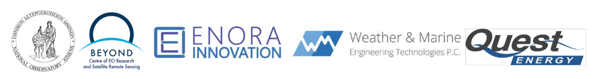

***

**Destination Renewable Energy (DRE)**

**Use Case Exploitation Roadmap**

***

Ref.: DestinE_ESA_DRE\_ Use Case Exploitation Roadmap \_v2.1

**Author's Table**

| Written by:  | George Koutalieris Symeon Symeonidis Vasillis Perifanis Iphigenia Kapsomenaki Theodora Papadopoulou Rizos-Theodoros Chadoulis Aggelos Georgakis Christos Stathopoulos | ENORA INNOVATION ENORA INNOVATION ENORA INNOVATION ENORA INNOVATION NOA NOA NOA WeMET PC |
|--------------|-----------------------------------------------------------------------------------------------------------------------------------------------------------------------|------------------------------------------------------------------------------------------|
| Verified by: | Theodora Papadopoulou                                                                                                                                                 | NOA                                                                                      |
| Approved by: | Haris Kontoes                                                                                                                                                         | NOA                                                                                      |

**Change Log**

| **Issue** | **Date**         | **Reason for change**    | **Section(s) changed** |
|-----------|------------------|--------------------------|------------------------|
| 1.0       | 10 December 2024 | Creation of the document |                        |
| 2.1       | 12 May 2025      | New version              | Entire document        |

***

**Table of Contents**

[**1 Introduction 4**](#introduction)

[1.1. Purpose of the Use Case Exploitation Roadmap Deliverable 4](#purpose-of-the-use-case-exploitation-roadmap-deliverable)

[**2 Use Case Overview 5**](#use-case-overview)

[2.1 Description of the Use Case in a nutshell 5](#description-of-the-use-case-in-a-nutshell)

[2.1.1 Objectives 5](#objectives)

[2.1.2 Inputs 5](#inputs)

[2.1.3 Outputs 5](#outputs)

[2.1.4 Workflow 6](#workflow)

[2.1.5 Benefits for End Users 6](#benefits-for-end-users)

[2.2 Roles of the partners 7](#roles-of-the-partners)

[2.3 Roadmap of the Implementation of DRE Software Application 7](#roadmap-of-the-implementation-of-dre-software-application)

[**3 Methodology for Exploitation 9**](#methodology-for-exploitation)

[3.1 Exploitation Strategy 9](#exploitation-strategy)

[3.1.1 Exploitation Roles 9](#exploitation-roles)

[3.1.2 Target Users 10](#target-users)

[3.2 Commercialisation 11](#commercialisation)

[3.3 Funding and Investment Opportunities 13](#funding-and-investment-opportunities)

[3.4 Future Directions 13](#future-directions)

[**4 Roadmap for Exploitation 14**](#roadmap-for-exploitation)

[4.1 Strategic Direction 14](#strategic-direction)

[4.2 Intellectual Property Rights (IPR) Management 15](#intellectual-property-rights-ipr-management)

[IPR Ownership and Attribution 15](#ipr-ownership-and-attribution)

[Licensing and Access Rights 16](#licensing-and-access-rights)

[Data Rights and Interoperability 16](#data-rights-and-interoperability)

[Confidentiality and Know-How 16](#confidentiality-and-know-how)

[IPR Governance and Dispute Resolution 17](#ipr-governance-and-dispute-resolution)

[Sustainability and Post-Project Exploitation 17](#sustainability-and-post-project-exploitation)

[4.3 Exploitation Activities 17](#exploitation-activities)

[**5 Potential Obstacles 20**](#potential-obstacles)

[**6 Conclusion and Next Steps 21**](#conclusion-and-next-steps)

# Introduction

## Purpose of the Use Case Exploitation Roadmap Deliverable

This document outlines the second version of the strategy for leveraging the Destination Renewable Energy (DRE) Use Case outcomes. It defines a roadmap for future exploitation activities to ensure the Use Case results are effectively utilised and adapted to benefit renewable energy stakeholders and end users. The strategy also guides the optimal use of the Hybrid Renewable Energy Forecasting System (HYREF) and other innovations developed during the Use Case.

***

It begins with an overview of the Destination Renewable Energy (DRE) use case, describing its objectives, inputs, and anticipated benefits. It then outlines the roadmap for implementing the DRE application software, highlighting key milestones and timelines. Following this, the methodology for exploitation is discussed, presenting strategies for maximising the impact and adoption of the Use Case's outcomes. The subsequent sections delve into future directions for the continued development and enhancement of the DRE. Potential challenges, such as limited stakeholder awareness and bureaucratic hurdles, are acknowledged alongside mitigation strategies. Finally, the document concludes with a comprehensive roadmap for exploitation, summarising the following steps and actions required to sustain and expand the benefits of the DRE Use Case.

# Use Case Overview

## Description of the Use Case in a nutshell

The DRE Use Case focuses on developing and demonstrating an advanced forecasting system for renewable energy production, combining wind and solar resources. The goal is to deliver accurate short-term (0–2 days ahead) renewable energy forecasts with high temporal and spatial resolution. This system supports stakeholders in the energy sector, enabling optimised production, storage, and trading of renewable energy while supporting infrastructure development and business planning.

### Objectives

1\. Hybrid Forecasting: Integrate solar and wind energy data to improve forecasting accuracy using DestinE system capabilities.

2\. Decision Support: Provide stakeholders with actionable insights to inform energy consumption, storage, and trading strategies.

3\. Scalability: Using advanced DestinE and DestinE Core Service Platform (DESP) data streams, design a solution that can be adapted to various spatial scales, from local installations to regional grids.

### Inputs

The use case will leverage cutting-edge datasets and models, including:

-   DESP/DestinE data streams for accurate and real-time inputs,
-   ECMWF Reanalysis v5 (ERA5) hourly data on single levels,
-   CAMS atmospheric forecasts for solar energy predictions,
-   Solar radiation time series, surface elevation (DEM), albedo data, and outputs from proprietary models for solar radiation (e.g., radiative transfer) and wind forecasting (e.g., high-resolution numerical weather prediction models).

### Outputs

The system will deliver multi-tiered outputs:

1\. Level 1 (L1): Solar radiation, wind assessment, and forecast data tailored to specific geographic locations.

2\. Level 2 (L2): High temporal resolution energy datasets co-designed with end users to address their specific needs.

3\. Level 3 (L3): Decision-support insights for infrastructure planning, portfolio optimisation, and energy trading.

### Workflow

The use case development is structured around four key pillars:

1.  Stakeholder Engagement: Early collaboration with renewable energy stakeholders to gather recommendations and define system requirements.
2.  System Development: Integration of DestinE data into existing models, assessment and forecasting solutions creation, and validation through iterative testing.
3.  Co-Design and Interoperability: Collaboration with end users to ensure the service meets real-world needs, with attention to timeliness and adaptability under various data conditions.
4.  Dissemination and Awareness: Promote the use and benefits of the DRE service through targeted communication with energy stakeholders, fostering adoption and long-term sustainability.

### Benefits for End Users

-   Improved Efficiency: Enhance energy portfolios by optimising consumption, storage, and trading strategies.
-   Informed Planning: Support infrastructure development and investment decisions using high-precision forecasts.
-   Broader Impact: Contribute to the green and digital transformation of the energy sector by advancing the integration of renewable energy sources.
-   Smart Living Solutions: Leverage AI-powered smart home technologies to offer end users greater control over their energy use, aligning with modern sustainability goals and cost optimisation.

    The DRE use case exemplifies how advanced forecasting and decision-support tools can empower stakeholders to address challenges related to renewable energy integration and climate resilience, driving the transition toward a sustainable energy future.

## Roles of the partners

Table 1 below outlines the responsibilities of each organisation involved in the DRE Use Case, highlighting their specific contributions to the development and implementation.

**Table 1. Roles and technical responsibilities of the DRE Use Case partners.**

***

| **Organisation** | **Responsibilities**                                                           |
|------------------|--------------------------------------------------------------------------------|
| **ENORA**        | - Organise the requirements specification process.                             |
|                  | - Design technical architecture and software systems.                          |
|                  | - Implement the DRE software application.                                      |
|                  | - Manage cloud onboarding and deployment.                                      |
|                  | - Design the user interface (UI).                                              |
| **NOA**          | - Define requirements and user scenarios for solar forecasting.                |
|                  | - Validate, evaluate, and improve the user interface.                          |
|                  | - Design, develop, and deploy the solar forecasting system.                    |
|                  | - Specify and design what-if scenarios.                                        |
|                  | - Onboard solar forecasting onto the DESP platform.                            |
|                  | - Test and validate the solar forecasting module.                              |
| **WeMET**        | - Define requirements and user scenarios for wind forecasting.                 |
|                  | - Validate, evaluate, and improve the user interface.                          |
|                  | - Design, develop, and deploy the wind forecasting system.                     |
|                  | - Onboard wind forecasting onto the DESP platform.                             |
|                  | - Provide meteorological and energy data from wind park infrastructures.       |
|                  | - Test and validate the wind forecasting module.                               |
| **Quest Energy** | - Conduct testing and validation of the DRE software application system.       |
|                  | - Provide solar test data from the Kinigos site.                               |
|                  | - Perform energy market analysis to align forecasting tools with market needs. |

## Roadmap of the Implementation of DRE Software Application

The development and deployment of the DRE software application followed a structured and phased approach, culminating in a fully operational system. Four key milestones were achieved throughout the Use Case, each contributing to the system's comprehensive functionality and user-focused design.

During the first phase, the foundational infrastructure was successfully established. Data pipelines were implemented to acquire, ingest, and process real-time and historical data streams from DESP and 3Es (ESA, ECMWF, and EUMETSAT), supported by robust databases and Application Programming Interfaces (APIs) capable of handling big data. The modular system architecture was defined and built, incorporating components for data ingestion, forecasting, decision support, and a basic user interface. Automated testing pipelines for Continuous Integration (CI) and Continuous Delivery (CD) were also implemented, ensuring a stable foundation for further development.

By the second release, the solar energy forecasting model was developed and integrated into the software, marking the completion of the second phase. Using DESP data and advanced forecasting algorithms, the model was rigorously tested and validated with historical and real-time datasets, ensuring its accuracy and reliability. The user interface was enhanced to display solar forecasting capabilities, providing actionable insights to users and demonstrating the system's potential.

The third phase introduced wind energy forecasting capabilities and advanced hybrid functionalities. Using DESP data, a wind energy forecasting model was developed and seamlessly integrated into the system alongside the existing solar model. The hybrid approach enabled the development of advanced services, including decision support tools, policy insights, and optimisation strategies. Close collaboration with QUEST ENERGY and other stakeholders ensured the system outputs were co-designed to meet end-user needs, incorporating valuable feedback into the final design.

The fourth phase delivered a fully integrated and validated application software that was ready for deployment. The solar and wind forecasting models and advanced services were fully operational and optimised for performance and reliability. Spatial upscaling capabilities were implemented, allowing users to generate renewable energy forecasts tailored to their specific geographic locations using DESP data. Comprehensive testing - including usability, performance, security, and stress tests - confirmed the system's robustness and readiness for deployment. Detailed documentation, user manuals, and training sessions were also completed, ensuring smooth adoption and effective use of the software.

The implementation of the DRE software application demonstrates its capacity to provide accurate renewable energy forecasts and actionable insights, empowering stakeholders to make informed decisions and drive the green energy transition.

# Methodology for Exploitation

The proposed strategy builds upon the exploitation framework outlined by the Use Case partners, focusing on the optimal use of the application. The partners are committed to ensuring the results and innovations of the DRE Use Case are effectively utilised beyond the Use Case's conclusion.

The DRE Use Case aims to empower stakeholders in the renewable energy sector by providing advanced tools for accurate forecasting and decision-making. The initiative is anchored on three main technological pillars: leveraging DestinE and DESP data streams, developing solar and wind forecasting models, and creating a decision support system tailored to the needs of renewable energy producers, policymakers, and investors. The Use Case has demonstrated the application of these tools by integrating solar and wind energy data, providing actionable insights based on hybrid models.

The participatory approach involves close collaboration with stakeholders such as QUEST ENERGY to co-design the system's features and outputs. Additionally, the Use Case integrates advanced decision-making tools into the DRE to support informed energy production, trading, and infrastructure development. Combining state-of-the-art forecasting algorithms with real-time data enhances decision-making processes and promotes sustainable energy solutions. Through these efforts, the DRE Use Case ensures that the tools and methodologies developed will have a lasting impact, driving the adoption of renewable energy technologies and supporting the green and digital transformation of the energy sector.

## Exploitation Strategy

### Exploitation Roles

Table 2 details each organisation's exploitation roles and contributions to the DRE Use Case outcomes.

**Table 2. Exploitation Roles and Responsibilities of the DRE Use Case partners.**

***

| **Organisation** | **Exploitation Role**                                  | **Responsibilities**                                                                                                                                 |
|------------------|--------------------------------------------------------|------------------------------------------------------------------------------------------------------------------------------------------------------|
| **NOA**          | Scientific Leadership (Solar Energy)                   | Specify requirements for future releases.                                                                                                            |
|                  |                                                        | Develop data and extended region forecasts for solar energy.                                                                                         |
|                  |                                                        | Create a marketing strategy for solar forecasting.                                                                                                   |
| **ENORA**        | Technical Lead (Software Implementation)               | Provide ongoing software support, upgrades, and releases.                                                                                            |
|                  |                                                        | Determine costing and pricing policies for software services.                                                                                        |
|                  |                                                        | Develop a marketing strategy for the DRE software application.                                                                                       |
| **WeMET**        | Industry Liaison & Scientific leadership (Wind Energy) | Develop data and extended region forecasts for wind energy.                                                                                          |
|                  |                                                        | Explore market development prospects for wind forecasting.                                                                                           |
|                  |                                                        | Formulate a marketing strategy for wind forecasting.                                                                                                 |
| **Quest Energy** | Industry Liaison                                       | Collaborate with stakeholders and promote the adoption of DRE solutions within the energy industry. Participate in the exploitation of the solution. |

### Target Users

Identifying target users is crucial for ensuring the effective utilisation of the results and findings of the DRE Use Case. Engaging these users and maintaining their interest in the Use Case's progress is key to its success. The Use Case coordination, in collaboration with the consortium, has developed a list of primary stakeholders and interested parties to keep the system's tools and outputs relevant and impactful.

The main target users identified for the DRE Use Case and its associated outcomes are as follows:

1.  **Renewable Energy Producers**: Companies and organisations operating solar and wind farms, as well as individual energy producers, seek accurate forecasts to optimise production and distribution.
2.  **Policy Makers and Regulators**: National and regional authorities responsible for energy policy, climate action plans, and renewable energy incentives, requiring reliable data for informed decision-making.
3.  **Energy Traders and Market Operators**: Professionals and companies involved in energy trading rely on forecasts to enhance market strategies and trading efficiency.
4.  **Energy Storage Developers**: Organisations focusing on battery storage or other energy storage technologies, utilising forecasts to maximise storage efficiency and integration with renewable sources.
5.  **Academic and Research Institutions**: Researchers, scientists, and students interested in renewable energy forecasting, hybrid energy models, and climate-resilient energy systems.
6.  **Consultancy Firms**: Professionals providing advisory services in renewable energy optimisation, grid management, and sustainable energy transitions.
7.  **Infrastructure Developers and Investors**: Stakeholders involved in planning and financing renewable energy projects, leveraging forecasts for site selection and investment decisions.
8.  **End-User Collaborators**: Stakeholders such as QUEST ENERGY are co-designing and refining the system's outputs to meet practical operational needs.
9.  **Regional Energy Networks**: Organisations, associations, and governmental bodies supporting renewable energy transitions at regional and national levels, focusing on sustainability and innovation.
10. **Environmental Advocacy Groups**: NGOs and organisations promoting clean energy adoption and climate resilience, utilising system insights for advocacy and outreach.

This list ensures that the **DRE** is tailored to the needs of its diverse stakeholders, fostering adoption and maximising the Use Case's impact across the renewable energy sector.

## Commercialisation

The commercialisation strategy for the DRE Use Case focuses on transforming the Use Case's innovations into viable market solutions that address the growing demand for accurate renewable energy forecasting and decision-support tools. This strategy ensures that the DRE Use Case's outcomes generate tangible value for stakeholders while contributing to the broader adoption of hybrid renewable energy systems.

***

***

**Key Elements of the Commercialisation Strategy**

In case the 3Es will not allow commercialisation via the platform, we could establish bilateral agreements e.g., with the Service provider (SERCO) or with the end-users (QUEST Energy and Unisystems Software Integrator member of QUEST Group), the cloud facilities provider (OVH), etc., so that when a user would like to use the paid tier, the user would purchase the service directly from NOA. Then NOA will purchase the respective resources, etc., from the platform and service providers.

1.  **Market Segmentation**  
    Renewable energy producers, traders, policymakers, infrastructure developers, and energy storage providers are the primary market segments for DRE. These stakeholders require advanced forecasting capabilities to optimise production, trading, and storage while supporting strategic planning and regulatory compliance.

***

Beyond these primary segments, the assessment capabilities of the DRE application, particularly in analysing solar and wind fields, can benefit a much broader range of end users. These include households, energy communities, farmers, sailors, and any individual users who can leverage the data to inform their decisions. When combined with the relevant Greek legislative framework, the system can assist users in evaluating the suitability of their land or production units, assessing investment potential, and optimising their energy generation strategies.

Furthermore, the application’s geographical scope can be extrapolated to cover wider areas, enhancing its applicability across different regions and user profiles.

For energy communities specifically, the DRE offers significant value by enabling them to share their energy portfolios with larger companies with the necessary technical expertise. Such users would benefit from knowing whether their production units operate under optimal conditions and whether their land is suitable for photovoltaic investments.

***

For smaller installations that participate in larger cooperative schemes and receive dividends annually, understanding the expected energy yield of their individual assets becomes essential. Access to accurate forecasts would help them assess whether to continue partnerships with their current energy providers or explore alternative options.

***

2.  **Value Proposition**  
    DRE offers precise, renewable energy forecasts (solar and wind) up to two days ahead with high spatial and temporal resolution. By integrating advanced hybrid modelling and decision-support capabilities, the system helps stakeholders reduce operational risks, maximise energy efficiency, and make informed investment decisions.

***

3.  **Day-Ahead Market in Maximising DRE’s Impact -** The Day-Ahead Market (DAM) plays a crucial role in the energy sector, enabling producers, aggregators, and suppliers to plan their operations and trading strategies accurately and efficiently. By submitting bids for the following day, market participants secure their positions and manage price volatility and production variability risks. For renewable energy stakeholders, especially those relying on variable sources such as solar and wind, accurate day-ahead forecasting is essential to optimise energy output, reduce imbalances, and minimise associated costs. Integrating advanced forecasting solutions, such as those developed in the DRE Use Case, directly supports market participation by improving forecast precision, enabling better decision-making, and enhancing competitiveness in an increasingly dynamic energy market.

***

4.  **Business Models**

***

-   DRE provides solar/wind power output forecasting tailored to DestinE users' infrastructure. An additional source of revenue could be for the consortium to develop endpoints and provide tailored forecasting as a service, integrating with existing applications or developing bespoke solutions to address the needs of large customers. SaaS services would link with customers to analyse their production data and provide forecasting as a service. In this context, it makes sense to pay for the assets and resources of the DestinE platform because SaaS revenues are dependent on DestinE resources.
    1.  Free tier: The free tier provides (i) a demonstration of solar/wind resource assessments for specific locations and (ii) limited previews of subscription-based visualisations and outputs.
        1.  Paid tier:
            1.  One-off: The one-off services include i) a single solar/wind resource assessment, offering in addition energy production estimates based on user-selected infrastructure inputs, and ii) providing a one-time solar/wind power output forecast for a specific production site with tailored outputs.
            2.  Annual subscription: The annual subscription delivers daily 2-day forecasts of solar/wind power outputs at a user-defined location, allowing users to submit specifications of their power plants, such as time series data and system design, for customised outputs.
    -   **Custom Solutions**: Develop tailored services for large-scale energy operators or policymakers with specific requirements.
5.  **Partnerships and Alliances**  
    Collaborations with renewable energy companies, regulatory bodies, and technology providers will be key to scaling DRE's commercialisation. Partnerships with industry leaders like QUEST ENERGY can provide credibility and access to broader markets.

***

Also, HEDNO (Hellenic Electricity Distribution Network Operator S.A. - ΔΕΔΔΗΕ) represents a valuable opportunity for potential future collaboration within the framework of the exploitation strategy.

There is also market potential for smart home solutions that integrate AI agents capable of automatically managing household energy systems.

***

6.  **Revenue Streams**

***

-   Subscription fees for regular access to forecasting services.
    -   Licensing of the DRE software to third-party energy management platforms.
    -   Consultancy services for system customisation, training, and integration.
7.  **Marketing and Outreach**  
    A focused marketing campaign will raise awareness about DRE's capabilities, targeting key stakeholders through industry events, conferences, webinars, and direct engagement. Demonstration projects and pilot deployments will showcase the system's practical benefits and encourage adoption.

***

8.  **Scalability and Global Reach**  
    The system's design allows for scalability, enabling application across different regions and energy markets. Utilising DESP data ensures adaptability to various geographies, expanding DRE's commercial potential globally.

***

9.  **Post-Project Support**  
    A dedicated support team will provide ongoing maintenance, updates, and user support to ensure long-term sustainability. Feedback from early adopters will drive continuous improvement and innovation.

***

The commercialisation of DRE aims to position it as a leading solution in the renewable energy market, fostering the transition to sustainable energy systems and driving economic and environmental benefits for stakeholders worldwide.

***

## Funding and Investment Opportunities

Strategic funding and investment opportunities will be crucial for commercialisation and scalability.

***

The Use Case will explore funding from ESA & EU innovation programs, renewable energy grants, and private investors focused on clean energy technologies. These investments will enable the expansion of DRE's capabilities, the development of tailored solutions for diverse markets, and the establishment of a robust support system for its users.

***

## Future Directions

Future directions for the DRE system involve expanding its capabilities to include real-time data integration from various renewable energy sources and improving its machine learning algorithms for more accurate and reliable forecasts. Emphasis will be placed on enhancing user interface design to facilitate ease of use for stakeholders with varying levels of technical expertise.

Additionally, efforts will be made to develop partnerships with national and international energy organisations to promote global adoption. The DRE system will also explore integrating new technologies, such as blockchain for secure data sharing and artificial intelligence for predictive maintenance, to solidify its role further as a pivotal tool in the renewable energy sector. Through continuous innovation and collaboration, the DRE system aims to become a leading solution in the transition towards a sustainable energy future.

# Roadmap for Exploitation

## Strategic Direction

Looking into the long-term sustainability of the DRE application on DestinE, it is predominantly aimed at moving towards commercialising its capabilities. By delivering highly accurate short-term forecasts from zero to two days ahead, the application positions itself as an essential tool primarily for energy producers, national distribution and transmission operators looking to optimise their energy management strategies, and private companies dealing with Renewable Energy Sources (RES) investments and policymakers. This focus on accurate forecasting drives operational efficiency. It creates a competitive advantage in the market for renewable energy, making it an attractive option for potential users who aim to harness the full potential of wind and solar resources.

DRE enables users to explore alternative energy uses, assess storage options, and identify trading opportunities based on the real-time availability of renewable energy. By facilitating a business model that encourages user uptake, the application aims to attract a diverse range of customers, from energy producers to policymakers, who are looking to participate or contribute to the renewable energy market actively. As the user base expands, the application realises its commercial potential. It contributes to a sustainable energy landscape, promoting the broader adoption of clean energy solutions and fostering economic growth within the sector.

The strategic direction for exploiting the DRE Use Case focuses on actively engaging primary and secondary users while attracting organisations interested in adopting the tools and methodologies developed through the Use Case. The overarching goal is to empower stakeholders to use the DRE and its hybrid forecasting capabilities. Using these innovative tools, users can optimise renewable energy production, evaluate energy potential, enhance decision-making processes, and contribute to effective policy development.

***

***

The consortium's diverse expertise and practical applications demonstrated during the Use Case will redefine how hybrid renewable energy forecasting is perceived and applied. The tools' adaptability ensures they can accommodate a variety of geographic scales, energy infrastructures, and user needs, making them highly relevant across different contexts and maximising their impact.

***

Use Case partners to leverage their strengths and extensive networks to drive these efforts. Exploitation activities will prioritise sharing the use case's scientific and technical advancements through targeted publications, conferences, and workshops for academic and professional energy communities. These initiatives will promote the utility of the DRE system, fostering widespread adoption and establishing it as a pivotal tool in driving green energy innovation and enabling the energy sector's digital transformation.

***

***

During the internal exploitation workshops, several opportunities for the commercial development of the DRE solution were identified:

-   The forecasting methodology stands out as a key differentiator, offering a competitive advantage in the market. The irradiation and energy production forecasts for solar and wind installations should be thoroughly evaluated and promoted through comparison with industry-standard accuracy benchmarks.
-   The DRE application provides a user-friendly interface, enabling customers to interact with the forecasting results and experiment with different models and methods. This hands-on approach enhances both transparency and trust in the solution.
-   Forecasting services could be offered to third-party applications through well-defined liaisons and contractual agreements. Capitalising on the concept of the “API economy”, the DRE could deliver weather and RES production forecasts to Facility Management Platforms and Smart Home systems, helping optimise energy efficiency at monitored sites.
-   Given the ongoing trend towards low-cost RES systems in residential and commercial buildings, DRE holds the potential to develop international collaborations with home automation vendors, further extending its market reach.

***

## Intellectual Property Rights (IPR) Management

Effective management of Intellectual Property Rights (IPR) is critical to ensure the protection, ownership clarity, and commercial potential of the innovations developed under the DRE Use Case. Given the collaborative nature of the project and the integration of proprietary data, models, and software, a comprehensive and transparent IPR strategy has been adopted by the consortium to safeguard contributions, incentivise further innovation, and facilitate future exploitation.

### IPR Ownership and Attribution

Ownership of intellectual property developed in the context of the DRE Use Case is defined based on the origin and nature of the contributions:

-   **Foreground IP** (i.e., assets created during the project):
    -   
    -   Each partner retains ownership .
    -   
    -   
-   **Background IP** (i.e., pre-existing assets used during the project):
    -   All partners have declared their relevant background IP, including proprietary models, data processing methods, and datasets.
    -   Access rights to background IP are granted under fair and non-discriminatory (FRAND) terms strictly for project implementation and exploitation purposes.

### Licensing and Access Rights

To ensure seamless collaboration and maximise the utility of project results:

-   **Internal Use**: All consortium members are granted royalty-free, non-exclusive rights to use jointly developed IP for internal R&D and further innovation within the context of renewable energy forecasting.
-   **Third-Party Use and Commercial Licensing**:
    -   Commercial use of IP, including sublicensing to third parties, is governed by formal agreements that respect ownership and usage rights.
    -   NOA, as the scientific lead, and ENORA, as the technical lead, will manage primary licensing strategies for solar forecasting and the DRE software respectively, ensuring alignment with partners’ interests.
    -   Licensing models may include open-source components (for non-critical modules), freemium services, or tiered commercial licenses based on user profiles.

### Data Rights and Interoperability

Given the reliance on multiple external datasets (e.g., DESP, ECMWF ERA5, CAMS), the DRE Use Case ensures:

-   Compliance with the licensing terms of external data providers.
-   Attribution of all third-party data sources in published results and software outputs.
-   Development of interoperable software tools to ensure flexibility for integration with external systems, while isolating proprietary components to maintain IP integrity.

### Confidentiality and Know-How

-   All partners are bound by confidentiality agreements to protect sensitive information and technical know-how.
-   Technical documentation and source code containing trade secrets or confidential methods are protected under secure access protocols.
-   Where applicable, patentability assessments will be conducted prior to the publication or dissemination of technical results.

### IPR Governance and Dispute Resolution

-   An IPR Committee has been established within the consortium to oversee IP disclosures, manage ownership issues, and address conflicts.
-   The committee ensures consistent application of the IPR strategy across project stages, especially during joint development, validation, and dissemination.
-   In case of disputes, resolution will follow the escalation process defined in the consortium agreement, with mediation as a first recourse before arbitration or legal action.

### Sustainability and Post-Project Exploitation

To support the long-term exploitation of DRE innovations:

Licensing frameworks will be refined post-project to support commercial partnerships, technology transfers, and custom solution development.

The consortium will explore IP monetisation avenues through licensing, SaaS models, and consultancy services.

Training and documentation will include IP handling guidelines for users and future developers.

## Exploitation Activities

Table 3 outlines the proposed activities for exploiting the DRE Use Case outcomes. It highlights their purpose, target audiences, and expected impacts to ensure the DRE system's widespread adoption and effective utilisation.

**Table 3. Proposed exploitation activities to maximise adoption of the DRE system.**

***

| **Activity**                          | **Description**                                                                                            | **Target Audience**                                   | **Expected Outcome**                                                              |
|---------------------------------------|------------------------------------------------------------------------------------------------------------|-------------------------------------------------------|-----------------------------------------------------------------------------------|
| **Engagement with Primary Users**     | Collaborate with renewable energy producers, policymakers, and market operators to promote the DRE system. | Energy producers, policymakers, and market operators. | Adoption of the DRE system in energy operations and policy decision-making.       |
| **Tool Adaptation and Localisation**  | Customise forecasting tools to fit specific geographic scales and energy infrastructure requirements.      | Regional and local energy stakeholders.               | Broader applicability of the DRE system across various contexts.                  |
| **Scientific Dissemination**          | Publish research findings in scientific journals and present them at international conferences.            | Academic and research communities.                    | Increased awareness and validation of the DRE system in the scientific community. |
| **Workshops and Webinars**            | Organise events to showcase DRE's capabilities and train users on its application.                         | Energy sector professionals and consultants.          | Enhanced understanding and utilisation of the DRE system.                         |
| **Policy Support and Advocacy**       | Provide data and insights to policymakers to aid in formulating renewable energy regulations.              | Governmental bodies and regulatory agencies.          | Improved policy frameworks supporting renewable energy adoption.                  |
| **Networking and Collaboration**      | Build partnerships with international organisations and renewable energy networks.                         | Global and regional energy organisations.             | Strengthened dissemination channels and collaborative opportunities for DRE.      |
| **Demonstration Projects**            | Implement pilot projects to showcase the practical applications of the DRE system.                         | Industry stakeholders, investors.                     | Real-world validation and increased confidence in the system's utility.           |
| **Online Knowledge Hub**              | Develop a digital platform with guides, tutorials, and case studies to adopt DRE tools independently.      | General stakeholders and end users.                   | Easier access to resources for replicating and applying DRE methodologies.        |
| **Feedback Collection and Iteration** | Continuously gather input from users to refine and improve the system.                                     | All stakeholders.                                     | An iterative approach ensures the DRE system meets user needs and expectations.   |

# Potential Obstacles

The DRE Use Case may encounter challenges related to the limited interest or adoption of the DRE system by renewable energy stakeholders, including producers, policymakers, and investors. A lack of awareness about the system's capabilities and insufficient dissemination efforts could impede its ability to achieve the desired impact, restricting its reach and utilisation within the renewable energy sector. Furthermore, bureaucratic complexities within the Greek administrative system pose additional challenges, potentially slowing down adoption and implementation processes for the DRE system.

To mitigate this potential obstacle, the Use Case has emphasised showcasing its accomplishments and the benefits of the DRE system through collaboration with prominent international institutions and organisations. By presenting its achievements at well-regarded global forums, conferences, and scientific publications, the Use Case aims to capture the interest of key stakeholders and highlight the system's value and relevance to the renewable energy industry.

Additionally, fostering partnerships and engaging with international stakeholders are key strategies to expand the reach of the DRE system. Collaborative relationships with renewable energy companies, research institutions, and policymaking bodies can provide vital opportunities for disseminating Use Case outcomes, sharing best practices, and building networks. These partnerships enable the Use Case to amplify its promotion efforts and ensure that DRE's tools and methodologies are recognised and adopted on a broader scale.

By actively engaging stakeholders and leveraging international platforms to demonstrate its innovations, the DRE Use Case aims to overcome challenges related to stakeholder disinterest. These efforts ensure the widespread adoption of the DRE system, maximising its impact and supporting the green and digital transformation of the energy sector.

# Conclusion and Next Steps

This document acts as a guide to identify and define the exploitable outcomes of the DRE Use Case, encompassing the value proposition and activities related to exploitation, dissemination, and deployment. The plan consolidates the efforts undertaken during the Use Case's 18-month duration, focusing on leveraging the outcomes to benefit renewable energy stakeholders, including producers, policymakers, and investors. It assesses the sustainability of the forecasting system and its application across various energy-related domains while addressing the pressing demand for clean and efficient energy solutions from economic, environmental, and social perspectives.
