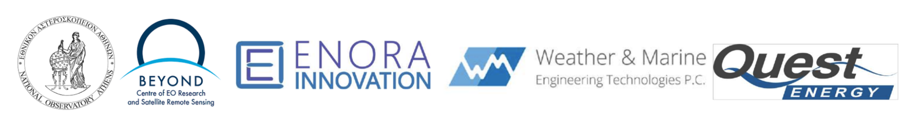

**Destination Renewable Energy (DRE)**

Software Release Plan (SRP)

Ref.: DestinE_ESA_DRE_SRP_v6.0

**Author's Table**

| Written by:  | George Koutalieris Symeon Symeonidis Vasillis Perifanis | ENORA INNOVATION |
|--------------|---------------------------------------------------------|------------------|
| Verified by: | Theodora Papadopoulou                                   | NOA              |
| Approved by: | Haris Kontoes                                           | NOA              |

**Change Log**

| Issue | Date             | Reason for change        | Section(s) changed           |
|-------|------------------|--------------------------|------------------------------|
| 1.0   | 15 December 2023 | Creation of the document |                              |
| 2.0   | 13 February 2024 | New version              | Edits in the entire document |
| 3.0   | 14 May 2024      | New version              | Edits in the entire document |
| 4.0   | 27 July 2024     | New Version              | Edits in the entire document |
| 5.0   | 24 October 2024  | New Version              | Edits in the entire document |
| 6.0   | 12 May 2025      | New Version              | Edits in the entire document |

**Table of Contents**

***

[1. Introduction 4](#introduction)

[1.1 Purpose of the document 4](#11-purpose-of-the-document)

[1.2 Brief overview and objectives of DRE Use Case 4](#12-brief-overview-and-objectives-of-dre-use-case)

[1.3 Scope and Key Objectives of the DRE Use Case 5](#13-scope-and-key-objectives-of-the-dre-use-case)

[2. Release Plan 6](#release-plan)

[3. Timeline and Milestones 9](#timeline-and-milestones)

[4. Risk Management 10](#risk-management)

[5. Conclusion 12](#5-conclusion)

# Introduction

## 1.1 Purpose of the document

The purpose of the Software Release Plan version 6.0 deliverable is to manage and guide the development and implementation of the digitised, predictive Hybrid Renewable Energy Forecasting System (HYREF) for Destination Renewable Energy (DRE) Use case, integrating physical solar and wind energy systems with their digital twin models to enhance decision-making in energy production, trade, and storage. This is the final version of the deliverable. It incorporates all updates made during each subsequent phase to reflect the current status of the Use Case. The Destination Renewable Energy (DRE) Use Case software application is called the Hybrid Renewable Energy Forecasting System (HYREF). Therefore, this document uses the terms DRE Use Case and HYREF interchangeably.

## 1.2 Brief overview and objectives of DRE Use Case

The DRE Use Case focuses on developing and upscaling the HYREF, a user-friendly web application designed to deliver accurate, real-time data and forecasts for solar and wind energy production. The core objective is to assist decision-makers in crafting well-informed strategies by providing detailed insights and data that reduce the uncertainty of weather-dependent renewable energy outputs.

The DRE service offers a forecasting suite that includes solar radiation assessment, wind power production assessment, and 2-day forecasts of Global Horizontal Irradiance (GHI), solar production, wind speed, and power output. It also integrates hybrid solar and wind power forecasting for enhanced predictive accuracy. Solar and wind resource assessments rely on CAMS solar radiation and historical wind data, using parameters such as wind speed and direction, temperature, pressure, humidity, and air density. This enables accurate energy yield estimation and supports location-based analysis through dedicated software.

The DRE models can further incorporate user-provided time series to improve forecast quality, tailoring simulations to specific solar and wind parks. Upscaling the initial implementation involves adding new methods, including data collocation, management of spatiotemporal limitations, and error identification based on user inputs and Digital Twin (DT) data.

The HYREF will be integrated into the DestinE platform, offering automated processing of solar and wind analysis through containerised services and leveraging DT and DestinE Data Lake (DEDL) resources. Outputs will be stored in databases or optimised file formats for quick retrieval and visualised dynamically through dashboards. Strong Identity and Access Management (IAM) protocols will secure user interactions.

By merging physical renewable energy systems with their digital counterparts through digital twins, the DRE Use Case enables dynamic simulation and projection services, playing a role in the broader transition to clean energy and global climate change mitigation efforts.

***

## 1.3 Scope and Key Objectives of the DRE Use Case

The scope of the DRE Use Case includes:

-   **Development of Advanced Forecasting Services:** Implement a comprehensive service for solar and wind energy forecasting, including solar radiation and wind production assessments, GHI forecasts, and hybrid solar-wind predictions.

***

-   **Digital Twin-Driven Virtual Systems:** Construction of detailed digital representations of solar and wind systems using massive historical and real-time data from Earth Observation platforms and meteorological sources.

***

-   **Integration with Physical Systems:** Seamless connection between digital models and operational energy systems to enable accurate performance analysis and prediction.

***

-   **User-Centric Forecast Modelling:** Inclusion of end-user time series data to create tailored forecasting simulations, enhancing the relevance and accuracy of predictions for specific energy parks.

***

-   **Spatiotemporal Data Handling and Error Management:** Adopting new methods, such as data collocation, handling of spatiotemporal constraints, and error detection using user inputs and Digital Twin feedback.

***

-   **Real-Time Analysis and Dashboard Visualisation:** Processing and storage of results in formats enabling fast retrieval and display as interactive time-series graphs within the HYREF application.

***

-   **Decision-Making Support:** Provision of actionable insights for energy production, trading, and storage based on highly accurate short-term ( two days ahead) forecasts.

***

-   **Robust Security and User Support:** Integration of advanced Identity and Access Management, user feedback mechanisms, responsive support processes, and comprehensive documentation.

***

-   **Environmental and Societal Impact:** Support EU climate goals by optimising renewable energy utilisation, reducing reliance on fossil fuels, and lowering greenhouse gas emissions.

***

# Release Plan

The Release Plan for the DRE Use Case, as presented in Table 1, outlines a strategic, phased approach to developing and integrating the HYREF. Spanning over 15 months, the plan is divided into five key releases, each focusing on distinct milestones and sets of epics. The roadmap ensures a structured evolution from foundational infrastructure setup and Digital Twin (DT) integration to advanced forecasting model implementation and user-driven customisation.

The plan incorporates historical and real-time data, simulation capabilities based on user-provided time series, enhanced error management through DT feedback, and spatiotemporal data processing. Special emphasis is placed on integration with the DestinE platform, secure user access through a robust IAM system, and dynamic visualisation via interactive dashboards.

Release 5 introduces an expanded scope, covering full-scale deployment of HYREF, automated processing pipelines using DEDL and DT data, and comprehensive support services for end users. This release also ensures the ingestion of forecast results into optimised storage formats and database systems, facilitating rapid access and long-term utility. The five releases offer a clear, progressive framework that culminates in delivering a fully operational, scalable, and user-centric renewable energy forecasting solution.

*Table 1 Release Plan of DRE Use Case*

***

| **Release 1: Infrastructure Month (Month 3)**                                                                                               |
|---------------------------------------------------------------------------------------------------------------------------------------------|
| Epics: Data Integration, System Architecture, Basic UI/UX, Testing Infrastructure                                                           |
| **Release 2: Solar (Proof of Concept) (Month 6)**                                                                                           |
| Epics: Solar Model Development, Solar Forecasting Integration, UI/UX Enhancement, Model Testing and Validation                              |
| **Release 3: Wind (Advanced Services) (Month 9)**                                                                                           |
| Epics: Wind Model Development, Wind Forecasting Integration, Advanced Services, Co-Production and Feedback Integration                      |
| **Release 4: Full Integration and Validation (Month 12)**                                                                                   |
| Epics: Integration, Spatial Upscaling, First consolidated version of the UI/UX, Testing and Validation, Documentation and Training          |
| **Release 5: DRE Operationalization and User Support (Month 18)**                                                                           |
| Epics: Deployment and testing of assessment and forecasting APIs, Final UI/UX refined, Service Scaling, Operational Launch, User Validation |

**1st Release: Infrastructure Month (Month 3)**

***

The consortium's primary focus during the Use Case's initial phase is establishing a solid foundation for future development, which involves the creation of essential infrastructure necessary to support the application.

***

**Epics:**

***

-   Data Integration Epic: Implement the functionality to acquire, ingest, and process data streams from DESP and 3Es. Includes setting up data pipelines, databases, and APIs to handle significant and real-time data streams.

***

-   System Architecture Epic: Define and implement the architecture of DRE, which will include creating various modules or components like data ingestion, forecasting, decision-making support, and user interface, among others.

***

-   Basic UI/UX Epic: Establish a basic user interface to facilitate future development and testing, which can be enhanced in subsequent releases.

***

-   Testing Infrastructure Epic: Set up automated testing infrastructure for continuous integration and delivery, which will help ensure that all further development is robust and reliable.

***

***

**2nd Release: Solar (Proof of Concept based on Solar model) (Month 6)**

***

The second phase will revolve around developing and implementing the solar model for the application.

***

**Epics:**

***

-   Solar Model Development Epic: Develop a solar energy forecasting model using available DESP data, which will involve understanding, selecting, and implementing appropriate forecasting algorithms.

***

-   Solar Forecasting Integration Epic: Integrate the solar model into DRE, which will include data acquisition and processing for the solar model and implementation as a component in DRE.

***

-   UI/UX Enhancement Epic: Upgrade the user interface to reflect the solar forecasting capability and provide preliminary actionable information to the user.

***

-   Model Testing and Validation Epic: Conduct comprehensive testing and validation of the solar model using historical and real-time DESP data.

***

**3rd Release: Wind (Advanced services and co-production with the introduction of the wind model) (Month 9)**

***

The third release will involve incorporating the wind model into the HYREF system.

***

**Epics:**

***

-   Wind Model Development Epic: Develop a wind energy forecasting model using the data provided by DESP which will involve researching and implementing appropriate algorithms for wind energy prediction.

***

-   Wind Forecasting Integration Epic: Integrate the wind model into DRE, which will involve processing wind-related data and incorporating the wind model as a system component.

***

-   Advanced Services Epic: Develop advanced services based on the hybrid (solar and wind) model, like a decision-making support system, policy insights, and optimisation strategies for the user's portfolio.

***

-   Co-Production and Feedback Integration Epic: Engage with the key renewable energy end-user QUEST ENERGY for co-designing and refining the system outputs. Implement received feedback into the system.

***

***

**4th Release: Full integrated and tested, validated SW (Month 12)**

***

The fourth release will focus on delivering a fully integrated and validated software solution.

***

**Epics:**

***

-   Integration Epic: Full integration of the HYREF system, including the solar and wind models, advanced services, and user feedback. It will also focus on system performance and reliability.

***

-   Spatial Upscaling Epic: Implement functionality for spatial upscaling using DESP data, allowing users to extrapolate renewable energy forecasts based on their geolocation.

***

-   Final UI/UX Epic: Complete the final design and implementation of the user interface, providing end-users with a seamless and user-friendly experience. A first consolidated version of the UI/UX is deployed.

***

-   Final Testing and Validation Epic: Conduct comprehensive system testing and validation to ensure all components work together seamlessly and the system is ready for deployment. This process will include performance, usability, security, and stress testing.

***

-   Documentation and Training Epic: Complete all

***

**5th Release: Operational launch, scaling (Month 18)**

The fifth release will focus on scaling the DRE service for operational launch on the DestinE platform, user support, and a refined model for sustainable service delivery.

**Epics:**

-   Deployment and testing of assessment and forecast APIs: Deploy and test the corrected version of the assessment and forecasting APIs.
-   Final UI/UX refinement: Perform final adjustments and corrective tasks to the UI/UX.
-   Service Scaling: Finalise methods for data collation, error identification, and spatiotemporal management. Ensure scalability for larger datasets and DT/DEDL integration.

***

-   Operational Launch: Deploy DRE on DestinE, enabling automated forecasting and data retrieval for users, following evaluation from the platform provider

***

-   User Validation: Perform a complete user testing of the operational DRE service

***

-   Secure and Sustainable Delivery: Integrate robust IAM to protect user interactions and data privacy while refining the tiered access model to support long-term, scalable, and sustainable service delivery.

***

# Timeline and Milestones

DRE's timeline and milestones are carefully structured to ensure timely delivery and alignment with our strategic objectives. This section outlines the key milestones and deadlines that will guide the progression of our Use Case. It includes a detailed timeline that encapsulates all critical phases of the Use Case, from initial development to final deployment. Maintaining a clear timeline allows us to monitor progress, allocate resources efficiently, and identify potential delays early. This proactive approach will enable us to maintain momentum and stay on track to achieve our Use Case goals.

***

The following key milestones and deadlines will mark the DRE's development:

***

-   **Month 3:** Completion of the Infrastructure phase, including establishing data integration and system architecture.

***

-   **Month 6:** Finalisation of the solar model, integration into the HYREF system, and enhancement of the UI/UX.

***

-   **Month 9:** Integration of the Wind model and developing advanced services and co-production features.

***

-   **Month 12:** Delivery of the fully integrated and tested software, including spatial upscaling and the first consolidated version of the UI/UX.

***

-   **Month 15:** Deployment and test of assessment and forecast APIs, Final UI/UX refinement and communication with APIs, Service Scaling, User Validation, and Operational Launch

***

***

Each milestone is associated with specific deliverables, responsible parties, and deadlines to ensure alignment across the team. For the 5th release, a dedicated Gantt diagram has been created to coordinate implementation and deployment activities among all DRE partners, leading up to the operational launch. In parallel, Serco has assigned corresponding tasks as Jira tickets to facilitate structured tracking and execution.

Project management tools and techniques such as Gantt charts and Jira workflows are used to monitor progress and ensure the timely completion of milestones. Weekly Use Case meetings and updates inform all partners of their responsibilities and upcoming deadlines.

In the event of delays or unforeseen challenges, the project management team can take corrective measures, including resource reallocation, timeline adjustments, or strategy revisions to maintain alignment with overall objectives. A structured timeline, clearly defined milestones, and integrated project management practices are essential for effectively coordinating and successfully delivering the DRE Use Case.

# Risk Management

***

Risk management is a component that ensures the successful execution of the DRE Use Case. This section delves into identifying potential risks that could impede our progress, ranging from technical challenges to external factors. We will outline each identified risk along with the corresponding mitigation strategies.

Our approach is designed to be proactive, aiming to minimise potential disruptions and ensure the smooth running of the Use Case. The emphasis on risk management underscores our commitment to delivering the Use Case effectively while maintaining the highest safety and compliance standards.

In the development of DRE, several risks have been identified, with corresponding mitigation strategies, and are the following:

-   **Technical Risks:** The complexity of integrating various data streams and algorithms presents significant technical challenges. To mitigate this, we will engage experienced developers and data scientists, utilise robust development frameworks, and conduct regular technical reviews. Another substantial risk is the availability of the DESP Core components. Suppose specific components (Authentication, data management, service orchestration, etc.) are not ready to deliver the plan releases on time. In that case, the DRE consortium will have to consider alternatives that allow the validation of the prototype application. These alternatives include but are not limited to the introduction of demo users and data as well as the setup of demonstration services in the backend, for example, concerning integration endpoints that will be restored as soon as the respective components are available.

***

-   **Data Security Risks:** Handling sensitive data from DESP and 3Es requires stringent security measures. We will implement industry-standard encryption and data protection protocols, conduct regular security audits, and ensure compliance with relevant data protection regulations.

***

-   **Project Management Risks:** Delays and budget overruns are common in complex projects. We will use agile project management techniques, maintain a flexible resource allocation strategy, and establish a clear communication plan to ensure timely delivery within the budget.

***

-   **Technical Compliance Risks:** Compliance with application development guidelines of the DESP platform will be pursued. In the case that the required application development components and user interface specifications are not provided in time for the DRE prototype deliverables, the consortium will use generic templates with appropriate user interface components aiming to adhere to the general colouring scheme of DESP and the hosted applications.

***

-   **User Acceptance Risks:** The final product will be validated by end-users. During the development process, we will involve key stakeholders, including QUEST ENERGY and WeMet, conducting user acceptance testing at each stage and employing co-creation methods integrated with Scrum methodology. The ENORA Innovation team will use the Unified Stakeholders' Needs Co-creation Process (ΑΕΝΕΑ)[^1] method to integrate continuous end-user feedback.

[^1]: Koutalieris, G., Symeonidis, S., Kapsomenaki, I., Feio, M. J., Esposito, L., Benis, A., ... & Tamburis, O. (2023, October). Enhancing urban environmental sustainability through unified stakeholders needs co-creation process (AENEA). In *2023 IEEE International Conference on Metrology for eXtended Reality, Artificial Intelligence and Neural Engineering (MetroXRAINE)* (pp. 899-904). IEEE.

***

To summarise, the risk management plan is a dynamic document that undergoes regular evaluation and revisions as the Use Case advances. Employing a dynamic strategy guarantees our readiness to tackle emerging difficulties and adjust our solutions to the changing Use Case environment.

***

# 5. Conclusion

This deliverable outlines Software Release Plan version 6.0 for the DRE Use Case. Spanning 15 months and structured into five strategic releases, the plan guides the transition from foundational infrastructure development to deploying advanced, Digital Twin-enabled forecasting models for solar and wind energy. The final release culminates in the operational launch of the DRE application on the DestinE platform, featuring automated workflows, scalable architecture, secure user access, and comprehensive support services. A Gantt diagram has been prepared to coordinate partner activities for the final implementation phase. At the same time, Serco has assigned Jira tickets to track deliverables and responsibilities across the consortium and service onboarding. As the final version, this deliverable provides a complete and consolidated overview of the DRE Use Case implementation, marking the transition from development to operational deployment.
