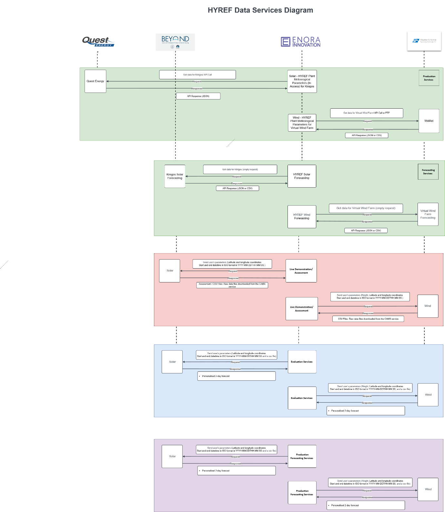

**Destination Renewable Energy (DRE)**

Software Requirement Specifications (SRS)

Ref.: DestinE_ESA_DRE_SRS_v6.0

**Author's Table**

| Written by:  | George Koutalieris Symeon Symeonidis Vasillis Perifanis Athanassios Drivas  Kyriaki Papachristopoulou Rizos-Theodoros Chadoulis Aggelos Georgakis Christos Stathopoulos Platon Patlakas | ENORA INNOVATION ENORA INNOVATION ENORA INNOVATION NOA NOA NOA NOA WeMET WeMET |
|--------------|-----------------------------------------------------------------------------------------------------------------------------------------------------------------------------------------|--------------------------------------------------------------------------------|
| Verified by: | Theodora Papadopoulou                                                                                                                                                                   | NOA                                                                            |
| Approved by: | Haris Kontoes                                                                                                                                                                           | NOA                                                                            |

**Change Log**

| Issue | Date             | Reason for change        | Section(s) changed           |
|-------|------------------|--------------------------|------------------------------|
| 1.0   | 15 December 2023 | Creation of the document |                              |
| 2.0   | 13 February 2024 | Second version           | Edits in the entire document |
| 3.0   | 14 May 2024      | Third Version            | Edits in the entire document |
| 4.0   | 27 July 2024     | Fourth Version           | Edits in the entire document |
| 5.0   | 24 October 2024  | Fifth Version            | Edits in the entire document |
| 6.0   | 12 May 2025      | Sixth Version            | Edits in the entire document |

**  
**

**Table of Contents**

***

[**1 Introduction 5**](#introduction)

[1.1 Purpose of the Document 5](#purpose-of-the-document)

[**2 DRE Use Case Summary 6**](#dre-use-case-summary)

[2.1 DRE Use Case Features 6](#dre-use-case-features)

[2.2 User Characteristics 7](#user-characteristics)

[2.3 Constraints 7](#constraints)

[**3 DRE Use Case Requirements 8**](#dre-use-case-requirements)

[3.1 Group 1: RES data integration 8](#group-1-res-data-integration)

[3.2 Group 2: Data Collection and Management 8](#group-2-data-collection-and-management)

[3.2.1 Solar and Wind Forecasting Specifications 9](#solar-and-wind-forecasting-specifications)

[**3.3 Group 3: Simulation and Projection 11**](#_heading=)

[3.4 Group 4: Communication Interfaces 12](#group-4-communication-interfaces)

[3.5 Group 5: User authentication interface 12](#group-5-user-authentication-interface)

[**3.6 Group 6: Advanced services specifications 12**](#_heading=)

[**3.7 Group 7: What-if scenario services specifications 13**](#_heading=)

[**4 Non-functional Requirements 14**](#non-functional-requirements)

[**5 Software System Attributes 15**](#software-system-attributes)

[**6 Operational DRE Advanced Services 16**](#_heading=)

[6.4 Operational DRE Advanced Service Solar and Wind Specifications 19](#operational-dre-advanced-service-solar-and-wind-specifications)

[6.4.1 Solar and Wind Assessment Specifications 20](#solar-and-wind-assessment-specifications)

[6.4.2 Solar and Wind Forecasting Specifications 24](#solar-and-wind-forecasting-specifications-1)

[**7 Conclusion 31**](#conclusion)

# Introduction

## Purpose of the Document

The deliverable "Software Requirement Specifications (SRS)" version 6.0 for the Destination Renewable Energy (DRE) Use Case application outlines the requirements for modelling, simulating, and forecasting renewable energy production. This document will guide the development of the DRE Use Case application that integrates data and predictive analytics to enhance decision-making in the renewable energy sector.

The Destination Renewable Energy (DRE) Use Case software application is called the Hybrid Renewable Energy Forecasting System (HYREF). Therefore, the terms DRE Use Case and HYREF are interchangeable. The intended audience of this document includes project managers, developers, data scientists, QA teams, stakeholders, technical writers, compliance officers, and support teams for the development of HYREF software.

# DRE Use Case Summary

The DRE use case integrates digitisation and renewable energy technologies. It acts as a bridge between the physical and digital domains in the renewable energy sector. DRE forms a digital use case component by digitising the physical systems of solar and wind energy production. This system merges real-time data from physical Renewable Energy Sources (RES) with their digital twin models. These models are constructed using comprehensive data, encompassing atmospheric and weather information from the DESP Data Lake and other sources.

DRE stands out for its ability to interact seamlessly with existing systems. Its communication interfaces (CI) connect directly to the production sites and the DestinE Core Service Platform (DESP), enhancing the capacity of DRE forecasts. This integration ensures that HYREF is a tool facilitating efficient energy management and policy-making.

IAM testing using Keycloak has been successfully completed with the accounts provided to the Use Case partners within the dedicated testing environment: https://iam.ivv.desp.space/realms/desp. The standardised authentication workflow requires users to log in via the DESP user portal, enabling secure access to client services. Additionally, the onboarding processes for the Solar and Wind Forecasting services have been deployed following the documentation and implementation guidelines supplied by Serco.

Any issues or dependencies during this phase are recorded and managed through a common Jira issue-tracking system. DRE's partners are committed to providing timely access and support to ensure a smooth transition and prompt commencement of project activities.

Regarding the Service Registry and API Specification for solar and wind forecasts, DRE partners are internally developing the API input/output. This will complete the onboarding phase and enable adequate validation and integration of the service.

## DRE Use Case Features

HYREF is designed with a range of features aimed at optimising renewable energy usage, including Simulation and Projection Services that model wind and solar energy outputs to support forecasting and planning, capabilities that aggregate system data from diverse sources, as atmospheric inputs, weather data, and DE data lakes, to construct accurate digital twins of physical energy systems. Furthermore, the service tools deliver hourly forecasts up to 48 hours in advance, facilitating informed decisions regarding energy usage, trading, and storage.

***

## User Characteristics

The primary users of the DRE Use Case application are:

1.  Weather Modelling Scientist

***

2.  Electricity Production Model Analyst

***

3.  Production Site Manager

***

4.  Hybrid RES Production Manager

***

5.  DESP contact point

***

These users require accurate, timely information to make informed energy production and policy decisions. DRE Use Case application addresses these needs by providing:

-   Detailed energy forecasts

***

-   Scenario analysis tools

***

-   User-friendly interfaces for interaction with the digital twins

***

NOTE: Detailed functional specifications and use case scenarios are presented in deliverable D5.2 (DRE Use Case Descriptor)

***

## Constraints

DRE Use Case application operates within certain constraints:

-   Technological Constraints: Dependence on the accuracy and availability of data from various sources and the reliability of digital twin models.

***

-   DESP-related constraints: Compliance with energy regulations and data privacy laws.

***

-   Data-Related Constraints: The availability, quality, and timeliness of atmospheric and weather data and their impact on the accuracy of forecasts and simulations.

***

# DRE Use Case Requirements

The following requirements are identified and grouped. Also, all the Use Case requirements will be translated into a set of features or user stories, which are compiled in a list known as the Product Backlog. The Backlog includes the elements of the Digital Twin, Data Management & ETL, and DRE Use Case application. The Backlog will be developed in close collaboration with the renewable energy end-users, ensuring that all needs are captured and understood from the beginning.

***

## Group 1: RES data integration

This group of requirements involves the integration of renewable energy systems data from solar and wind production units. A complete and dynamic digital twin of the entire energy production system will be created by merging real-time operational data from these physical systems with the digital models. This integration enables accurate monitoring and predictive analysis of the energy systems.

**Functional Requirements:**

-   Real-time data synchronisation between physical systems and digital models.

***

-   Compatibility with various solar and wind energy production technologies.

***

-   Continuous updating mechanism for digital twins to reflect real-time changes.

***

-   Scalability to accommodate additional energy sources or systems.

***

## Group 2: Data Collection and Management

This group of requirements involves the collection and management of data from physical systems (solar and wind) and atmospheric conditions. The collected data, including energy outputs and weather-related information, is for accurate modelling and forecasting.

**Functional Requirements:**

-   Efficient data processing and storage systems are compatible with the DESP Data Lake.

***

-   Mechanisms to ensure the integrity and confidentiality of collected data.

***

-   Regular updates and maintenance protocols for data collection hardware and software.

***

The data processing pipeline involves several stages, starting from data ingestion, followed by data processing, storage, and finally, integration with the DESP Data Lake. For storage, we utilise local storage solutions for the initial stages. The processed data is then transferred to more robust storage systems compatible with the DESP Data Lake. This may include object storage solutions or distributed file systems that ensure scalability and reliability.

Compatibility with DESP Data Lake: To ensure seamless integration and compatibility with the DESP Data Lake, we have configured our service specifications, including data formats and arguments, to be in line with the requirements of the DESP platform. To ensure interoperability, we have set up the service specifications (data format, arguments) to be included in the service registry. Registering our service specifications in the DESP Service registry ensures that all data is appropriately formatted and compatible, facilitating smooth data exchange and integration through the software life cycle. This approach guarantees interoperability and enhances data processing and storage efficiency and reliability within the DESP ecosystem.

### Solar and Wind Forecasting Specifications

This section outlines the Solar and Wind Forecasting API specifications as part of the DRE Use Case. The APIs provide access to solar and wind forecasts, respectively, within specified geographic boundaries and time frames by utilising FastAPI[^1] for high performance and ease of use, Uvicorn[^2] for fast ASGI server deployment, Pandas[^3] for data manipulation, and Shapely[^4] for geometric operations. It is designed to support our broader goals of integrating renewable energy forecasts into advanced energy management systems.

[^1]: https://fastapi.tiangolo.com/

[^2]: https://www.uvicorn.org/

[^3]: https://pandas.pydata.org/

[^4]: https://pypi.org/project/shapely/

The service is accessible via the **/solar and /wind** endpoints, supporting HTTP GET requests. This endpoint is designed to retrieve solar/wind forecast data tailored to specific geographic boundaries and time intervals.

The API requires several parameters to tailor the data retrieval: **bbox**, **start_date**, **end_date,** and **time**. Each parameter must be provided in the request and validated as follows:

-   The latitude parameter specifies the geographic latitude of the wind park and must be a valid floating-point number greater than or equal to -90.0 and less than or equal to 90.0.
-   The longitude parameter defines the geographic longitude and must be a valid floating-point number greater than or equal to -180.0 and less than or equal to 180.0.
-   The elevation parameter represents the solar park’s altitude in meters and must be a value greater than or equal to 0 and less than or equal to 8849.

The API's response behaviour includes HTTP status codes to indicate the possible outcomes. A successful data retrieval returns a 200 OK status with the forecast data formatted in JSON. If parameters are invalid or missing, the server responds with a 400 Bad Request status and a detailed error message. A 404 Not Found status is returned when no data matches the provided parameters. In the case of server-side errors, a 500 Internal Server Error status is used.

In Tables 1 and 2, one can see the exact input and output specification of the solar API.

**Table 1. Input specification for solar forecasting.**

| Parameter              | Type   | Description                                      | Notes                                                            |
|------------------------|--------|--------------------------------------------------|------------------------------------------------------------------|
| Latitude and Longitude | string | Bounding box coordinates: xmin, ymin, xmax, ymax | Must be a comma-separated string of four floating-point numbers. |
| start_date             | string | Start date in YYYYMMDD format                    | Must be a valid date string in YYYYMMDD format.                  |
| end_date               | string | End date in YYYYMMDD format                      | Must be a valid date string in YYYYMMDD format.                  |

**Table 2. Output specification for solar forecasting.**

| Parameter                 | Type   | Description                                                               |
|---------------------------|--------|---------------------------------------------------------------------------|
| time_utc                  | string | ISO 8601-formatted timestamp of the measurement                           |
| Solar_Power_Production_kW | float  | Solar power production in kilowatts (kW)                                  |
| GHI_kWh_m2                | float  | Global Horizontal Irradiation in kiloWatt-hours per square meter (kWh/m²) |

Below are defined the exact input and output specifications of the wind API:

**Table 3. Input specification for wind forecasting.**

| Parameter              | Type   | Description                                                                    | Notes                                                               |
|------------------------|--------|--------------------------------------------------------------------------------|---------------------------------------------------------------------|
| Latitude and Longitude | string | Bounding box coordinates: xmin, ymin, xmax, ymax                               | It must be a comma-separated string of four floating-point numbers. |
| start_date             | string | Start date in YYYYMMDD format                                                  | It must be a valid date string in YYYYMMDD format.                  |
| end_date               | string | End date in YYYYMMDD format                                                    | It must be a valid date string in YYYYMMDD format.                  |
| time                   | string | Hours of the day to filter: e.g., 0-23 for a range or 0,5,6 for specific hours | It must be a valid time range or comma-separated hours.             |

**Table 4. Output specification for wind forecasting.**

| Parameter                | Type    | Description                                            |
|--------------------------|---------|--------------------------------------------------------|
| time_utc                 | string  | ISO 8601-formatted timestamp of the measurement        |
| Wind_Power_Production_kW | float   | Wind power production in kilowatts (kW)                |
| Wind_speed_ms            | float   | Wind speed measured in meters per second (m/s)         |
| Wind_direction           | float   | Wind direction measured in degrees (°)                 |
| hour                     | integer | Hour of the day when the measurement was taken (0-23). |

## Group 3: Simulation and Projection

This group of requirements involves using collected data to model and predict the performance of solar and wind energy systems. This process is for short-term forecasting (up to two days ahead) and supports decision-making regarding energy use, trade, and storage.

**Functional Requirements:**

-   Support accurate and reliable energy production simulation via advanced forecasting algorithms.

***

-   User-friendly dashboards for accessing and interpreting simulation results.

***

-   Regular updates to simulation models based on new data and trends.

***

## Group 4: Communication Interfaces

Communication interface requirements are for exchanging data and information between the end-users and the DRE Use Case application. These interfaces facilitate data transfer and are integral to the system's functionality.

**Functional Requirements:**

-   Robust and secure communication channels to prevent data breaches.

***

-   Compatibility with various data formats and protocols used by end-users and the DESP.

***

-   Low-latency data transmission for monitoring and response.

***

-   Regularly test and update communication protocols to ensure reliability.

***

## Group 5: User authentication interface

Authentication interface (IAM) requirements are used to identify and manage access for external DRE Use Case application users. These interfaces facilitate real-time data transfer for the user's activities on the application.

**Functional Requirements:**

-   Secure communication channel based on industry standards
-   Utilisation of the OpenID Connect process for the user integration flow
-   Low-latency data transmission and high availability

## Group 6: Advanced services specifications

The Hybrid Energy Forecasting Service combines solar and wind energy models to provide real-time forecasts for users managing both renewable systems. This service supports decision-making by offering detailed energy output visualisations for solar, wind, and their combined total.

**Functional Requirements:**

-   **Real-time Data Processing**: Continuous analysis of solar and wind outputs for up-to-date forecasts.
-   **Hybrid System Visualisation**: Interactive displays showing solar, wind, and combined hybrid energy outputs.
-   **User-friendly Interface**: Intuitive interface with customisable dashboards.

## Group 7: What-if scenario services specifications

The HYREF application provides advanced visualisations for analysing "what-if" scenarios, allowing users to explore the effects of varying environmental conditions on energy forecasts. Using pre-run simulations based on historical data, users can dynamically adjust initial conditions to gain valuable insights into energy production under different scenarios.

Functional Requirements:

-   Pre-Run Simulations: Provides preconfigured simulations based on historical dust intrusion cases, enabling users to explore scenarios without requiring real-time input.

***

-   Dust Intrusion Analysis: Quantifies the impact of dust attenuation and soiling on energy production, categorised by event severity into "low," "medium," and "high" aerosol concentration levels.

***

-   Scenario Visualisation: Displays interactive graphs showing time-series data, including the original solar radiation forecast (GHI) and corrected forecasts based on varying aerosol intensity.

***

-   Dynamic Scenario Switching: This enables users to toggle between different intensity levels to explore their effects on solar radiation and energy production forecasts.

***

-   User-Friendly Interface: Intuitive and interactive design for seamless navigation and analysis of simulation results.

***

***

# Non-functional Requirements

The HYREF is designed to operate at an optimal level of performance, characterised by specific metrics that ensure its reliability, efficiency, and accuracy. These non-functional requirements support the decision-making processes related to renewable energy production and management.

**System Responsiveness:** HYREF is expected to exhibit high responsiveness, with the ability to process incoming data rapidly and update forecasts. This includes:

\- Real-time data processing and atmospheric/weather data collection modalities.

\- A maximum response time for processing incoming data and reflecting updates in the system.

**Data Processing Speeds:** The system efficiently handles large volumes of data from diverse sources without lag. This entails:

\- Capable of processing and integrating data from various sources, including solar and wind production systems, atmospheric data, and the DESP Data Lake.

\- Capable of batch import of historical data that complies with the DRE data schema

**Accuracy in Projections:** Accuracy in the HYREF's capability provides reliable forecasting.

\- Reliable what-if scenario projections aid in decision-making for energy trade, use, and storage.

**Continual Learning and Adaptation:** The system should incorporate continual learning and adaptation mechanisms, improving its forecasting accuracy over time based on historical data and performance feedback.

**Scalability and Flexibility:** HYREF should be scalable to handle increasing data volumes and flexible enough to integrate future technological advancements or changes in data sources.

**User Interface Responsiveness:** The system should have a user-friendly interface with a low response time, enabling efficient user interaction.

# Software System Attributes

The Software System Attributes for the HYREF are the following:

**1. Reliability:** HYREF is designed to operate with high reliability, ensuring consistent performance and accuracy in forecasting

**2. Availability:** HYREF is expected to be operational 24/7, providing uninterrupted service to support continuous energy production and policy-making decisions

**3. Security:** Given the sensitive nature of energy production data and policy decisions, HYREF prioritises security. This encompasses robust data protection measures, including encryption, secure data transfer protocols, and regular security audits

4\. **Maintainability**: To ensure long-term effectiveness, HYREF is designed for easy maintainability. This includes a modular architecture to facilitate updates, integrations, and precise documentation for system components and processes.

**5. Portability:** HYREF is built with portability in mind, allowing it to be adapted and deployed in various environments with different energy production systems and regulatory contexts. The system architecture is flexible, enabling it to integrate with multiple data sources and production site technologies.

All the System Attributes are related and depend on the availability of the DESP Core Services, which support HYREF's main components.

# Operational DRE Advanced Services

This section outlines the Operational DRE Advanced Service, emphasising the collaboration and integration of partners and systems to facilitate accurate solar and wind energy forecasting and assessment. Most of the above requirements apply to the Operational DRE Advanced Service and will be implemented accordingly. To avoid repetition, they are not restated in this section. These requirements have been grouped and translated into features or user stories. The "HYREF Data Services Diagram" visually represents the software's structured organisation of production, forecasting, live demonstrations, and evaluation workflows, as will be implemented in DRE release 5. The Use Case leverages APIs for data access and exchange to facilitate seamless system interoperability, utilising formats such as JSON and CSV.

**Figure 1. Overview of HYREF Data Services Architecture.**

***

The HYREF Data Services Architecture in Figure 1 showcases the integration and interaction between partners and service layers to support data-driven decision-making for renewable energy forecasting and production. The architecture is divided into five main service domains, which are grouped as follows: a) Production Services and Forecasting Services for the QUEST/WeMet end users of the DRE Use Case, which requirements are described in detail in Section 3, b) Live Demonstration, and Evaluation and Production Forecasting Services that will be part of the DRE Advanced Service, and their requirements are described in this section. Each domain facilitates distinct functionalities, such as data collection from solar and wind sources, advanced forecasting algorithms, and assessments using geospatial parameters. The system leverages API integrations to retrieve, process, and distribute data in standardised formats (JSON and CSV). This approach enhances the accuracy of renewable energy forecasts and optimises the deployment of these insights in both live and simulated environments, thereby supporting the continuous evaluation and improvement of forecasting models. The architecture ensures seamless data flow across different service areas, aligning with the project's objectives to advance the predictability and efficiency of renewable energy systems. The following subsection describes each DRE Advanced Service service in detail.

1.  Live Demonstration

***

Solar and wind resource assessment is available as a service. For solar energy, the Copernicus Atmosphere Monitoring Service (CAMS) radiation service dataset is utilised to estimate solar radiation potential, while for wind energy, ERA5 hourly single-level reanalysis data is employed to assess wind resources. The results are visualised and available for download in CSV format.

***

The capabilities of the solar and wind 2-day forecasting services are also demonstrated for the DRE Use Case end users of QUEST and WeMet. This example will showcase how the solar and wind 2-day forecasting service will be for every potential user, tailored to their infrastructure and needs.

***

***

1.  Evaluation Services

***

Solar radiation/wind speed and energy resource assessment services deliver reliable and site-specific resource assessment for site location and project planning. A one-time provision of forecasting wind/solar services is also available to help potential users evaluate its features and capabilities. Our one-off production forecasting services deliver reliable, single-use predictions designed to support energy planning and decision-making for demonstration purposes. These services leverage advanced modelling techniques and user-specific inputs to provide precise forecasts for solar and wind energy production, showcasing the potential and effectiveness of our forecasting capabilities.

***

Both services rely on user-specific data. Historical power production data is needed for solar energy to train a machine learning model that integrates with Digital Twin solar radiation forecasts. Users are required to provide historical data on the solar park based on the provided template, along with precise location details (latitude, longitude, and altitude). In case of no historical data availability, a user could still acquire detailed solar power production forecasts by specifying key solar park parameters such as tilt angle (in degrees), azimuth (in degrees), tracking type (0 for no tracking, 1 for single-axis tracking, 2 for dual-axis tracking) and DC capacity (in watts) must be specified.

***

For wind energy, the system allows users to select a location, set the turbine hub height (in meters), and input wind turbine specifications to enable a comprehensive wind speed and energy resource assessment. Forecasts are generated based on user-defined parameters, including the wind farm location, turbine specifications, and available historical wind data. Users can also input the power curve of wind speed (in m/s) and corresponding power output (in kW), ensuring a customisable solution.

***

***

1.  Production Forecasting Services

***

The production forecasting services will provide reliable predictions to support energy planning and decision-making in an operational mode. These services integrate advanced modelling techniques, Digital Twin data, and user-specific inputs (see section 6.2) to deliver solar and wind energy production forecasts. The system delivers energy forecasts tailored to the user's needs by integrating site-specific details and meteorological data.

***

## Operational DRE Advanced Service Solar and Wind Specifications

This section analyses the Operational DRE Advanced Service (Release 5), and specifically the API specifications for solar and wind assessment and forecasting.

### Solar and Wind Assessment Specifications

This section outlines the Solar and Wind Assessment API specifications as part of the DRE Use Case. The APIs provide access to solar and wind forecasts, respectively, within specified geographic boundaries and time frames by utilising FastAPI[^5] for high performance and ease of use, Uvicorn[^6] for fast ASGI server deployment, Pandas[^7] for data manipulation, and Shapely[^8] for geometric operations. For authentication as well as supplementary utilities related to accessing collections and API endpoints of Destine DataLake, the destinelab package is used. Additionally, packages such as cfgrib for data manipulations and scientific calculations, like scipy[^9], are also implemented. The overall framework is designed to support our broader goals of integrating renewable energy forecasts into advanced energy management systems.

[^5]: https://fastapi.tiangolo.com/

[^6]: https://www.uvicorn.org/

[^7]: https://pandas.pydata.org/

[^8]: https://pypi.org/project/shapely/

[^9]: https://scipy.org/

The service is accessible via the **/solar and /wind** endpoints, supporting HTTP GET requests. This endpoint is designed to retrieve solar and wind assessment data tailored to specific geographic boundaries and time intervals.

The API for the basic version of the wind component requires several parameters to tailor the data retrieval: **latitude, longitude, start_date, end_date, and height**.

Each parameter must be provided in the request and is validated as follows:

-   The latitude parameter specifies the geographic latitude of the location and must be a valid floating-point number greater than or equal to -90.0 and less than or equal to 90.0.

***

-   The longitude parameter defines the geographic longitude of the location and must be a valid floating-point number greater than or equal to -180.0 and less than or equal to 180.0.

***

-   The start_date parameter indicates the beginning of the data retrieval period and must be a valid date not earlier than 1940-01-01 and not later than seven days before the current date. The start_date must not be later than the end_date.

***

-   The end_date parameter specifies the end of the data retrieval period and must be a valid date within the same bounds (1940-01-01 to seven days before the current date). The end_date must not be earlier than the start_date.

***

-   The height parameter represents the measurement height above ground level and must be an integer value predefined as either 10 or 100 meters.

***

Given the aforementioned options, the API processes the request, performs the associated actions such as the download of the corresponding datasets, continues with the statistical analysis and calculation of the relevant parameters, and outputs the results.

The Wind Premium Assessment API builds upon the Basic Assessment by requiring additional site-specific information to enable turbine-specific energy yield estimation. Unlike the Basic Assessment, where the measurement height is predefined, the Premium Assessment requires the user to specify the turbine hub height.

-   The hub_height parameter represents the turbine hub height in meters and must be a value greater than or equal to 40 and less than or equal to 300.

Additionally, users must upload a wind turbine power curve model or select one of the reference power curve models. The following parameters must be provided and are subject to strict validation to ensure the accuracy and reliability of the assessment.

The power curve model must be uploaded as a CSV file with the following structure:

-   The file must contain exactly two columns, with case-sensitive names: wind_speed_in_m_per_s and power_in_kW.
-   No empty cells or text entries are allowed; only numerical values must be used, with missing data indicated by -999.
-   Decimal numbers must use a dot ('.') as the separator.
-   The wind_speed_in_m_per_s values must be floats between 0 and 45, provided sequentially.
-   The power_in_kW values must be floats between 0 and 18,000.

With the selection of the desired options, the API processes, the request proceeds with the designed analysis and calculations, as in the case of the basic assessment, with the inclusion of statistics and results relevant to wind power energy yield.

Below are defined the exact input and output specifications of the wind API:

**Table 5. Input specification for premium wind assessment.**

| Parameter  | Type    | Description                                          | Notes                                                                                                                    |
|------------|---------|------------------------------------------------------|--------------------------------------------------------------------------------------------------------------------------|
| Latitude   | float   | Latitude of the wind park                            | Must be between -90.0 and 90.0                                                                                           |
| Longitude  | float   | Longitude of the wind park                           | Must be between -180.0 and 180.0                                                                                         |
| start_date | string  | Start date of the data retrieval period (YYYY-MM-DD) | Must be a valid date not earlier than 1940-01-01 and not later than 7 days before today. Must not be later than end_date |
| end_date   | string  | End date of the data retrieval period (YYYY-MM-DD)   | Must be a valid date within the same bounds. Must not be earlier than start_date                                         |
| height     | integer | Measurement height above ground level (m)            | Must be either 10 or 100                                                                                                 |

**Table 6. Input specification for premium wind assessment.**

| Parameter                | Type     | Description                                          | Notes                                                                                                                    |
|--------------------------|----------|------------------------------------------------------|--------------------------------------------------------------------------------------------------------------------------|
| Latitude                 | float    | Latitude of the wind park                            | Must be between -90.0 and 90.0                                                                                           |
| Longitude                | float    | Longitude of the wind park                           | Must be between -180.0 and 180.0                                                                                         |
| start_date               | string   | Start date of the data retrieval period (YYYY-MM-DD) | Must be a valid date not earlier than 1940-01-01 and not later than 7 days before today. Must not be later than end_date |
| end_date                 | string   | End date of the data retrieval period (YYYY-MM-DD)   | Must be a valid date within the same bounds. Must not be earlier than start_date                                         |
| hub height               | integer  | Hub height of turbines (in meters)                   | Must be between 40 and 300 meters                                                                                        |
| power_curve_model_upload | CSV file | User-uploaded power curve file                       | Must follow defined CSV format with wind_speed_in_m_per_s and power_in_kW columns                                        |

**Table 7. The output specification for basic wind assessment is also provided in the premium version.**

| Parameter                   | Type   | Description                                     |
|-----------------------------|--------|-------------------------------------------------|
| time_utc                    | string | ISO 8601-formatted timestamp of the measurement |
| Wind_speed_ms               | float  | Wind speed measured in meters per second (m/s)  |
| Wind_direction              | float  | Wind direction measured in degrees (°)          |
| Histogram\_ values          | float  | Values to create a histogram                    |
| Weibull_values              | float  | Values to create the Weibull distribution       |
| Wind_directional_statistics | float  | Directional statistics for the table            |

Output specification for premium wind assessment

| Parameter                   | Type   | Description                                                |
|-----------------------------|--------|------------------------------------------------------------|
| time_utc                    | string | ISO 8601-formatted timestamp of the measurement            |
| Wind_speed_ms               | float  | Wind speed measured in meters per second (m/s)             |
| Wind_direction              | float  | Wind direction measured in degrees (°)                     |
| Histogram\_ values          | float  | Values to create a histogram                               |
| Weibull_values              | float  | Values to create the Weibull distribution                  |
| Wind_directional_statistics | float  | Directional statistics for the table                       |
| Wind_Power_Production_kW    | float  | Wind power production in kilowatts (kW)                    |
| Mean_annual_energy          | float  | Estimated mean annual energy production per wind speed bin |
| Wind_power_analytics        | float  | Wind power analytics for the table                         |

### Solar and Wind Forecasting Specifications

This section outlines the Solar and Wind Forecasting API specifications as part of the DRE Use Case. The APIs provide access to solar and wind forecasts, respectively, within specified geographic boundaries and time frames by utilising FastAPI[^10] for high performance and ease of use, Uvicorn[^11] for fast ASGI server deployment, Pandas[^12] for data manipulation, and Shapely[^13] for geometric operations. It is designed to support our broader goals of integrating renewable energy forecasts into advanced energy management systems.

[^10]: https://fastapi.tiangolo.com/

[^11]: https://www.uvicorn.org/

[^12]: https://pandas.pydata.org/

[^13]: https://pypi.org/project/shapely/

The service is accessible via the **/solar and /wind** endpoints, supporting HTTP GET requests. This endpoint is designed to retrieve solar and wind forecast data tailored to specific geographic boundaries and time intervals.

Regarding the solar forecasting service, two distinct services have been developed, the ‘Train using your own data’ which trains a ML model based on the uploaded historical data of the user, and the ‘Park specifications’ service, which utilises python libraries such as pvlib, and leverages user-supplied park specifications to generate detailed solar power forecasts. Each of these services has its own API specifications as described below:

Train using your own data:

The API for this solar component requires several parameters to tailor the data retrieval: latitude, longitude, and elevation.

Each parameter must be provided in the request and is validated as follows:

-   The latitude parameter specifies the geographic latitude of the wind park and must be a valid floating-point number greater than or equal to -90.0 and less than or equal to 90.0.
-   The longitude parameter defines the geographic longitude and must be a valid floating-point number greater than or equal to -180.0 and less than or equal to 180.0.
-   The elevation parameter represents the solar park’s altitude in meters and must be a value greater than or equal to 0 and less than or equal to 8849.

In addition to these parameters, the API requires user-supplied data files for model training: a .csv file with historical solar park energy production data.

The historical user data must be provided as a CSV file with the following structure:

-   Required column names: time_utc, total_production_active_power_kw.
-   All columns must have no empty cells and consist only of numerals (no text).
-   The time_utc column must follow the ISO 8601 format (e.g., YYYY-MM-DDTHH:MM:SSZ), contain no timestamps beyond 3 days before the current system time, no duplicate timestamps, and the entries must be sequential.
-   No duplicates and no missing timestamps (except for the rare cases of a country’s time shift)
-   The total_production_active_power_kw column must be a float greater than 0 and smaller than 10000
-   All numerical fields must use a dot ('.') as the decimal separator.

Park specifications:

Correct formatting and validation of both the historical solar power production data CSV file and the API input parameters are essential to ensure successful model training and operational forecast generation.

The API's response behaviour includes HTTP status codes to indicate the possible outcomes. A successful data retrieval returns a 200 OK status with the forecast data formatted in JSON. If parameters are invalid or missing, the server responds with a 400 Bad Request status and a detailed error message. A 404 Not Found status is returned when no data matches the provided parameters. In the case of server-side errors, a 500 Internal Server Error status is used.

With the provision of the required information, the API performs a number of predefined processes, such as the download and manipulation of the CAMS solar radiation time series datasets, the manipulation of the extremes-DT downloaded forecasts, as well as some conditional processes according to the options given in the request. Thus, the forecasted solar power production and the obtained forecasted GHI (Global Horizontal Irradiance) are provided together with the option of their visualisation.

Below are defined the exact input and output specifications of the solar APIs:

**Table 8. Input specification for solar forecasting.**

| Parameter                                         | Type     | Description                                          | Notes                                                                               |
|---------------------------------------------------|----------|------------------------------------------------------|-------------------------------------------------------------------------------------|
| Latitude                                          | float    | Latitude of the solar park                           | Must be between -90.0 and 90.0                                                      |
| Longitude                                         | float    | Longitude of the solar park                          | Must be between -180.0 and 180.0                                                    |
| Εlevation                                         | float    | Solar park’s altitude (in meters)                    | Must be between 0 and 8949 meters                                                   |
| Ηistorical solar park power production data file  | CSV file | User-uploaded historical solar power production data | Must follow the defined CSV format with time_utc, total_production_active_power_kw. |

**Table 9. Output specification for solar forecasting.**

| Parameter                          | Type   | Description                                                         |
|------------------------------------|--------|---------------------------------------------------------------------|
| time_utc                           | string | ISO 8601-formatted timestamp of the measurement                     |
| Solar_Power_Production_kW          | float  | Solar power production in kilowatts (kW)                            |
| GHI (Global Horizontal Irradiance) | float  | forecasted GHI in kWh/m2, as obtained from the extremes-DT dataset. |

The API for the wind component requires several parameters to tailor the data retrieval: **latitude, longitude, hub_height, and capacity**.

Each parameter must be provided in the request and is validated as follows:

-   The latitude parameter specifies the geographic latitude of the wind park and must be a valid floating-point number greater than or equal to -90.0 and less than or equal to 90.0.

***

-   The longitude parameter defines the geographic longitude and must be a valid floating-point number greater than or equal to -180.0 and less than or equal to 180.0.

***

-   The hub_height parameter represents the turbine hub height in meters and must be a value greater than or equal to 40 and less than or equal to 300.

***

-   The capacity parameter defines the installed capacity of the wind park in kilowatts and must be a non-negative number.

***

In addition to these parameters, the API requires user-supplied data files for model training and site-specific configuration: a user-defined power curve model and, optionally, historical wind park meteorological and energy production data.

The power curve model must be uploaded as a CSV file with the following structure:

-   The file must contain exactly two columns, with case-sensitive names: wind_speed_in_m_per_s and power_in_kW.

***

-   No empty cells or text entries are allowed; only numerical values must be used, with missing data indicated by -999.

***

-   Decimal numbers must use a dot ('.') as the separator.

***

-   The wind_speed_in_m_per_s values must be floats between 0 and 45, provided sequentially.

***

-   The power_in_kW values must be floats between 0 and 18,000.

***

The historical user data must also be provided as a CSV file with the following structure:

-   Required column names: time_utc, power_in_kW, and wind_speed_in_m_per_s.

***

-   Optional columns: wind_direction_in_deg_optional, temperature_in_C_optional, pressure_in_Pa_optional, and humidity_in_%_optional.

***

-   All columns must have no empty cells, using -999 for missing values where necessary.

***

-   The time_utc column must follow the ISO 8601 format (e.g., YYYY-MM-DDTHH:MM:SSZ), contain no future timestamps beyond the current system time, no duplicate timestamps, and the entries must be sequential.

***

-   All numerical fields must use a dot ('.') as the decimal separator.

***

Numerical validation rules:

-   power_in_kW: floats between 0 and 18,000.

***

-   wind_speed_in_m_per_s: floats between 0 and 45.

***

-   wind_direction_in_deg_optional: floats between 0 and 360.

***

-   temperature_in_C_optional: floats between -30 and 50.

***

-   pressure_in_Pa_optional: floats between 85,000 and 105,000.

***

-   humidity_in_%_optional: floats between 10 and 100.

***

Correct formatting and validation of both the power curve and historical user data are essential to ensure successful model training and operational forecast generation.

The API's response behaviour includes HTTP status codes to indicate the possible outcomes. A successful data retrieval returns a 200 OK status with the forecast data formatted in JSON. If parameters are invalid or missing, the server responds with a 400 Bad Request status and a detailed error message. A 404 Not Found status is returned when no data matches the provided parameters. In the case of server-side errors, a 500 Internal Server Error status is used.

With the provision of the required information, the API performs a number of predefined processes, such as the download and manipulation of the weather forecasting datasets, as well as some conditional processes according to the options given in the request. As a result, the outputs of the forecasted power, wind speed, and wind direction are provided together with the option of their visualisation.

Below are defined the exact input and output specifications of the wind API:

**Table 10. Input specification for wind forecasting.**

| Parameter                         | Type     | Description                                             | Notes                                                                                                                                                        |
|-----------------------------------|----------|---------------------------------------------------------|--------------------------------------------------------------------------------------------------------------------------------------------------------------|
| Latitude                          | float    | Latitude of the wind park                               | Must be between -90.0 and 90.0                                                                                                                               |
| Longitude                         | float    | Longitude of the wind park                              | Must be between -180.0 and 180.0                                                                                                                             |
| hub_height                        | float    | Hub height of turbines (in meters)                      | Must be between 40 and 300 meters                                                                                                                            |
| Capacity                          | float    | Installed capacity of the wind park (in kW)             | Must be a non-negative number                                                                                                                                |
| power_curve_model_upload          | CSV file | User-uploaded power curve file                          | Must follow the defined CSV format with wind_speed_in_m_per_s and power_in_kW columns                                                                        |
| historical_wind_park_data_upload  | CSV file | User-uploaded historical wind and power production data | Must follow defined CSV format with time_utc, power_in_kW, wind_speed_in_m_per_s (optional: wind_direction_in_deg_optional, temperature_in_C_optional, etc.) |

**Table 11. Output specification for wind forecasting.**

| Parameter                | Type   | Description                                     |
|--------------------------|--------|-------------------------------------------------|
| time_utc                 | string | ISO 8601-formatted timestamp of the measurement |
| Wind_Power_Production_kW | float  | Wind power production in kilowatts (kW)         |
| Wind_speed_ms            | float  | Wind speed measured in meters per second (m/s)  |
| Wind_direction           | float  | Wind direction measured in degrees (°)          |

# Conclusion

This deliverable outlines the Software Requirement Specifications (SRS) version 6.0 for the DRE Use Case. Functional and non-functional specifications provide a framework for the integration of physical systems with digital models, enhancing forecasting accuracy and decision-making capabilities in the renewable energy sector. This deliverable will be updated during each subsequent iteration to reflect an updated Use Case status.
