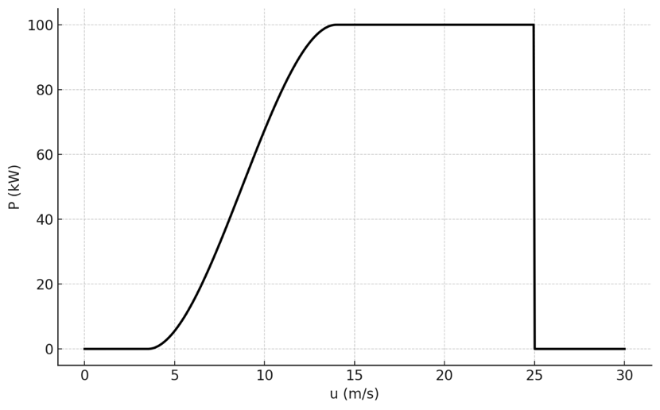
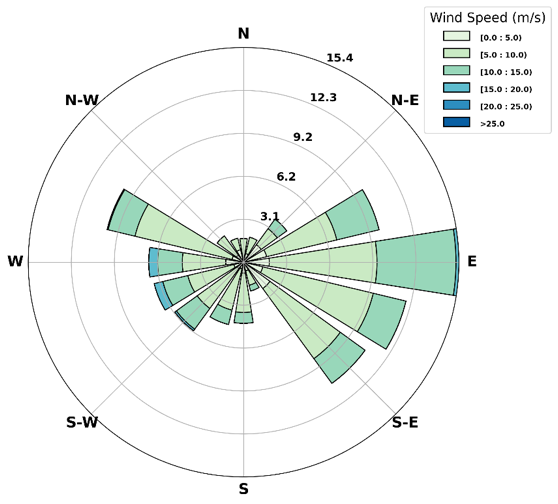
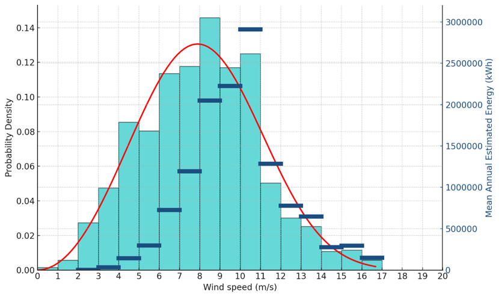
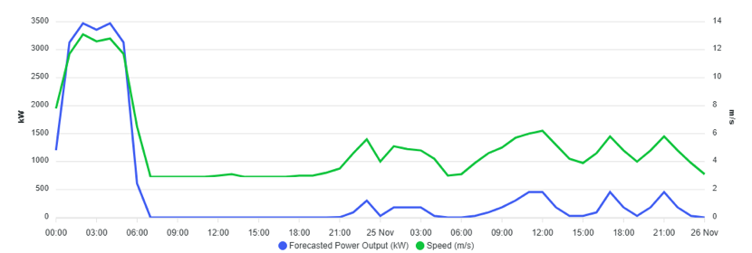

1.  **General**

**What types of renewable energy production does the DRE Service forecast?**

The DRE Service provides forecasts for solar photovoltaic (PV) and wind energy production. It leverages meteorological and historical data to deliver accurate generation predictions for both energy types across various geographic regions.

**I am not an expert user. How can I interpret the output graphs?**

DRE is a scientific service tailored to the needs of experts and professionals. It includes energy assessment and forecasting based on input provided by end-users. At each step, specific guidance notes are provided to assist end-users.

Users who are not familiar with energy forecasting methodologies are encouraged to review the MOOC or User Guide for both solar and wind services.

**What is the forecast horizon provided by the DRE Service?**

The forecast horizon extends up to 48 hours, depending on the subscription plan. Users can typically access forecasts ranging from hourly to monthly intervals, supporting both short-term operations and long-term planning.

**What user-provided input data is required to generate customised forecasts?**

To generate a customised forecast, users typically need to provide the following input information:

-   Geographic location (latitude/longitude)
-   System configuration (capacity, tilt, azimuth, etc.)
-   User’s Park data.

**Once a processing job is complete, how can I visualize the outputs?**

The outputs will appear directly on your screen in the Archive section. Click "Visualise" to view the results of the requested forecasting

.

Forecast results are presented through:

-   Interactive dashboards
-   Time series graphs

These visuals enable quick insights into expected performance and variability.

**Can users download the forecasted data generated by DRE?**

Yes. Users can export data in CSV, PNG or SVG formats, depending on their needs. Data export is available for both raw forecast outputs.

**Can users access the previous results they generated on DRE?**

Yes, the platform maintains a historical archive of assessments and forecast results, allowing users to retrieve past outputs.

**Is the free tier time-limited, and can users upgrade to another plan directly via DRE?**

The free tier is available with feature limitations, not time-limited.

Users can upgrade to other plans directly through the platform to unlock extended features, support, and data granularity.

2.  **Solar Services**

**What is solar irradiation, and how is it measured in your forecasts?  
** Solar irradiation refers to the power per unit area received from the Sun in the form of electromagnetic radiation. It’s measured in kilowatt-hours per square meter (kWh/m²) and represents the total energy received on a surface over time, which is crucial for estimating solar power output.

**What is the difference between solar irradiation and solar power output?  
** Solar irradiation is an environmental input — the sunlight energy available. Solar power output (in kW) is the system's response, determined by how efficiently your solar panels convert that energy into electricity, influenced by panel specs, angle, weather, and system losses.

**What are the main atmospheric factors affecting solar irradiation forecasts?  
** Key atmospheric variables include cloud cover, aerosol optical depth, water vapor content, and solar zenith angle. These are integrated in radiative transfer models used in weather-based irradiation forecasting.

**What kind of data is used for the training of the machine learning solar forecasting model, to predict solar radiation?  
** We use the user uploaded dataset and combine it with data from the CAMS McClear and HelioClim-3 services, which rely on satellite-based radiative transfer models and real-time atmospheric data to simulate surface solar irradiance under clear-sky and all-sky conditions.

**How accurate is the CAMS/ radiation data used in your system?**

CAMS data offers high temporal (hourly) and spatial (up to 2–5 km resolution) accuracy. Its validation against ground measurements shows mean bias errors below ±10% for hourly Global Horizontal Irradiance (GHI), making it suitable for forecasting applications.

**What temporal resolution does your forecast offer?**

Forecasts are provided in hourly intervals, covering a full 48-hour horizon. This resolution balances computational efficiency with operational relevance for planning and grid management.

**How do you account for shading or soiling in the forecast?**

Our forecast assumes declared system conditions. System derating factors or historical performance losses are also incorporated into the uploaded historical data used in the training of the model, and thus taken into account.

**How are seasonal changes accounted for in forecasts?**

Seasonality is inherently modeled through the variation in solar zenith angles and day length, as well as seasonal atmospheric composition (e.g., aerosols, humidity), which are captured in the dynamic CAMS inputs.

**What happens if I don’t have historical data to upload?**

No problem — we can still generate reliable forecasts using your park’s characteristics such as location, size, orientation, and tilt.

**How often is the forecast updated?**

With the Annual Subscription plan, forecasts are automatically updated daily. The One-Time Forecast provides a single 2-day outlook.

**Can this service support grid integration studies or energy yield assessments?**

Yes. Our forecast data can be used as input for grid balancing, battery dispatch strategies, and long-term yield analysis when aggregated and combined with system performance modeling.

**How does the DRE Service calculate irradiation forecasts and energy production forecasts?**

The DRE Service uses DT forecasting data, which is locally adapted using available user input. The adjusted forecast fields are then used to estimate the potential wind energy yield based on a wind power curve. The power curve model can be predefined, provided by the user or calculated through the data the user uploads.

3.  **Wind services**

**What is a Wind Turbine Power Curve?**

A **power curve** is a graph that shows how much electricity a wind turbine can generate at different wind speeds.

-   The **horizontal axis** is the **wind speed**.
-   The **vertical axis** is the **power output**.

See an example below:

**How is Wind Energy Output Calculated from Power Curves?**

Wind energy output is calculated by matching horizontal wind speed data (e.g., hourly values) to the turbine’s power curve to find the corresponding power.

**What is Total Energy Potential (kWh)?**

This is the total amount of energy a wind turbine is expected to generate over the analysis period (e.g., a year or a specific number of hours), based on wind data and the turbine’s power curve.

**What is Average Power Output (kW)?**

This represents the average rate of energy production over the given period. It's calculated by dividing the total energy generated by the total time (in hours).

**What is Capacity Factor?**

The capacity factor indicates how efficiently a turbine operates over time. It’s the ratio between the actual energy produced and the energy it could have produced if it ran at full capacity the entire time.

**What is the Mean Wind Speed (m/s)?**

This is the average wind speed observed during the selected period. It helps evaluate the windiness of a site and is a key input for estimating energy production.

**What is Wind Power Density (W/m²)?**

Wind power density measures the available power in the wind per square meter, based on wind speed and air density. It reflects the energy content of the wind and is used to assess site suitability for wind power.

**What is a Wind Rose and What is it Used For?**

A **wind rose** shows how wind typically behaves at a specific location over a period of time. It provides a visual summary of how often the wind blows **from different directions** and, in some cases, **how strong** it is when it does.

**How to read the Wind Rose provided in DRE?**

****

-   The **length of the bars** indicates how common winds are from that direction — the longer the bar, the more frequent the wind from that direction (in percentage %).
-   The **colors** show that the **wind speed** is grouped into ranges. Lighter colors indicate lower wind speeds, while darker shades represent stronger winds.
-   The chart is arranged like a compass, so each direction (N, NE, E, etc.) tells you where the wind is blowing **from**.

**What is a Wind Speed Histogram?**

A **wind speed histogram** is a simple bar chart that shows how often different wind speeds (at predefined bins) occur at a specific location over a time period. It helps us understand the **distribution of wind speeds**, without considering which direction the wind is blowing from.

**What is a Weibull Distribution, and why is it used for Wind Speed?**

The **Weibull distribution** is a mathematical function commonly used to describe **how wind speeds are spread out** at a specific location. It’s a smooth curve that gives a good approximation of how often certain wind speeds occur. It helps summarize complex wind data with just two key parameters:

-   **Shape (k):** Shows how peaked or spread the wind speeds are.
-   **Scale (c):** Reflects the average windiness of the site.

When fitted to wind speed data, the Weibull distribution offers a smooth, realistic curve that:

-   Captures the **most likely wind speeds**,
-   Estimates the **probability of extreme winds**, and
-   Supports **wind energy assessments**, especially for turbine design and energy yield forecasting.

**How to read the following figure provided by DRE?**

-   The **histogram (in cyan)** shows how frequently different wind speeds occur at the selected location. Taller bars represent more common wind speeds. The **left y-axis** displays this frequency (as probability density).
-   The **red curve** is a **Weibull distribution** fitted to the same wind speed data. It provides a smooth approximation of the wind pattern, helping to model the likelihood of each wind speed - including values that may not appear often in the raw data.
-   The **horizontal blue lines** represent the **mean annual energy production** associated with each wind speed range, based on a predefined wind power curve. They show how energy output depends not just on wind speed intensity, but also on how frequently each speed occurs. The energy peak emerges where both factors align. The **right y-axis** displays the mean annual estimated energy.

**What do the directional statistic outputs refer to?**

-   **Direction**: The wind direction the data refers to — where the wind is coming from (e.g., N, NE, E).
-   **Frequency** (%): The percentage of time the wind comes from that direction.
-   **Weibull Shape (k):** A parameter that defines the spread of wind speeds; higher values mean wind speeds are more consistent.
-   **Weibull Scale (c):** A parameter that reflects the typical wind speed; closely related to the mean wind speed.
-   **Mean Wind Speed (m/s):** The average wind speed from that direction.
-   **95th Percentile (m/s):** The wind speed value that is exceeded 5% of the time — shows the strength of occasional stronger winds.
-   **97th Percentile (m/s):** Wind speed exceeded 3% of the time — useful for assessing rare but relevant high-wind events.
-   **99th Percentile (m/s):** Wind speed exceeded just 1% of the time — often used in structural design or turbine safety analysis.

**How to read the following figure provided by DRE?**

-   This figure illustrates a timeseries illustrating the evolution and the **relationship between wind speed and power generation**.
-   **X-axis**: Time progression from midnight on the 24th to midnight on the 26th of November.
-   **Left Y-axis (kW)**: Forecasted power output from the wind turbine.
-   **Right Y-axis (m/s)**: Wind speed.
